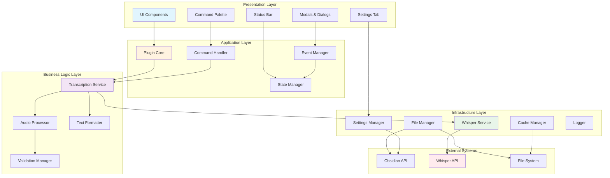
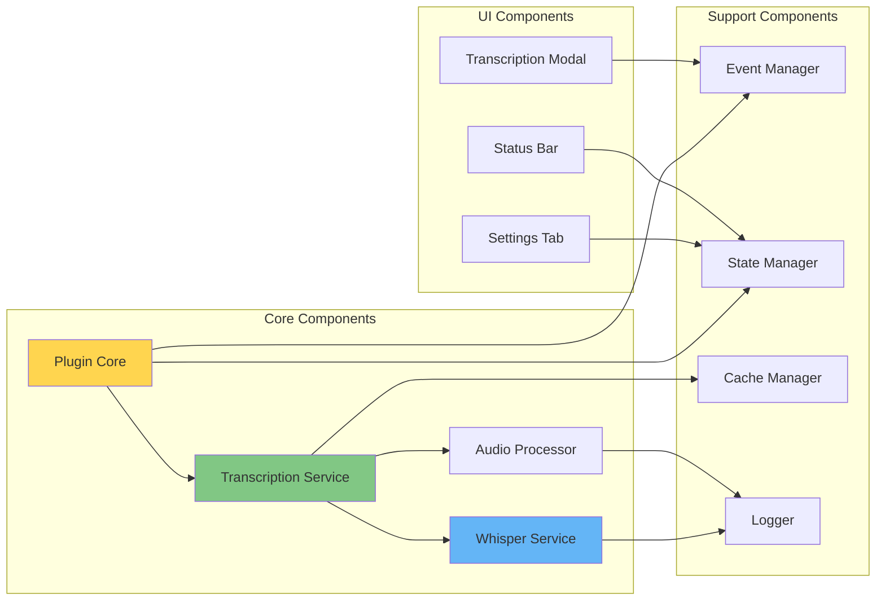
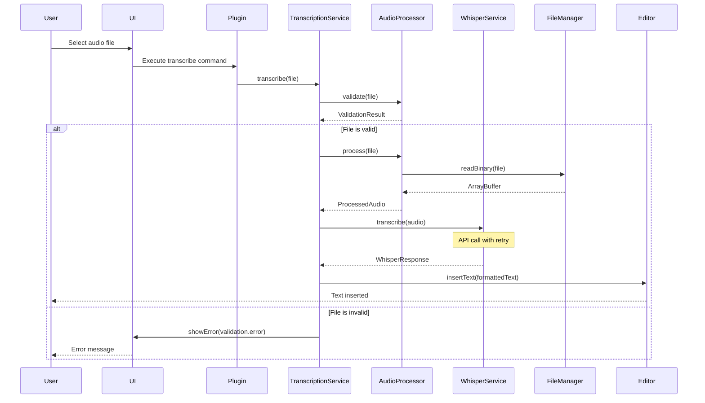
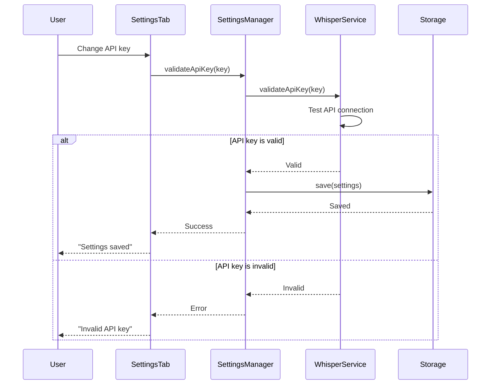
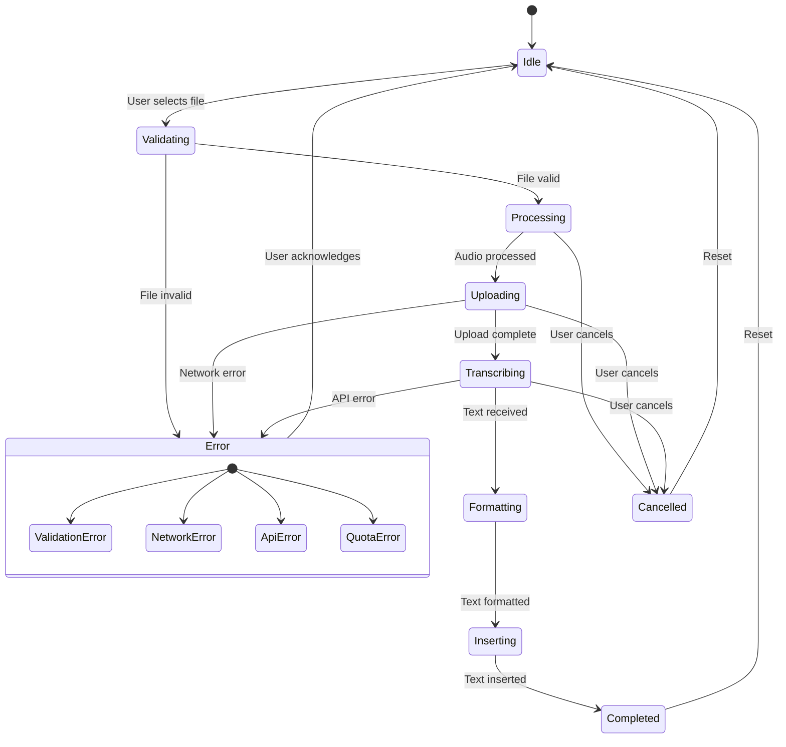

# 옵시디언 음성-텍스트 변환 플러그인 시스템 아키텍처

## 목차
1. [개요](#1-개요)
2. [아키텍처 원칙](#2-아키텍처-원칙)
3. [시스템 아키텍처](#3-시스템-아키텍처)
4. [컴포넌트 구조](#4-컴포넌트-구조)
5. [데이터 흐름](#5-데이터-흐름)
6. [API 통합 설계](#6-api-통합-설계)
7. [상태 관리 전략](#7-상태-관리-전략)
8. [에러 처리 계층](#8-에러-처리-계층)
9. [확장성 고려사항](#9-확장성-고려사항)
10. [보안 아키텍처](#10-보안-아키텍처)

---

## 1. 개요

### 1.1 프로젝트 목표
옵시디언 환경에서 음성 파일(M4A)을 텍스트로 변환하는 플러그인을 개발합니다. 이 시스템은 OpenAI Whisper API를 활용하여 고품질의 음성 인식을 제공하며, 사용자 친화적인 인터페이스와 강건한 에러 처리를 갖춘 확장 가능한 아키텍처로 설계됩니다.

### 1.2 핵심 요구사항
- **기능적 요구사항**
  - M4A 형식 음성 파일 처리
  - Whisper API를 통한 텍스트 변환
  - 변환된 텍스트의 노트 삽입
  - 진행 상태 표시 및 취소 기능
  - API 키 안전한 저장 및 관리

- **비기능적 요구사항**
  - 25MB 이하 파일 처리 (Whisper API 제한)
  - 30초 이내 응답 시간 목표
  - 99% 이상 가용성
  - TypeScript 기반 타입 안정성
  - 모듈화된 확장 가능한 구조

### 1.3 기술 스택
- **프레임워크**: Obsidian Plugin API
- **언어**: TypeScript 4.7+
- **빌드 도구**: ESBuild
- **테스트**: Jest
- **코드 품질**: ESLint, Prettier
- **외부 API**: OpenAI Whisper API

---

## 2. 아키텍처 원칙

### 2.1 설계 원칙
1. **관심사의 분리 (Separation of Concerns)**
   - 각 계층과 컴포넌트는 명확한 책임을 가짐
   - UI, 비즈니스 로직, 데이터 접근 계층 분리

2. **의존성 역전 (Dependency Inversion)**
   - 고수준 모듈이 저수준 모듈에 의존하지 않음
   - 인터페이스를 통한 추상화

3. **단일 책임 원칙 (Single Responsibility)**
   - 각 클래스와 모듈은 하나의 책임만 가짐
   - 변경의 이유가 하나

4. **개방-폐쇄 원칙 (Open-Closed)**
   - 확장에는 열려있고 수정에는 닫혀있음
   - 새로운 기능 추가 시 기존 코드 수정 최소화

5. **인터페이스 분리 (Interface Segregation)**
   - 클라이언트가 사용하지 않는 메서드에 의존하지 않음
   - 작고 구체적인 인터페이스

### 2.2 아키텍처 패턴
- **Layered Architecture**: 계층별 책임 분리
- **Repository Pattern**: 데이터 접근 추상화
- **Service Pattern**: 비즈니스 로직 캡슐화
- **Observer Pattern**: 이벤트 기반 통신
- **Strategy Pattern**: 알고리즘 교체 가능
- **Factory Pattern**: 객체 생성 로직 캡슐화

---

## 3. 시스템 아키텍처

### 3.1 전체 아키텍처 다이어그램



### 3.2 계층별 책임

#### Presentation Layer (표현 계층)
- **책임**: 사용자 인터페이스 및 상호작용 처리
- **구성요소**:
  - UI Components: 재사용 가능한 UI 요소
  - Command Palette: 명령어 실행 인터페이스
  - Modals: 파일 선택, 진행 상태 표시
  - Settings Tab: 플러그인 설정 관리 UI
  - Status Bar: 실시간 상태 표시

#### Application Layer (응용 계층)
- **책임**: 플러그인 생명주기 및 조정
- **구성요소**:
  - Plugin Core: 플러그인 진입점 및 초기화
  - Command Handler: 사용자 명령 처리
  - Event Manager: 이벤트 발행/구독 관리
  - State Manager: 전역 상태 관리

#### Business Logic Layer (비즈니스 로직 계층)
- **책임**: 핵심 비즈니스 규칙 및 프로세스
- **구성요소**:
  - Transcription Service: 변환 프로세스 조정
  - Audio Processor: 오디오 파일 처리 및 검증
  - Text Formatter: 텍스트 포맷팅 및 후처리
  - Validation Manager: 입력 검증 및 규칙 적용

#### Infrastructure Layer (인프라 계층)
- **책임**: 외부 시스템 통합 및 기술적 관심사
- **구성요소**:
  - Whisper Service: Whisper API 클라이언트
  - File Manager: 파일 시스템 작업
  - Settings Manager: 설정 영속성
  - Cache Manager: 캐싱 전략
  - Logger: 로깅 및 모니터링

---

## 4. 컴포넌트 구조

### 4.1 핵심 컴포넌트 상세 설계

#### 4.1.1 Plugin Core
```typescript
interface IPluginCore {
    onload(): Promise<void>;
    onunload(): void;
    registerCommands(): void;
    initializeServices(): void;
    setupEventHandlers(): void;
}

class SpeechToTextPlugin implements IPluginCore {
    private transcriptionService: ITranscriptionService;
    private settingsManager: ISettingsManager;
    private eventManager: IEventManager;
    private stateManager: IStateManager;
    
    async onload(): Promise<void> {
        await this.initializeServices();
        this.registerCommands();
        this.setupEventHandlers();
    }
}
```

#### 4.1.2 Transcription Service
```typescript
interface ITranscriptionService {
    transcribe(file: AudioFile): Promise<TranscriptionResult>;
    cancel(): void;
    getStatus(): TranscriptionStatus;
}

class TranscriptionService implements ITranscriptionService {
    constructor(
        private whisperService: IWhisperService,
        private audioProcessor: IAudioProcessor,
        private textFormatter: ITextFormatter,
        private eventBus: IEventBus
    ) {}
    
    async transcribe(file: AudioFile): Promise<TranscriptionResult> {
        // 1. 파일 검증
        // 2. 오디오 처리
        // 3. API 호출
        // 4. 텍스트 포맷팅
        // 5. 결과 반환
    }
}
```

#### 4.1.3 Whisper Service
```typescript
interface IWhisperService {
    transcribe(audio: ArrayBuffer, options: WhisperOptions): Promise<WhisperResponse>;
    validateApiKey(key: string): Promise<boolean>;
    cancel(): void;
}

class WhisperService implements IWhisperService {
    private httpClient: IHttpClient;
    private retryStrategy: IRetryStrategy;
    private rateLimiter: IRateLimiter;
    
    async transcribe(audio: ArrayBuffer, options: WhisperOptions): Promise<WhisperResponse> {
        return this.retryStrategy.execute(() => 
            this.rateLimiter.acquire(() => 
                this.httpClient.post(WHISPER_ENDPOINT, this.buildRequest(audio, options))
            )
        );
    }
}
```

### 4.2 컴포넌트 의존성 관계



### 4.3 인터페이스 정의

```typescript
// Core Interfaces
interface ITranscriptionService {
    transcribe(file: AudioFile): Promise<TranscriptionResult>;
    cancel(): void;
    getStatus(): TranscriptionStatus;
    on(event: TranscriptionEvent, handler: EventHandler): void;
}

interface IWhisperService {
    transcribe(audio: ArrayBuffer, options: WhisperOptions): Promise<WhisperResponse>;
    validateApiKey(key: string): Promise<boolean>;
    cancel(): void;
    getQuota(): Promise<QuotaInfo>;
}

interface IAudioProcessor {
    validate(file: TFile): Promise<ValidationResult>;
    process(file: TFile): Promise<ProcessedAudio>;
    extractMetadata(buffer: ArrayBuffer): Promise<AudioMetadata>;
    compress(buffer: ArrayBuffer): Promise<ArrayBuffer>;
}

interface ITextFormatter {
    format(text: string, options: FormatOptions): string;
    insertTimestamps(text: string, segments: Segment[]): string;
    cleanUp(text: string): string;
    applyTemplate(text: string, template: string): string;
}

// Event Interfaces
interface IEventManager {
    emit(event: string, data: any): void;
    on(event: string, handler: EventHandler): Unsubscribe;
    once(event: string, handler: EventHandler): Unsubscribe;
    off(event: string, handler?: EventHandler): void;
}

interface IStateManager {
    getState(): AppState;
    setState(updates: Partial<AppState>): void;
    subscribe(listener: StateListener): Unsubscribe;
    reset(): void;
}

// Infrastructure Interfaces
interface ISettingsManager {
    load(): Promise<Settings>;
    save(settings: Settings): Promise<void>;
    get<K extends keyof Settings>(key: K): Settings[K];
    set<K extends keyof Settings>(key: K, value: Settings[K]): Promise<void>;
}

interface ICacheManager {
    get(key: string): Promise<any | null>;
    set(key: string, value: any, ttl?: number): Promise<void>;
    delete(key: string): Promise<void>;
    clear(): Promise<void>;
}

interface ILogger {
    debug(message: string, context?: any): void;
    info(message: string, context?: any): void;
    warn(message: string, context?: any): void;
    error(message: string, error?: Error, context?: any): void;
}
```

---

## 5. 데이터 흐름

### 5.1 주요 사용자 시나리오

#### 5.1.1 음성 파일 변환 프로세스



#### 5.1.2 설정 변경 플로우



### 5.2 상태 전이 다이어그램



### 5.3 데이터 모델

```typescript
// Domain Models
interface AudioFile {
    path: string;
    name: string;
    size: number;
    format: AudioFormat;
    created: Date;
    modified: Date;
}

interface ProcessedAudio {
    buffer: ArrayBuffer;
    metadata: AudioMetadata;
    originalFile: AudioFile;
    compressed: boolean;
}

interface AudioMetadata {
    duration: number;
    bitrate: number;
    sampleRate: number;
    channels: number;
    codec: string;
}

interface TranscriptionResult {
    text: string;
    language: string;
    confidence: number;
    segments?: TranscriptionSegment[];
    metadata: TranscriptionMetadata;
}

interface TranscriptionSegment {
    id: number;
    start: number;
    end: number;
    text: string;
    confidence: number;
}

interface TranscriptionMetadata {
    model: string;
    processingTime: number;
    audioLength: number;
    wordCount: number;
}

// State Models
interface AppState {
    status: TranscriptionStatus;
    currentFile: AudioFile | null;
    progress: number;
    error: Error | null;
    history: TranscriptionHistory[];
}

interface TranscriptionHistory {
    id: string;
    file: AudioFile;
    result: TranscriptionResult;
    timestamp: Date;
    success: boolean;
}

// Configuration Models
interface Settings {
    apiKey: string;
    model: WhisperModel;
    language: LanguageCode;
    autoInsert: boolean;
    insertPosition: InsertPosition;
    timestampFormat: TimestampFormat;
    maxFileSize: number;
    enableCache: boolean;
    cacheTTL: number;
}

type TranscriptionStatus = 
    | 'idle'
    | 'validating'
    | 'processing'
    | 'uploading'
    | 'transcribing'
    | 'formatting'
    | 'inserting'
    | 'completed'
    | 'cancelled'
    | 'error';

type WhisperModel = 'whisper-1';
type LanguageCode = 'auto' | 'en' | 'ko' | 'ja' | 'zh' | string;
type InsertPosition = 'cursor' | 'end' | 'beginning';
type TimestampFormat = 'none' | 'inline' | 'sidebar';
```

---

## 6. API 통합 설계

### 6.1 Obsidian API 통합

#### 6.1.1 파일 시스템 접근
```typescript
class ObsidianFileManager implements IFileManager {
    constructor(private vault: Vault) {}
    
    async readAudioFile(path: string): Promise<ArrayBuffer> {
        const file = this.vault.getAbstractFileByPath(path);
        if (!file || !(file instanceof TFile)) {
            throw new FileNotFoundError(path);
        }
        return await this.vault.readBinary(file);
    }
    
    async getAudioFiles(): Promise<TFile[]> {
        return this.vault.getFiles().filter(file => 
            SUPPORTED_AUDIO_FORMATS.includes(file.extension)
        );
    }
}
```

#### 6.1.2 에디터 통합
```typescript
class EditorIntegration {
    constructor(private app: App) {}
    
    async insertTranscription(text: string, position: InsertPosition): Promise<void> {
        const activeView = this.app.workspace.getActiveViewOfType(MarkdownView);
        if (!activeView) {
            throw new NoActiveEditorError();
        }
        
        const editor = activeView.editor;
        switch (position) {
            case 'cursor':
                editor.replaceSelection(text);
                break;
            case 'end':
                const lastLine = editor.lastLine();
                editor.setLine(lastLine, editor.getLine(lastLine) + '\n\n' + text);
                break;
            case 'beginning':
                editor.setLine(0, text + '\n\n' + editor.getLine(0));
                break;
        }
    }
}
```

### 6.2 Whisper API 통합

#### 6.2.1 API 클라이언트 설계
```typescript
class WhisperAPIClient implements IWhisperService {
    private static readonly API_ENDPOINT = 'https://api.openai.com/v1/audio/transcriptions';
    private static readonly MAX_FILE_SIZE = 25 * 1024 * 1024; // 25MB
    private static readonly TIMEOUT = 30000; // 30 seconds
    
    constructor(
        private httpClient: IHttpClient,
        private apiKey: string,
        private retryStrategy: IRetryStrategy,
        private rateLimiter: IRateLimiter
    ) {}
    
    async transcribe(audio: ArrayBuffer, options: WhisperOptions): Promise<WhisperResponse> {
        // 크기 검증
        if (audio.byteLength > WhisperAPIClient.MAX_FILE_SIZE) {
            throw new FileSizeExceededError(audio.byteLength, WhisperAPIClient.MAX_FILE_SIZE);
        }
        
        // 요청 생성
        const formData = this.buildFormData(audio, options);
        
        // API 호출 with retry and rate limiting
        return await this.rateLimiter.acquire(async () => {
            return await this.retryStrategy.execute(async () => {
                const response = await this.httpClient.post(
                    WhisperAPIClient.API_ENDPOINT,
                    formData,
                    {
                        headers: {
                            'Authorization': `Bearer ${this.apiKey}`
                        },
                        timeout: WhisperAPIClient.TIMEOUT
                    }
                );
                
                if (!response.ok) {
                    throw new WhisperAPIError(response.status, response.statusText);
                }
                
                return response.json();
            });
        });
    }
    
    private buildFormData(audio: ArrayBuffer, options: WhisperOptions): FormData {
        const formData = new FormData();
        const blob = new Blob([audio], { type: 'audio/m4a' });
        
        formData.append('file', blob, 'audio.m4a');
        formData.append('model', options.model || 'whisper-1');
        
        if (options.language && options.language !== 'auto') {
            formData.append('language', options.language);
        }
        
        if (options.prompt) {
            formData.append('prompt', options.prompt);
        }
        
        if (options.temperature !== undefined) {
            formData.append('temperature', options.temperature.toString());
        }
        
        if (options.responseFormat) {
            formData.append('response_format', options.responseFormat);
        }
        
        return formData;
    }
}
```

#### 6.2.2 재시도 전략
```typescript
class ExponentialBackoffRetry implements IRetryStrategy {
    private readonly maxRetries = 3;
    private readonly baseDelay = 1000;
    private readonly maxDelay = 10000;
    
    async execute<T>(operation: () => Promise<T>): Promise<T> {
        let lastError: Error;
        
        for (let attempt = 0; attempt < this.maxRetries; attempt++) {
            try {
                return await operation();
            } catch (error) {
                lastError = error as Error;
                
                if (!this.isRetryable(error)) {
                    throw error;
                }
                
                if (attempt < this.maxRetries - 1) {
                    const delay = this.calculateDelay(attempt);
                    await this.sleep(delay);
                }
            }
        }
        
        throw new MaxRetriesExceededError(lastError!, this.maxRetries);
    }
    
    private isRetryable(error: any): boolean {
        // 재시도 가능한 에러 판단
        if (error instanceof WhisperAPIError) {
            // 5xx 서버 에러 또는 429 Rate Limit
            return error.status >= 500 || error.status === 429;
        }
        // 네트워크 에러
        return error instanceof NetworkError;
    }
    
    private calculateDelay(attempt: number): number {
        const delay = Math.min(
            this.baseDelay * Math.pow(2, attempt),
            this.maxDelay
        );
        // Jitter 추가
        return delay + Math.random() * 1000;
    }
    
    private sleep(ms: number): Promise<void> {
        return new Promise(resolve => setTimeout(resolve, ms));
    }
}
```

#### 6.2.3 Rate Limiting
```typescript
class RateLimiter implements IRateLimiter {
    private queue: Array<() => void> = [];
    private processing = false;
    private lastRequestTime = 0;
    private readonly minInterval = 100; // 최소 100ms 간격
    
    async acquire<T>(operation: () => Promise<T>): Promise<T> {
        return new Promise((resolve, reject) => {
            this.queue.push(async () => {
                try {
                    const result = await operation();
                    resolve(result);
                } catch (error) {
                    reject(error);
                }
            });
            
            this.process();
        });
    }
    
    private async process(): Promise<void> {
        if (this.processing || this.queue.length === 0) {
            return;
        }
        
        this.processing = true;
        
        while (this.queue.length > 0) {
            const now = Date.now();
            const timeSinceLastRequest = now - this.lastRequestTime;
            
            if (timeSinceLastRequest < this.minInterval) {
                await this.sleep(this.minInterval - timeSinceLastRequest);
            }
            
            const operation = this.queue.shift()!;
            this.lastRequestTime = Date.now();
            
            await operation();
        }
        
        this.processing = false;
    }
    
    private sleep(ms: number): Promise<void> {
        return new Promise(resolve => setTimeout(resolve, ms));
    }
}
```

---

## 7. 상태 관리 전략

### 7.1 전역 상태 관리

```typescript
class StateManager implements IStateManager {
    private state: AppState;
    private listeners: Set<StateListener> = new Set();
    private history: StateSnapshot[] = [];
    private readonly maxHistorySize = 10;
    
    constructor(initialState: AppState) {
        this.state = { ...initialState };
    }
    
    getState(): Readonly<AppState> {
        return Object.freeze({ ...this.state });
    }
    
    setState(updates: Partial<AppState>): void {
        const prevState = { ...this.state };
        this.state = { ...this.state, ...updates };
        
        // 히스토리 저장
        this.saveSnapshot(prevState);
        
        // 리스너 알림
        this.notifyListeners(prevState, this.state);
    }
    
    subscribe(listener: StateListener): Unsubscribe {
        this.listeners.add(listener);
        return () => this.listeners.delete(listener);
    }
    
    private notifyListeners(prevState: AppState, nextState: AppState): void {
        this.listeners.forEach(listener => {
            listener(nextState, prevState);
        });
    }
    
    private saveSnapshot(state: AppState): void {
        this.history.push({
            state,
            timestamp: Date.now()
        });
        
        if (this.history.length > this.maxHistorySize) {
            this.history.shift();
        }
    }
    
    undo(): void {
        if (this.history.length === 0) return;
        
        const snapshot = this.history.pop()!;
        this.state = { ...snapshot.state };
        this.notifyListeners(this.state, snapshot.state);
    }
}
```

### 7.2 비동기 상태 처리

```typescript
class AsyncStateManager {
    private pendingOperations = new Map<string, AbortController>();
    
    async executeWithState<T>(
        operationId: string,
        operation: () => Promise<T>,
        stateManager: IStateManager
    ): Promise<T> {
        // 기존 작업 취소
        this.cancelOperation(operationId);
        
        // 새 작업 시작
        const controller = new AbortController();
        this.pendingOperations.set(operationId, controller);
        
        try {
            // 상태 업데이트: 시작
            stateManager.setState({ status: 'processing' });
            
            // 작업 실행
            const result = await operation();
            
            // 상태 업데이트: 완료
            stateManager.setState({ status: 'completed' });
            
            return result;
        } catch (error) {
            // 상태 업데이트: 에러
            stateManager.setState({ 
                status: 'error',
                error: error as Error 
            });
            throw error;
        } finally {
            this.pendingOperations.delete(operationId);
        }
    }
    
    cancelOperation(operationId: string): void {
        const controller = this.pendingOperations.get(operationId);
        if (controller) {
            controller.abort();
            this.pendingOperations.delete(operationId);
        }
    }
    
    cancelAll(): void {
        this.pendingOperations.forEach(controller => controller.abort());
        this.pendingOperations.clear();
    }
}
```

---

## 8. 에러 처리 계층

### 8.1 에러 계층 구조

```typescript
// Base Error Classes
abstract class BaseError extends Error {
    constructor(
        message: string,
        public readonly code: string,
        public readonly statusCode?: number,
        public readonly isRetryable: boolean = false
    ) {
        super(message);
        this.name = this.constructor.name;
        Error.captureStackTrace(this, this.constructor);
    }
}

// Domain Errors
class ValidationError extends BaseError {
    constructor(message: string, public readonly field?: string) {
        super(message, 'VALIDATION_ERROR', 400, false);
    }
}

class FileNotFoundError extends BaseError {
    constructor(public readonly path: string) {
        super(`File not found: ${path}`, 'FILE_NOT_FOUND', 404, false);
    }
}

class FileSizeExceededError extends BaseError {
    constructor(
        public readonly actualSize: number,
        public readonly maxSize: number
    ) {
        super(
            `File size ${actualSize} exceeds maximum ${maxSize}`,
            'FILE_SIZE_EXCEEDED',
            413,
            false
        );
    }
}

// API Errors
class WhisperAPIError extends BaseError {
    constructor(
        public readonly status: number,
        public readonly statusText: string,
        public readonly response?: any
    ) {
        super(
            `Whisper API error: ${status} ${statusText}`,
            'WHISPER_API_ERROR',
            status,
            status >= 500 || status === 429
        );
    }
}

class NetworkError extends BaseError {
    constructor(message: string, public readonly originalError?: Error) {
        super(message, 'NETWORK_ERROR', 0, true);
    }
}

class RateLimitError extends BaseError {
    constructor(public readonly retryAfter?: number) {
        super(
            'API rate limit exceeded',
            'RATE_LIMIT',
            429,
            true
        );
    }
}
```

### 8.2 에러 처리 전략

```typescript
class ErrorHandler {
    constructor(
        private logger: ILogger,
        private notificationService: INotificationService
    ) {}
    
    handle(error: Error, context?: any): void {
        // 로깅
        this.logger.error(error.message, error, context);
        
        // 에러 분류 및 처리
        if (error instanceof ValidationError) {
            this.handleValidationError(error);
        } else if (error instanceof WhisperAPIError) {
            this.handleAPIError(error);
        } else if (error instanceof NetworkError) {
            this.handleNetworkError(error);
        } else {
            this.handleUnknownError(error);
        }
    }
    
    private handleValidationError(error: ValidationError): void {
        this.notificationService.error(
            `Validation failed: ${error.message}`,
            { duration: 3000 }
        );
    }
    
    private handleAPIError(error: WhisperAPIError): void {
        let message: string;
        
        switch (error.status) {
            case 401:
                message = 'Invalid API key. Please check your settings.';
                break;
            case 429:
                message = 'Rate limit exceeded. Please try again later.';
                break;
            case 500:
            case 502:
            case 503:
                message = 'Server error. Please try again.';
                break;
            default:
                message = `API error: ${error.message}`;
        }
        
        this.notificationService.error(message, { duration: 5000 });
    }
    
    private handleNetworkError(error: NetworkError): void {
        this.notificationService.error(
            'Network error. Please check your connection.',
            { duration: 4000 }
        );
    }
    
    private handleUnknownError(error: Error): void {
        this.notificationService.error(
            `An unexpected error occurred: ${error.message}`,
            { duration: 5000 }
        );
    }
}
```

### 8.3 에러 복구 메커니즘

```typescript
class ErrorRecovery {
    async withRecovery<T>(
        operation: () => Promise<T>,
        recoveryStrategy?: (error: Error) => Promise<T>
    ): Promise<T> {
        try {
            return await operation();
        } catch (error) {
            if (recoveryStrategy) {
                try {
                    return await recoveryStrategy(error as Error);
                } catch (recoveryError) {
                    // 복구 실패
                    throw error; // 원래 에러 throw
                }
            }
            throw error;
        }
    }
    
    async withFallback<T>(
        operation: () => Promise<T>,
        fallback: T
    ): Promise<T> {
        try {
            return await operation();
        } catch (error) {
            return fallback;
        }
    }
    
    async withCircuitBreaker<T>(
        operation: () => Promise<T>,
        breaker: ICircuitBreaker
    ): Promise<T> {
        if (breaker.isOpen()) {
            throw new CircuitOpenError();
        }
        
        try {
            const result = await operation();
            breaker.recordSuccess();
            return result;
        } catch (error) {
            breaker.recordFailure();
            throw error;
        }
    }
}
```

---

## 9. 확장성 고려사항

### 9.1 플러그인 확장 포인트

```typescript
// Extension Points
interface ITranscriptionProvider {
    name: string;
    transcribe(audio: ArrayBuffer, options: any): Promise<TranscriptionResult>;
    validateOptions(options: any): ValidationResult;
}

interface IAudioFormatHandler {
    supportedFormats: string[];
    canHandle(file: TFile): boolean;
    process(file: TFile): Promise<ArrayBuffer>;
}

interface ITextPostProcessor {
    name: string;
    priority: number;
    process(text: string, context: ProcessingContext): string;
}

// Extension Registry
class ExtensionRegistry {
    private providers = new Map<string, ITranscriptionProvider>();
    private formatHandlers = new Map<string, IAudioFormatHandler>();
    private postProcessors: ITextPostProcessor[] = [];
    
    registerProvider(provider: ITranscriptionProvider): void {
        this.providers.set(provider.name, provider);
    }
    
    registerFormatHandler(handler: IAudioFormatHandler): void {
        handler.supportedFormats.forEach(format => {
            this.formatHandlers.set(format, handler);
        });
    }
    
    registerPostProcessor(processor: ITextPostProcessor): void {
        this.postProcessors.push(processor);
        this.postProcessors.sort((a, b) => a.priority - b.priority);
    }
}
```

### 9.2 성능 최적화 전략

#### 9.2.1 캐싱 전략
```typescript
class TranscriptionCache implements ICacheManager {
    private cache = new Map<string, CacheEntry>();
    private readonly maxSize = 100;
    private readonly defaultTTL = 3600000; // 1 hour
    
    async get(key: string): Promise<TranscriptionResult | null> {
        const entry = this.cache.get(key);
        
        if (!entry) return null;
        
        if (this.isExpired(entry)) {
            this.cache.delete(key);
            return null;
        }
        
        // LRU: 최근 사용 시간 업데이트
        entry.lastAccessed = Date.now();
        return entry.value;
    }
    
    async set(key: string, value: TranscriptionResult, ttl?: number): Promise<void> {
        // 캐시 크기 제한 확인
        if (this.cache.size >= this.maxSize) {
            this.evictLRU();
        }
        
        this.cache.set(key, {
            value,
            created: Date.now(),
            lastAccessed: Date.now(),
            ttl: ttl || this.defaultTTL
        });
    }
    
    private evictLRU(): void {
        let oldestKey: string | null = null;
        let oldestTime = Infinity;
        
        for (const [key, entry] of this.cache.entries()) {
            if (entry.lastAccessed < oldestTime) {
                oldestTime = entry.lastAccessed;
                oldestKey = key;
            }
        }
        
        if (oldestKey) {
            this.cache.delete(oldestKey);
        }
    }
}
```

#### 9.2.2 동시성 제어
```typescript
class ConcurrencyController {
    private readonly maxConcurrent = 3;
    private running = 0;
    private queue: Array<() => Promise<void>> = [];
    
    async execute<T>(operation: () => Promise<T>): Promise<T> {
        return new Promise((resolve, reject) => {
            const task = async () => {
                this.running++;
                try {
                    const result = await operation();
                    resolve(result);
                } catch (error) {
                    reject(error);
                } finally {
                    this.running--;
                    this.processQueue();
                }
            };
            
            if (this.running < this.maxConcurrent) {
                task();
            } else {
                this.queue.push(task);
            }
        });
    }
    
    private processQueue(): void {
        if (this.queue.length > 0 && this.running < this.maxConcurrent) {
            const task = this.queue.shift()!;
            task();
        }
    }
}
```

### 9.3 모듈화 및 플러그인 시스템

```typescript
// Plugin System
interface IPlugin {
    name: string;
    version: string;
    onLoad(context: PluginContext): Promise<void>;
    onUnload(): Promise<void>;
}

class PluginManager {
    private plugins = new Map<string, IPlugin>();
    private context: PluginContext;
    
    constructor(app: App) {
        this.context = this.createContext(app);
    }
    
    async loadPlugin(plugin: IPlugin): Promise<void> {
        if (this.plugins.has(plugin.name)) {
            throw new Error(`Plugin ${plugin.name} already loaded`);
        }
        
        await plugin.onLoad(this.context);
        this.plugins.set(plugin.name, plugin);
    }
    
    async unloadPlugin(name: string): Promise<void> {
        const plugin = this.plugins.get(name);
        if (!plugin) return;
        
        await plugin.onUnload();
        this.plugins.delete(name);
    }
    
    private createContext(app: App): PluginContext {
        return {
            app,
            registerCommand: (command) => this.context.app.commands.register(command),
            registerView: (view) => this.context.app.workspace.registerView(view),
            // ... 기타 API
        };
    }
}
```

---

## 10. 보안 아키텍처

### 10.1 API 키 보안

```typescript
class SecureApiKeyManager {
    private encryptedKey: string | null = null;
    private readonly salt = 'obsidian-speech-to-text';
    
    async setApiKey(key: string): Promise<void> {
        // 키 검증
        if (!this.isValidApiKey(key)) {
            throw new ValidationError('Invalid API key format');
        }
        
        // 암호화 (간단한 예시, 실제로는 더 강력한 암호화 필요)
        this.encryptedKey = await this.encrypt(key);
        
        // 안전한 저장
        await this.secureStore(this.encryptedKey);
    }
    
    async getApiKey(): Promise<string> {
        if (!this.encryptedKey) {
            throw new Error('API key not configured');
        }
        
        return await this.decrypt(this.encryptedKey);
    }
    
    private isValidApiKey(key: string): boolean {
        // OpenAI API 키 형식 검증
        return /^sk-[A-Za-z0-9]{48}$/.test(key);
    }
    
    private async encrypt(text: string): Promise<string> {
        // 암호화 구현
        // 실제 구현에서는 Web Crypto API 사용
        return btoa(text); // 예시
    }
    
    private async decrypt(encrypted: string): Promise<string> {
        // 복호화 구현
        return atob(encrypted); // 예시
    }
    
    private async secureStore(encrypted: string): Promise<void> {
        // Obsidian의 안전한 저장소 사용
        await this.plugin.saveData({ apiKey: encrypted });
    }
}
```

### 10.2 입력 검증 및 살균

```typescript
class InputSanitizer {
    sanitizeFileName(fileName: string): string {
        // 위험한 문자 제거
        return fileName
            .replace(/[<>:"/\\|?*]/g, '')
            .replace(/\.\./g, '')
            .trim();
    }
    
    sanitizeApiResponse(response: any): WhisperResponse {
        // 응답 검증 및 살균
        if (!response || typeof response !== 'object') {
            throw new ValidationError('Invalid API response');
        }
        
        return {
            text: this.sanitizeText(response.text),
            language: this.sanitizeLanguage(response.language),
            duration: this.sanitizeNumber(response.duration),
            segments: response.segments?.map(s => this.sanitizeSegment(s))
        };
    }
    
    private sanitizeText(text: any): string {
        if (typeof text !== 'string') {
            throw new ValidationError('Invalid text in response');
        }
        
        // XSS 방지를 위한 HTML 엔티티 이스케이프
        return text
            .replace(/&/g, '&amp;')
            .replace(/</g, '&lt;')
            .replace(/>/g, '&gt;')
            .replace(/"/g, '&quot;')
            .replace(/'/g, '&#039;');
    }
    
    private sanitizeLanguage(lang: any): string {
        if (!lang || typeof lang !== 'string') {
            return 'unknown';
        }
        
        // 언어 코드 검증
        return /^[a-z]{2}(-[A-Z]{2})?$/.test(lang) ? lang : 'unknown';
    }
    
    private sanitizeNumber(num: any): number {
        const parsed = parseFloat(num);
        return isNaN(parsed) ? 0 : parsed;
    }
}
```

### 10.3 권한 및 접근 제어

```typescript
class AccessControl {
    private permissions: Set<Permission> = new Set();
    
    constructor(private settings: Settings) {
        this.initializePermissions();
    }
    
    private initializePermissions(): void {
        // 기본 권한 설정
        this.permissions.add(Permission.READ_FILES);
        this.permissions.add(Permission.WRITE_EDITOR);
        
        // 설정에 따른 권한
        if (this.settings.enableCache) {
            this.permissions.add(Permission.USE_CACHE);
        }
    }
    
    hasPermission(permission: Permission): boolean {
        return this.permissions.has(permission);
    }
    
    requirePermission(permission: Permission): void {
        if (!this.hasPermission(permission)) {
            throw new PermissionDeniedError(permission);
        }
    }
}

enum Permission {
    READ_FILES = 'READ_FILES',
    WRITE_EDITOR = 'WRITE_EDITOR',
    USE_CACHE = 'USE_CACHE',
    MODIFY_SETTINGS = 'MODIFY_SETTINGS'
}
```

---

## 부록

### A. 디렉토리 구조

```
speech-to-text-plugin/
├── src/
│   ├── main.ts                           # 플러그인 진입점
│   ├── core/                             # 핵심 비즈니스 로직
│   │   ├── plugin.ts                     # 플러그인 코어
│   │   ├── transcription/
│   │   │   ├── TranscriptionService.ts   # 변환 서비스
│   │   │   ├── AudioProcessor.ts         # 오디오 처리
│   │   │   └── TextFormatter.ts          # 텍스트 포맷팅
│   │   └── validation/
│   │       └── ValidationManager.ts      # 검증 관리
│   ├── infrastructure/                   # 인프라 계층
│   │   ├── api/
│   │   │   ├── WhisperService.ts         # Whisper API 클라이언트
│   │   │   ├── HttpClient.ts             # HTTP 클라이언트
│   │   │   └── RetryStrategy.ts          # 재시도 전략
│   │   ├── storage/
│   │   │   ├── SettingsManager.ts        # 설정 관리
│   │   │   ├── CacheManager.ts           # 캐시 관리
│   │   │   └── FileManager.ts            # 파일 관리
│   │   └── logging/
│   │       └── Logger.ts                 # 로거
│   ├── presentation/                     # 표현 계층
│   │   ├── commands/
│   │   │   └── CommandHandler.ts         # 명령 처리
│   │   ├── ui/
│   │   │   ├── TranscriptionModal.ts     # 변환 모달
│   │   │   ├── FilePicker.ts             # 파일 선택기
│   │   │   ├── StatusBar.ts              # 상태 바
│   │   │   └── SettingsTab.ts            # 설정 탭
│   │   └── views/
│   │       └── TranscriptionView.ts      # 변환 뷰
│   ├── application/                      # 응용 계층
│   │   ├── EventManager.ts               # 이벤트 관리
│   │   ├── StateManager.ts               # 상태 관리
│   │   └── DependencyContainer.ts        # 의존성 컨테이너
│   ├── domain/                           # 도메인 모델
│   │   ├── models/
│   │   │   ├── AudioFile.ts              # 오디오 파일 모델
│   │   │   ├── Transcription.ts          # 변환 모델
│   │   │   └── Settings.ts               # 설정 모델
│   │   └── errors/
│   │       ├── BaseError.ts              # 기본 에러
│   │       ├── ValidationError.ts        # 검증 에러
│   │       └── ApiError.ts               # API 에러
│   ├── utils/                            # 유틸리티
│   │   ├── ErrorHandler.ts               # 에러 처리
│   │   ├── RateLimiter.ts                # Rate Limiting
│   │   └── Helpers.ts                    # 헬퍼 함수
│   └── types/                            # 타입 정의
│       ├── index.ts                      # 공통 타입
│       ├── whisper.d.ts                  # Whisper API 타입
│       └── obsidian.d.ts                 # Obsidian 확장 타입
├── tests/                                # 테스트
│   ├── unit/
│   ├── integration/
│   └── e2e/
├── docs/                                 # 문서
│   ├── api/
│   ├── guides/
│   └── examples/
├── styles.css                           # 스타일시트
├── manifest.json                        # 플러그인 메타데이터
├── versions.json                        # 버전 정보
├── tsconfig.json                        # TypeScript 설정
├── package.json                         # 프로젝트 설정
├── .eslintrc.json                      # ESLint 설정
├── .prettierrc                         # Prettier 설정
└── esbuild.config.mjs                  # 빌드 설정
```

### B. 기술 결정 기록 (ADR)

#### ADR-001: TypeScript 사용
- **상태**: 승인됨
- **결정**: TypeScript를 주 개발 언어로 사용
- **이유**: 타입 안정성, 개발 생산성, Obsidian API 타입 지원
- **결과**: 런타임 에러 감소, 코드 품질 향상

#### ADR-002: Layered Architecture 채택
- **상태**: 승인됨
- **결정**: 계층형 아키텍처 적용
- **이유**: 관심사 분리, 테스트 용이성, 유지보수성
- **결과**: 모듈 간 낮은 결합도, 높은 응집도

#### ADR-003: Whisper API 직접 통합
- **상태**: 승인됨
- **결정**: OpenAI Whisper API 직접 호출
- **이유**: 높은 정확도, 지속적인 개선, 관리 편의성
- **결과**: 외부 의존성, API 비용 발생

### C. 성능 벤치마크 목표

| 메트릭 | 목표 | 측정 방법 |
|--------|------|-----------|
| 플러그인 로드 시간 | < 500ms | Performance API |
| API 응답 시간 (평균) | < 5s | 네트워크 타이밍 |
| 메모리 사용량 | < 50MB | Chrome DevTools |
| 캐시 히트율 | > 80% | 캐시 통계 |
| 에러율 | < 1% | 로그 분석 |

---

*최종 업데이트: 2025-08-22*
*버전: 1.0.0*