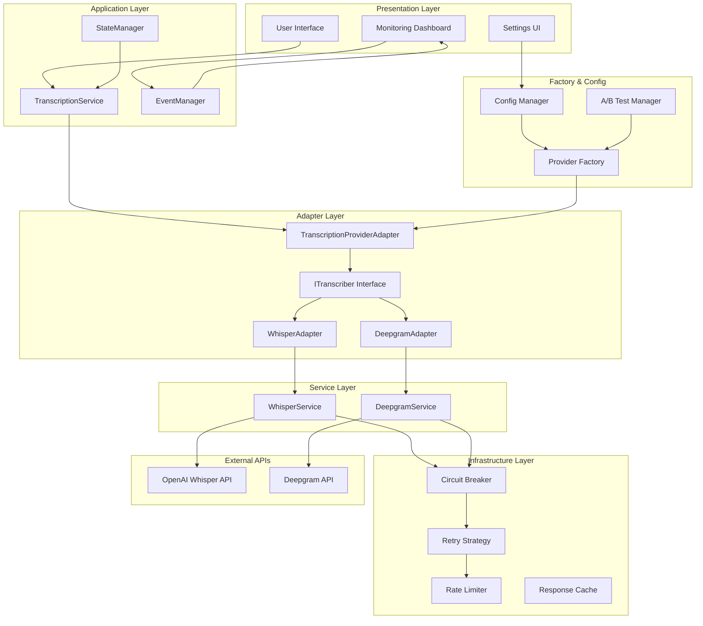
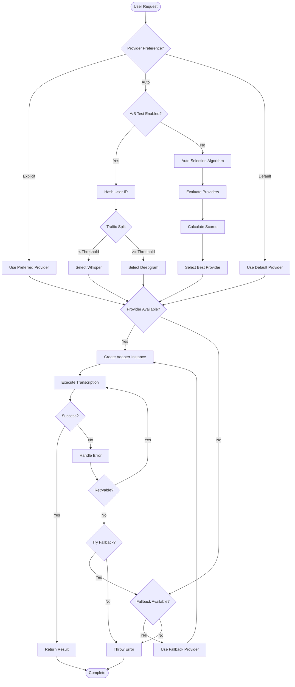
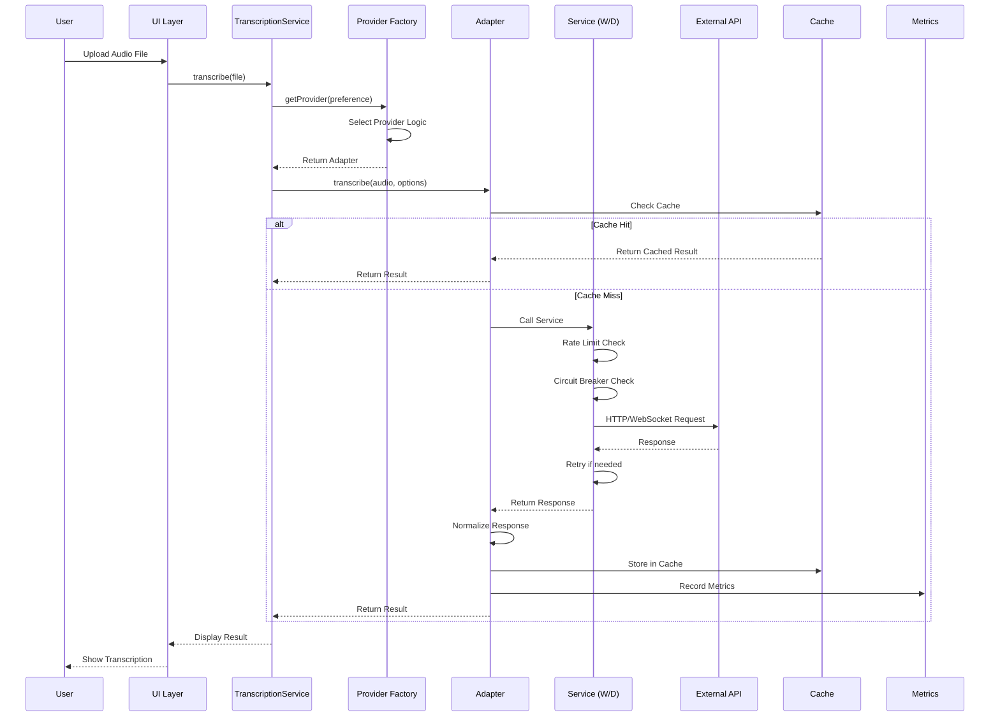
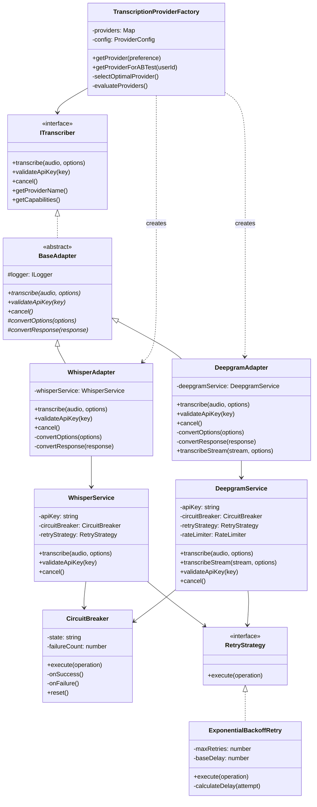
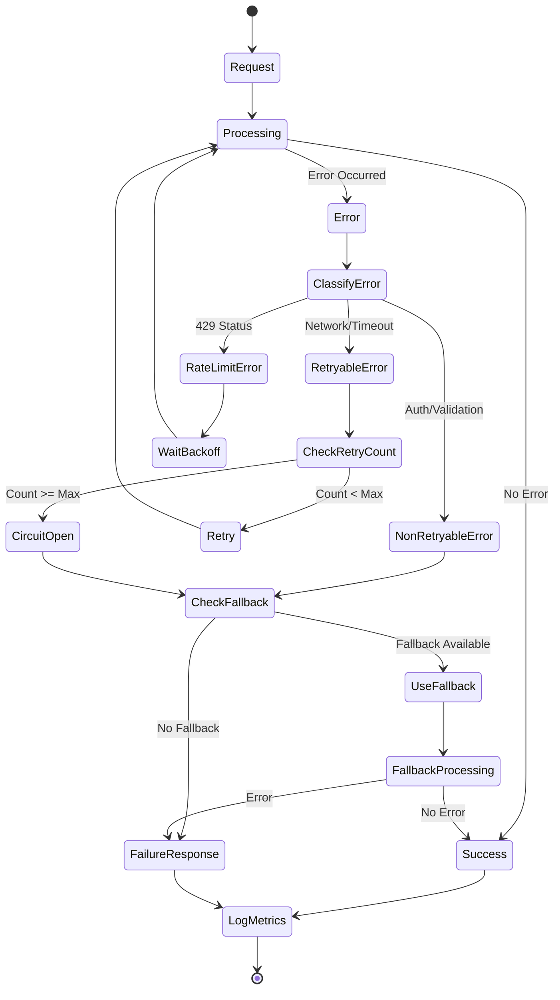
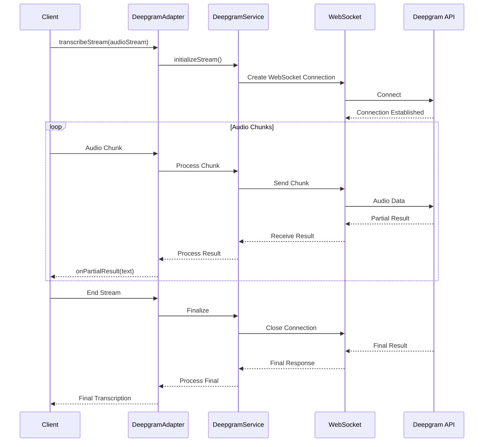
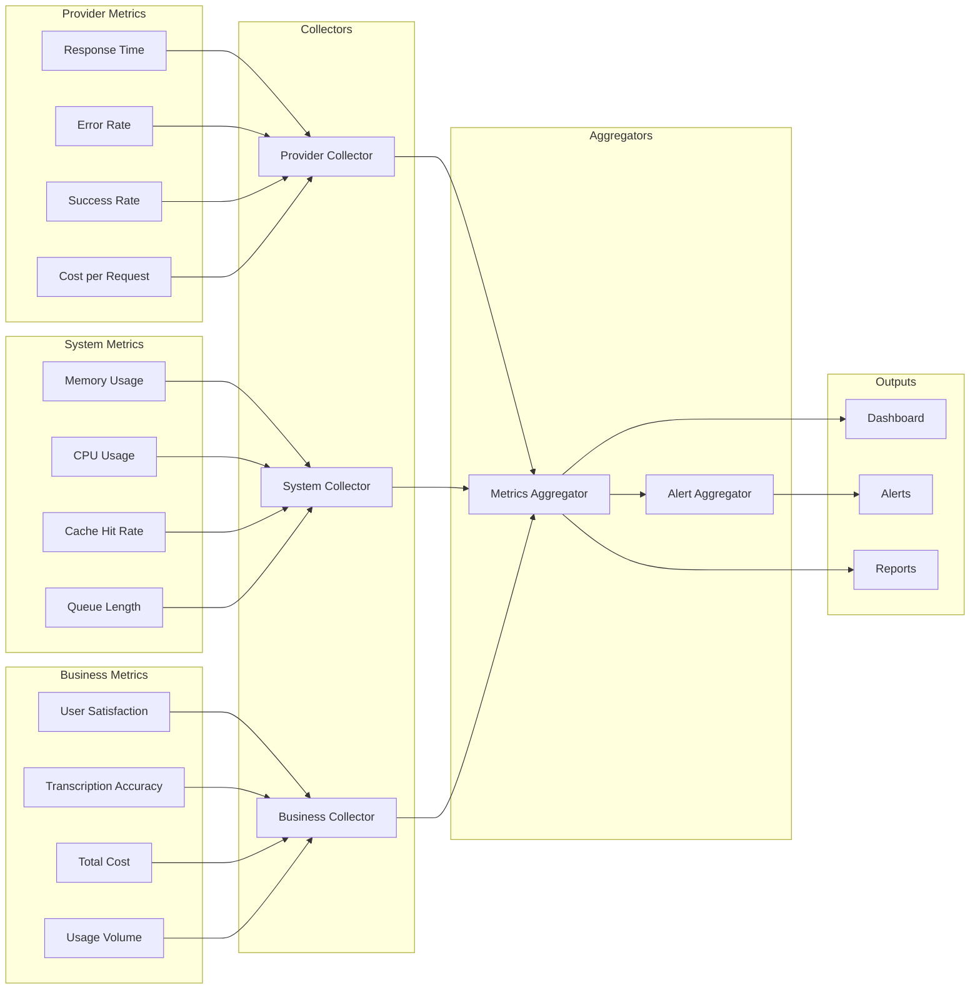
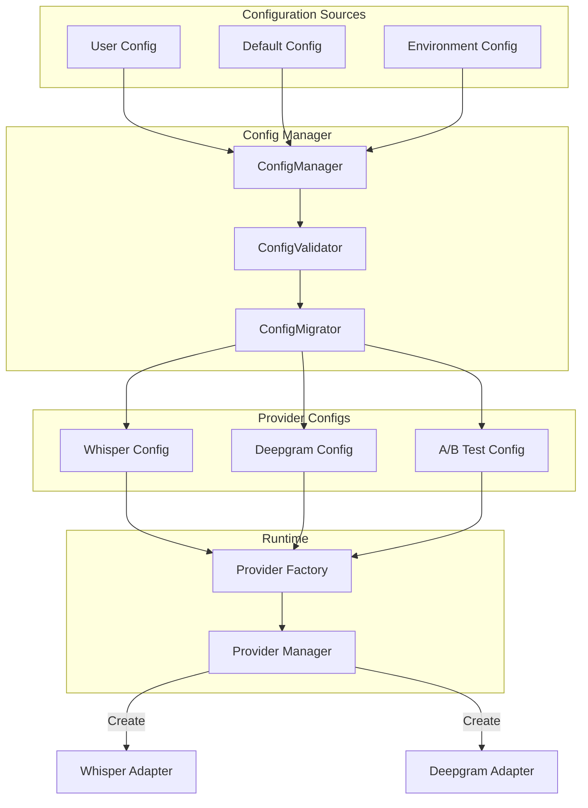
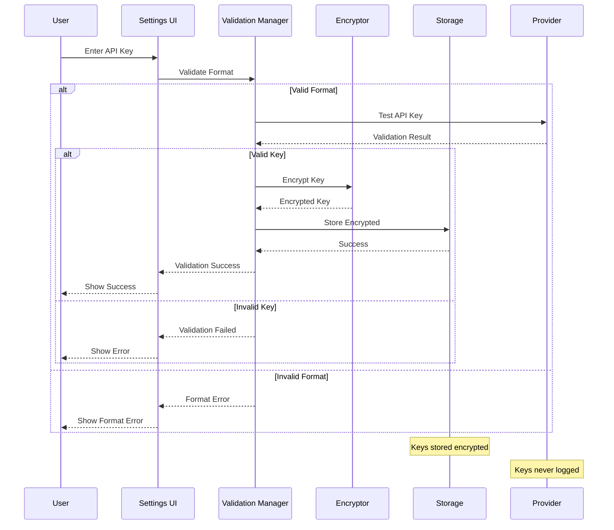

# 시스템 아키텍처 다이어그램

## 1. 전체 시스템 아키텍처



## 2. Provider 선택 플로우



## 3. 데이터 플로우 다이어그램



## 4. 클래스 다이어그램



## 5. 에러 처리 플로우



## 6. 마이그레이션 단계별 아키텍처 변화

### Phase 1: 현재 상태 (Whisper Only)
```
UI → TranscriptionService → WhisperService → Whisper API
```

### Phase 2: Adapter 도입
```
UI → TranscriptionService → ITranscriber → WhisperAdapter → WhisperService → Whisper API
```

### Phase 3: Deepgram 추가
```
UI → TranscriptionService → Factory → ITranscriber
                                    ├── WhisperAdapter → WhisperService → Whisper API
                                    └── DeepgramAdapter → DeepgramService → Deepgram API
```

### Phase 4: 완전 마이그레이션
```
UI → TranscriptionService → Factory → DeepgramAdapter → DeepgramService → Deepgram API
                                    └── (WhisperAdapter as Fallback)
```

## 7. 스트리밍 아키텍처 (Deepgram 전용)



## 8. 모니터링 및 메트릭 수집



## 9. 설정 관리 시스템



## 10. 보안 및 인증 플로우



이 다이어그램들은 Deepgram API 마이그레이션의 전체 시스템 아키텍처를 시각적으로 표현합니다. 각 다이어그램은 시스템의 다른 측면을 보여주며, 구현 시 참고할 수 있는 청사진 역할을 합니다.