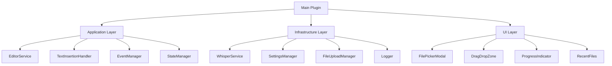

# 컴포넌트 가이드 (Component Guide)

## 목차
1. [개요](#개요)
2. [UI 컴포넌트](#ui-컴포넌트)
3. [서비스 컴포넌트](#서비스-컴포넌트)
4. [패턴 구현](#패턴-구현)
5. [통합 예제](#통합-예제)
6. [베스트 프랙티스](#베스트-프랙티스)

---

## 개요

이 문서는 Speech-to-Text 플러그인의 주요 컴포넌트들의 구조, 사용법, 통합 방법을 설명합니다.

### 컴포넌트 아키텍처



---

## UI 컴포넌트

### DragDropZone

파일 드래그 앤 드롭 기능을 제공하는 컴포넌트입니다.

#### 기본 사용법
```typescript
import { DragDropZone } from './ui/components/DragDropZone';

const dropZone = new DragDropZone(container, {
    onFileDrop: async (files) => {
        for (const file of files) {
            await processFile(file);
        }
    },
    acceptedFormats: ['.m4a', '.mp3', '.wav'],
    maxFileSize: 25 * 1024 * 1024
});

// 활성화/비활성화
dropZone.setEnabled(true);

// 정리
dropZone.destroy();
```

#### 주요 기능
- **파일 검증**: 형식과 크기 자동 검증
- **시각적 피드백**: 드래그 오버 시 하이라이트
- **다중 파일 지원**: 여러 파일 동시 처리
- **에러 처리**: 잘못된 파일 형식 알림

### FilePickerModal

파일 선택 모달 다이얼로그 컴포넌트입니다.

#### 기본 사용법
```typescript
import { FilePickerModal } from './ui/modals/FilePickerModal';

class AudioFilePickerModal extends FilePickerModal {
    constructor(app: App, onSelect: (file: TFile) => void) {
        super(app);
        this.onSelect = onSelect;
    }
    
    protected getItems(): TFile[] {
        return this.app.vault.getFiles()
            .filter(f => this.isAudioFile(f));
    }
    
    protected onChooseItem(file: TFile): void {
        this.onSelect(file);
    }
}

// 사용
const modal = new AudioFilePickerModal(app, async (file) => {
    await transcriptionService.transcribe(file);
});
modal.open();
```

#### 주요 기능
- **검색 기능**: 실시간 파일 검색
- **최근 파일**: 최근 사용한 파일 표시
- **파일 미리보기**: 파일 정보 표시
- **키보드 단축키**: Enter/Esc 지원

### ProgressIndicator

진행 상황을 표시하는 컴포넌트입니다.

#### 기본 사용법
```typescript
import { ProgressIndicator } from './ui/components/ProgressIndicator';

const progress = new ProgressIndicator();

// 진행 상황 업데이트
progress.update({
    percentage: 50,
    message: '파일 처리 중...',
    status: 'processing'
});

// 완료
progress.complete('변환 완료!');

// 에러
progress.error('변환 실패');

// 숨기기
progress.hide();
```

#### 상태 타입
```typescript
type ProgressStatus = 
    | 'idle'        // 대기
    | 'preparing'   // 준비 중
    | 'uploading'   // 업로드 중
    | 'processing'  // 처리 중
    | 'completed'   // 완료
    | 'error';      // 에러
```

### RecentFiles

최근 사용한 파일 목록을 관리하는 컴포넌트입니다.

#### 기본 사용법
```typescript
import { RecentFiles } from './ui/components/RecentFiles';

const recentFiles = new RecentFiles(maxItems = 10);

// 파일 추가
recentFiles.add(file);

// 목록 가져오기
const files = recentFiles.getAll();

// 특정 파일 제거
recentFiles.remove(file.path);

// 전체 초기화
recentFiles.clear();
```

---

## 서비스 컴포넌트

### WhisperService

OpenAI Whisper API와 통신하는 핵심 서비스입니다.

#### 초기화 및 설정
```typescript
import { WhisperService } from './infrastructure/api/WhisperService';
import { Logger } from './infrastructure/logging/Logger';

const logger = new Logger('WhisperService');
const whisperService = new WhisperService(apiKey, logger);
```

#### 음성 변환
```typescript
// 기본 변환
const response = await whisperService.transcribe(audioBuffer);

// 옵션과 함께 변환
const response = await whisperService.transcribe(audioBuffer, {
    language: 'ko',
    prompt: '이전 대화 컨텍스트...',
    temperature: 0.2,
    responseFormat: 'verbose_json'
});

// 세그먼트 정보 포함
if (response.segments) {
    response.segments.forEach(segment => {
        console.log(`[${segment.start}-${segment.end}] ${segment.text}`);
    });
}
```

#### 에러 처리
```typescript
try {
    const response = await whisperService.transcribe(audioBuffer);
} catch (error) {
    if (error instanceof AuthenticationError) {
        // API 키 문제
        await settingsManager.setApiKey('');
    } else if (error instanceof RateLimitError) {
        // 재시도 로직
        setTimeout(() => retry(), error.retryAfter * 1000);
    } else if (error instanceof FileTooLargeError) {
        // 파일 압축 필요
        const compressed = await compressAudio(audioBuffer);
        await whisperService.transcribe(compressed);
    }
}
```

### SettingsManager

플러그인 설정을 관리하는 서비스입니다.

#### 설정 로드 및 저장
```typescript
import { SettingsManager } from './infrastructure/storage/SettingsManager';

const settingsManager = new SettingsManager(plugin, logger);

// 설정 로드
const settings = await settingsManager.load();

// 개별 설정 값 가져오기
const language = settingsManager.get('language');
const autoInsert = settingsManager.get('autoInsert');

// 설정 업데이트
await settingsManager.set('language', 'ko');
await settingsManager.set('temperature', 0.3);

// 전체 설정 저장
await settingsManager.save({
    ...settings,
    language: 'en'
});
```

#### API 키 관리
```typescript
// API 키 설정 (자동 암호화)
const success = await settingsManager.setApiKey('sk-...');

// API 키 가져오기 (복호화됨)
const apiKey = settingsManager.getApiKey();

// 마스킹된 API 키 표시
const masked = settingsManager.getMaskedApiKey();
console.log(masked); // "sk-XXXXX...XXXX"
```

### FileUploadManager

대용량 파일 처리 및 업로드를 관리합니다.

#### 파일 처리
```typescript
import { FileUploadManager } from './infrastructure/api/FileUploadManager';

const uploadManager = new FileUploadManager(vault, logger);

// 진행 상황 콜백과 함께 파일 처리
const processed = await uploadManager.prepareAudioFile(file, (progress) => {
    console.log(`${progress.percentage}% - ${progress.message}`);
    progressIndicator.update(progress);
});

console.log(`원본: ${processed.originalSize}, 처리 후: ${processed.processedSize}`);
```

#### 청크 업로드
```typescript
// 대용량 파일을 청크로 나누어 업로드
for await (const chunk of uploadManager.uploadInChunks(buffer)) {
    await sendChunkToServer(chunk);
}

// 취소 기능
uploadManager.cancel();
```

### EditorService

Obsidian 에디터와의 통합을 담당합니다.

#### 텍스트 삽입
```typescript
import { EditorService } from './application/EditorService';

const editorService = new EditorService(app, eventManager, logger);

// 커서 위치에 삽입
await editorService.insertAtCursor("변환된 텍스트");

// 선택 영역 대체
await editorService.replaceSelection("새로운 텍스트");

// 문서 끝에 추가
await editorService.appendToDocument("\n\n## 추가 내용");

// 특정 위치에 삽입
const position = { line: 10, ch: 0 };
await editorService.insertAtPosition("삽입할 텍스트", position);
```

#### Undo/Redo 지원
```typescript
// 작업 실행 (자동으로 히스토리에 기록)
await editorService.insertAtCursor("텍스트", true);

// Undo
await editorService.undo();

// Redo
await editorService.redo();

// 히스토리 초기화
editorService.clearHistory();
```

### TextInsertionHandler

텍스트 포맷팅과 삽입을 처리합니다.

#### 포맷팅 옵션
```typescript
import { TextInsertionHandler } from './application/TextInsertionHandler';

const insertionHandler = new TextInsertionHandler(
    editorService, 
    eventManager, 
    logger
);

// 인용구 형식으로 삽입
await insertionHandler.insertText("변환된 텍스트", {
    mode: 'cursor',
    format: 'quote',
    quoteAuthor: 'Speaker Name'
});

// 코드 블록으로 삽입
await insertionHandler.insertText("코드 내용", {
    mode: 'cursor',
    format: 'code',
    codeLanguage: 'javascript'
});

// 타임스탬프와 함께 삽입
await insertionHandler.insertText("텍스트", {
    mode: 'cursor',
    format: 'plain',
    addTimestamp: true,
    timestampFormat: 'YYYY-MM-DD HH:mm:ss'
});
```

#### 템플릿 사용
```typescript
// 템플릿 적용
await insertionHandler.insertText("내용", {
    mode: 'cursor',
    format: 'plain',
    template: '## {{date}} 회의록\n\n{{content}}\n\n---\n작성: {{time}}'
});
```

### EventManager

애플리케이션 전체의 이벤트를 관리합니다.

#### 이벤트 구독
```typescript
import { EventManager } from './application/EventManager';

const eventManager = new EventManager(logger);

// 이벤트 리스너 등록
const unsubscribe = eventManager.on('transcription:complete', (data) => {
    console.log(`변환 완료: ${data.text.substring(0, 50)}...`);
    
    if (data.autoInsert) {
        insertionHandler.insertText(data.text, insertOptions);
    }
});

// 일회성 리스너
eventManager.once('file:selected', (data) => {
    console.log(`파일 선택됨: ${data.file.path}`);
});

// 구독 해제
unsubscribe();
```

#### 고급 기능
```typescript
// 이벤트 디바운싱 (연속 호출 방지)
eventManager.debounce('settings:changed', 500, (data) => {
    saveSettings(data);
});

// 이벤트 쓰로틀링 (호출 빈도 제한)
eventManager.throttle('transcription:progress', 100, (data) => {
    updateProgressBar(data.progress);
});

// 이벤트 체인
eventManager.chain(
    'transcription:complete',
    'editor:text-inserted',
    (data) => ({ text: data.text, position: 'cursor' })
);

// 이벤트 필터링
eventManager.filter(
    'file:validated',
    (data) => data.valid === true,
    (data) => processValidFile(data.file)
);
```

---

## 패턴 구현

### Singleton Pattern

전역적으로 단일 인스턴스를 보장합니다.

```typescript
import { SingletonDecorator } from './patterns/Singleton';

@SingletonDecorator
class GlobalStateManager {
    private state: AppState;
    
    getState(): AppState {
        return this.state;
    }
}

// 어디서든 동일한 인스턴스
const manager1 = new GlobalStateManager();
const manager2 = new GlobalStateManager();
console.log(manager1 === manager2); // true
```

### Observer Pattern

이벤트 기반 통신을 구현합니다.

```typescript
import { EventEmitter } from './patterns/Observer';

interface CustomEvents {
    'data:updated': { id: string; value: any };
    'error:occurred': { error: Error };
}

class DataService extends EventEmitter<CustomEvents> {
    updateData(id: string, value: any) {
        // 데이터 업데이트
        this.emit('data:updated', { id, value });
    }
}
```

### Factory Pattern

객체 생성을 추상화합니다.

```typescript
import { ServiceFactory } from './patterns/Factory';

const factory = new ServiceFactory();

// 서비스 등록
factory.register('whisper', () => new WhisperService(apiKey, logger));
factory.register('settings', () => new SettingsManager(plugin));

// 서비스 생성
const whisperService = factory.create('whisper');
const settingsManager = factory.create('settings');
```

---

## 통합 예제

### 완전한 음성 변환 플로우

```typescript
class SpeechToTextWorkflow {
    constructor(
        private whisperService: WhisperService,
        private uploadManager: FileUploadManager,
        private editorService: EditorService,
        private insertionHandler: TextInsertionHandler,
        private eventManager: EventManager,
        private logger: Logger
    ) {}
    
    async processAudioFile(file: TFile): Promise<void> {
        try {
            // 1. 시작 이벤트 발생
            this.eventManager.emit('transcription:start', {
                fileName: file.name,
                fileSize: file.stat.size
            });
            
            // 2. 파일 준비 및 검증
            const processed = await this.uploadManager.prepareAudioFile(
                file,
                (progress) => {
                    this.eventManager.emit('transcription:progress', {
                        progress: progress.percentage * 0.3, // 0-30%
                        message: progress.message
                    });
                }
            );
            
            // 3. API 호출
            this.eventManager.emit('transcription:progress', {
                progress: 30,
                message: 'Transcribing audio...'
            });
            
            const response = await this.whisperService.transcribe(
                processed.buffer,
                {
                    language: this.settings.language,
                    responseFormat: 'verbose_json'
                }
            );
            
            // 4. 텍스트 포맷팅 및 삽입
            this.eventManager.emit('transcription:progress', {
                progress: 90,
                message: 'Formatting text...'
            });
            
            await this.insertionHandler.insertText(response.text, {
                mode: this.settings.insertPosition,
                format: 'plain',
                addTimestamp: this.settings.timestampFormat !== 'none',
                language: response.language
            });
            
            // 5. 완료 이벤트
            this.eventManager.emit('transcription:complete', {
                text: response.text,
                duration: processed.metadata.duration || 0
            });
            
            // 6. 성공 알림
            new Notice(`Transcription complete! (${response.language})`);
            
        } catch (error) {
            // 에러 처리
            this.eventManager.emit('transcription:error', {
                error: error as Error,
                fileName: file.name
            });
            
            this.logger.error('Transcription failed', error as Error);
            new Notice(`Failed: ${(error as Error).message}`);
        }
    }
}
```

### 설정 UI 통합

```typescript
class SettingsTab extends PluginSettingTab {
    constructor(
        app: App,
        plugin: Plugin,
        private settingsManager: SettingsManager,
        private whisperService: WhisperService
    ) {
        super(app, plugin);
    }
    
    display(): void {
        const { containerEl } = this;
        containerEl.empty();
        
        // API 키 설정
        new Setting(containerEl)
            .setName('OpenAI API Key')
            .setDesc('Your OpenAI API key for Whisper')
            .addText(text => text
                .setPlaceholder('sk-...')
                .setValue(this.settingsManager.getMaskedApiKey())
                .onChange(async (value) => {
                    if (value && !value.includes('*')) {
                        const isValid = await this.whisperService.validateApiKey(value);
                        if (isValid) {
                            await this.settingsManager.setApiKey(value);
                            new Notice('API key validated and saved');
                        } else {
                            new Notice('Invalid API key');
                        }
                    }
                })
            );
        
        // 언어 설정
        new Setting(containerEl)
            .setName('Language')
            .setDesc('Transcription language')
            .addDropdown(dropdown => dropdown
                .addOptions({
                    'auto': 'Auto-detect',
                    'ko': 'Korean',
                    'en': 'English',
                    'ja': 'Japanese',
                    'zh': 'Chinese'
                })
                .setValue(this.settingsManager.get('language'))
                .onChange(async (value) => {
                    await this.settingsManager.set('language', value);
                })
            );
    }
}
```

---

## 베스트 프랙티스

### 1. 에러 처리

항상 try-catch로 에러를 처리하고 사용자에게 적절한 피드백을 제공하세요.

```typescript
try {
    await riskyOperation();
} catch (error) {
    // 로깅
    logger.error('Operation failed', error);
    
    // 사용자 알림
    new Notice(errorHandler.getUserMessage(error));
    
    // 이벤트 발생
    eventManager.emit('error:occurred', { error });
    
    // 복구 가능한 경우 재시도
    if (errorHandler.isRetryable(error)) {
        await retry(riskyOperation);
    }
}
```

### 2. 리소스 정리

컴포넌트 사용 후 항상 정리하세요.

```typescript
class MyComponent {
    private subscriptions: Unsubscribe[] = [];
    
    initialize() {
        // 이벤트 구독
        this.subscriptions.push(
            eventManager.on('event', this.handleEvent)
        );
    }
    
    destroy() {
        // 모든 구독 해제
        this.subscriptions.forEach(unsub => unsub());
        
        // 리소스 정리
        this.uploadManager?.cleanup();
        this.whisperService?.cancel();
    }
}
```

### 3. 비동기 작업 관리

```typescript
class AsyncOperationManager {
    private operations = new Set<Promise<any>>();
    
    async execute<T>(operation: () => Promise<T>): Promise<T> {
        const promise = operation();
        this.operations.add(promise);
        
        try {
            const result = await promise;
            return result;
        } finally {
            this.operations.delete(promise);
        }
    }
    
    async cancelAll() {
        await Promise.allSettled(this.operations);
        this.operations.clear();
    }
}
```

### 4. 타입 안전성

TypeScript의 타입 시스템을 최대한 활용하세요.

```typescript
// 타입 가드 사용
function isWhisperResponse(obj: any): obj is WhisperResponse {
    return obj && typeof obj.text === 'string';
}

// 제네릭 활용
function createService<T extends IService>(
    ServiceClass: new (...args: any[]) => T,
    ...args: any[]
): T {
    return new ServiceClass(...args);
}

// 유틸리티 타입
type DeepPartial<T> = {
    [P in keyof T]?: T[P] extends object ? DeepPartial<T[P]> : T[P];
};
```

### 5. 성능 최적화

```typescript
// 디바운싱
const debouncedSave = debounce(saveSettings, 500);

// 메모이제이션
const memoizedExpensiveOperation = memoize(expensiveOperation);

// 레이지 로딩
const LazyService = lazy(() => import('./HeavyService'));
```

---

## 컴포넌트 생명주기

### 초기화 순서

1. **Logger 초기화**: 로깅 시스템 설정
2. **EventManager 생성**: 이벤트 시스템 준비
3. **Settings 로드**: 설정 불러오기
4. **Services 초기화**: 각 서비스 인스턴스 생성
5. **UI 컴포넌트 생성**: UI 요소 초기화
6. **이벤트 리스너 등록**: 이벤트 구독 설정

### 종료 순서

1. **진행 중인 작업 취소**: 모든 비동기 작업 중단
2. **이벤트 리스너 해제**: 구독 정리
3. **UI 컴포넌트 정리**: DOM 요소 제거
4. **서비스 정리**: 리소스 해제
5. **설정 저장**: 마지막 상태 저장
6. **Logger 종료**: 로그 플러시

---

## 디버깅 도구

### 개발 모드 활성화

```typescript
// 개발 환경에서만 디버그 모드 활성화
if (process.env.NODE_ENV === 'development') {
    eventManager.setDebugMode(true);
    logger.setLevel(LogLevel.DEBUG);
    
    // 전역 디버그 객체
    window.speechToTextDebug = {
        services: {
            whisper: whisperService,
            settings: settingsManager,
            editor: editorService
        },
        eventManager,
        logger
    };
}
```

### 이벤트 모니터링

```typescript
// 모든 이벤트 로깅
const events = [
    'transcription:start',
    'transcription:progress',
    'transcription:complete',
    'transcription:error'
];

events.forEach(event => {
    eventManager.on(event as any, (data) => {
        console.log(`[Event] ${event}:`, data);
    });
});

// 통계 확인
console.log('Event Stats:', eventManager.getStats());
console.log('Event History:', eventManager.getHistory());
```

---

*최종 업데이트: 2025-08-22*  
*버전: 1.0.0*