# Phase 3 구현 시퀀스 다이어그램

## 1. 설정 관리 시퀀스

### 1.1 API 키 설정 및 검증

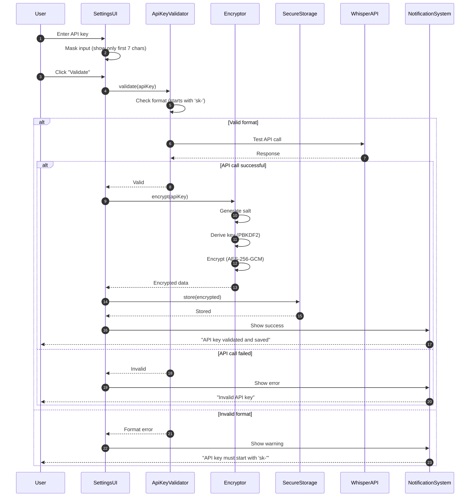
```mermaid
sequenceDiagram
    autonumber
    
    participant User
    participant SettingsUI
    participant ApiKeyValidator
    participant Encryptor
    participant SecureStorage
    participant WhisperAPI
    participant NotificationSystem
    
    User->>SettingsUI: Enter API key
    SettingsUI->>SettingsUI: Mask input (show only first 7 chars)
    
    User->>SettingsUI: Click "Validate"
    SettingsUI->>ApiKeyValidator: validate(apiKey)
    
    ApiKeyValidator->>ApiKeyValidator: Check format (starts with 'sk-')
    
    alt Valid format
        ApiKeyValidator->>WhisperAPI: Test API call
        WhisperAPI-->>ApiKeyValidator: Response
        
        alt API call successful
            ApiKeyValidator-->>SettingsUI: Valid
            SettingsUI->>Encryptor: encrypt(apiKey)
            Encryptor->>Encryptor: Generate salt
            Encryptor->>Encryptor: Derive key (PBKDF2)
            Encryptor->>Encryptor: Encrypt (AES-256-GCM)
            Encryptor-->>SettingsUI: Encrypted data
            
            SettingsUI->>SecureStorage: store(encrypted)
            SecureStorage-->>SettingsUI: Stored
            
            SettingsUI->>NotificationSystem: Show success
            NotificationSystem-->>User: "API key validated and saved"
            
        else API call failed
            ApiKeyValidator-->>SettingsUI: Invalid
            SettingsUI->>NotificationSystem: Show error
            NotificationSystem-->>User: "Invalid API key"
        end
        
    else Invalid format
        ApiKeyValidator-->>SettingsUI: Format error
        SettingsUI->>NotificationSystem: Show warning
        NotificationSystem-->>User: "API key must start with 'sk-'"
    end
```

### 1.2 설정 내보내기/가져오기

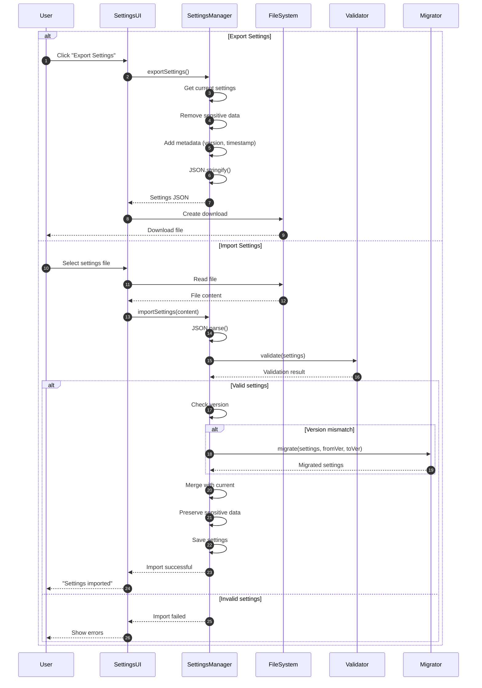
```mermaid
sequenceDiagram
    autonumber
    
    participant User
    participant SettingsUI
    participant SettingsManager
    participant FileSystem
    participant Validator
    participant Migrator
    
    alt Export Settings
        User->>SettingsUI: Click "Export Settings"
        SettingsUI->>SettingsManager: exportSettings()
        
        SettingsManager->>SettingsManager: Get current settings
        SettingsManager->>SettingsManager: Remove sensitive data
        SettingsManager->>SettingsManager: Add metadata (version, timestamp)
        SettingsManager->>SettingsManager: JSON.stringify()
        
        SettingsManager-->>SettingsUI: Settings JSON
        SettingsUI->>FileSystem: Create download
        FileSystem-->>User: Download file
        
    else Import Settings
        User->>SettingsUI: Select settings file
        SettingsUI->>FileSystem: Read file
        FileSystem-->>SettingsUI: File content
        
        SettingsUI->>SettingsManager: importSettings(content)
        SettingsManager->>SettingsManager: JSON.parse()
        
        SettingsManager->>Validator: validate(settings)
        Validator-->>SettingsManager: Validation result
        
        alt Valid settings
            SettingsManager->>SettingsManager: Check version
            
            alt Version mismatch
                SettingsManager->>Migrator: migrate(settings, fromVer, toVer)
                Migrator-->>SettingsManager: Migrated settings
            end
            
            SettingsManager->>SettingsManager: Merge with current
            SettingsManager->>SettingsManager: Preserve sensitive data
            SettingsManager->>SettingsManager: Save settings
            
            SettingsManager-->>SettingsUI: Import successful
            SettingsUI-->>User: "Settings imported"
            
        else Invalid settings
            SettingsManager-->>SettingsUI: Import failed
            SettingsUI-->>User: Show errors
        end
    end
```

## 2. 진행 상태 추적 시퀀스

### 2.1 비동기 작업 실행 및 진행률 표시

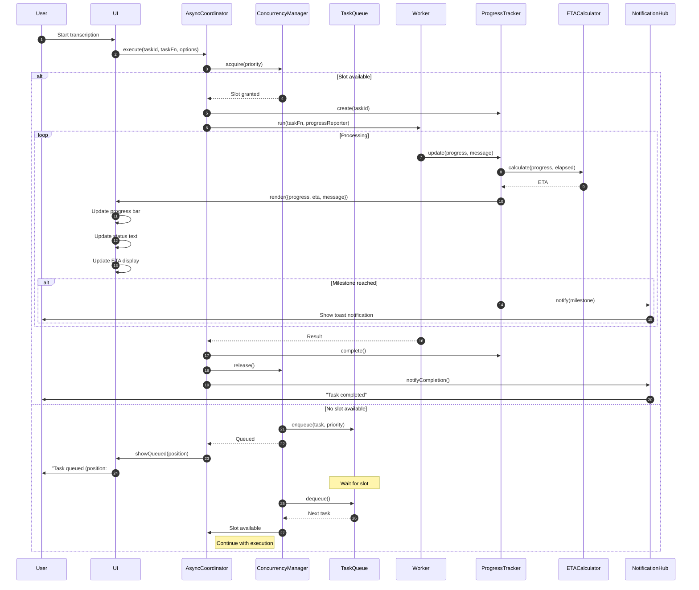
```mermaid
sequenceDiagram
    autonumber
    
    participant User
    participant UI
    participant AsyncCoordinator
    participant ConcurrencyManager
    participant TaskQueue
    participant Worker
    participant ProgressTracker
    participant ETACalculator
    participant NotificationHub
    
    User->>UI: Start transcription
    UI->>AsyncCoordinator: execute(taskId, taskFn, options)
    
    AsyncCoordinator->>ConcurrencyManager: acquire(priority)
    
    alt Slot available
        ConcurrencyManager-->>AsyncCoordinator: Slot granted
        AsyncCoordinator->>ProgressTracker: create(taskId)
        AsyncCoordinator->>Worker: run(taskFn, progressReporter)
        
        loop Processing
            Worker->>ProgressTracker: update(progress, message)
            ProgressTracker->>ETACalculator: calculate(progress, elapsed)
            ETACalculator-->>ProgressTracker: ETA
            
            ProgressTracker->>UI: render({progress, eta, message})
            UI->>UI: Update progress bar
            UI->>UI: Update status text
            UI->>UI: Update ETA display
            
            alt Milestone reached
                ProgressTracker->>NotificationHub: notify(milestone)
                NotificationHub->>User: Show toast notification
            end
        end
        
        Worker-->>AsyncCoordinator: Result
        AsyncCoordinator->>ProgressTracker: complete()
        AsyncCoordinator->>ConcurrencyManager: release()
        AsyncCoordinator->>NotificationHub: notifyCompletion()
        NotificationHub->>User: "Task completed"
        
    else No slot available
        ConcurrencyManager->>TaskQueue: enqueue(task, priority)
        ConcurrencyManager-->>AsyncCoordinator: Queued
        AsyncCoordinator->>UI: showQueued(position)
        UI->>User: "Task queued (position: #3)"
        
        Note over TaskQueue: Wait for slot
        
        ConcurrencyManager->>TaskQueue: dequeue()
        TaskQueue-->>ConcurrencyManager: Next task
        ConcurrencyManager->>AsyncCoordinator: Slot available
        Note right of AsyncCoordinator: Continue with execution
    end
```

### 2.2 작업 취소 처리

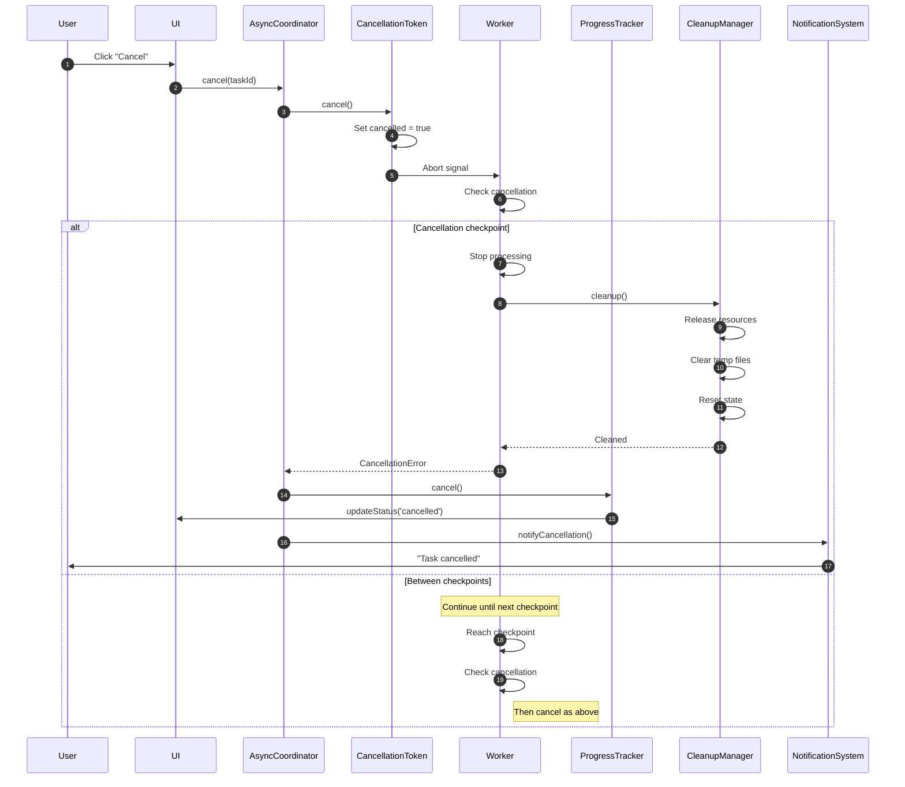
```mermaid
sequenceDiagram
    autonumber
    
    participant User
    participant UI
    participant AsyncCoordinator
    participant CancellationToken
    participant Worker
    participant ProgressTracker
    participant CleanupManager
    participant NotificationSystem
    
    User->>UI: Click "Cancel"
    UI->>AsyncCoordinator: cancel(taskId)
    
    AsyncCoordinator->>CancellationToken: cancel()
    CancellationToken->>CancellationToken: Set cancelled = true
    CancellationToken->>Worker: Abort signal
    
    Worker->>Worker: Check cancellation
    
    alt Cancellation checkpoint
        Worker->>Worker: Stop processing
        Worker->>CleanupManager: cleanup()
        
        CleanupManager->>CleanupManager: Release resources
        CleanupManager->>CleanupManager: Clear temp files
        CleanupManager->>CleanupManager: Reset state
        CleanupManager-->>Worker: Cleaned
        
        Worker-->>AsyncCoordinator: CancellationError
        AsyncCoordinator->>ProgressTracker: cancel()
        ProgressTracker->>UI: updateStatus('cancelled')
        
        AsyncCoordinator->>NotificationSystem: notifyCancellation()
        NotificationSystem->>User: "Task cancelled"
        
    else Between checkpoints
        Note over Worker: Continue until next checkpoint
        Worker->>Worker: Reach checkpoint
        Worker->>Worker: Check cancellation
        Note right of Worker: Then cancel as above
    end
```

## 3. 알림 시스템 시퀀스

### 3.1 멀티채널 알림 전송

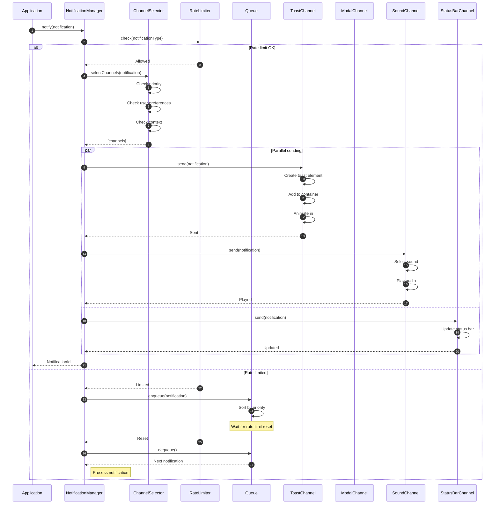
```mermaid
sequenceDiagram
    autonumber
    
    participant Application
    participant NotificationManager
    participant ChannelSelector
    participant RateLimiter
    participant Queue
    participant ToastChannel
    participant ModalChannel
    participant SoundChannel
    participant StatusBarChannel
    
    Application->>NotificationManager: notify(notification)
    
    NotificationManager->>RateLimiter: check(notificationType)
    
    alt Rate limit OK
        RateLimiter-->>NotificationManager: Allowed
        
        NotificationManager->>ChannelSelector: selectChannels(notification)
        ChannelSelector->>ChannelSelector: Check priority
        ChannelSelector->>ChannelSelector: Check user preferences
        ChannelSelector->>ChannelSelector: Check context
        ChannelSelector-->>NotificationManager: [channels]
        
        par Parallel sending
            NotificationManager->>ToastChannel: send(notification)
            ToastChannel->>ToastChannel: Create toast element
            ToastChannel->>ToastChannel: Add to container
            ToastChannel->>ToastChannel: Animate in
            ToastChannel-->>NotificationManager: Sent
            
        and
            NotificationManager->>SoundChannel: send(notification)
            SoundChannel->>SoundChannel: Select sound
            SoundChannel->>SoundChannel: Play audio
            SoundChannel-->>NotificationManager: Played
            
        and
            NotificationManager->>StatusBarChannel: send(notification)
            StatusBarChannel->>StatusBarChannel: Update status bar
            StatusBarChannel-->>NotificationManager: Updated
        end
        
        NotificationManager-->>Application: NotificationId
        
    else Rate limited
        RateLimiter-->>NotificationManager: Limited
        NotificationManager->>Queue: enqueue(notification)
        Queue->>Queue: Sort by priority
        
        Note over Queue: Wait for rate limit reset
        
        RateLimiter->>NotificationManager: Reset
        NotificationManager->>Queue: dequeue()
        Queue-->>NotificationManager: Next notification
        Note right of NotificationManager: Process notification
    end
```

### 3.2 진행률 알림 업데이트

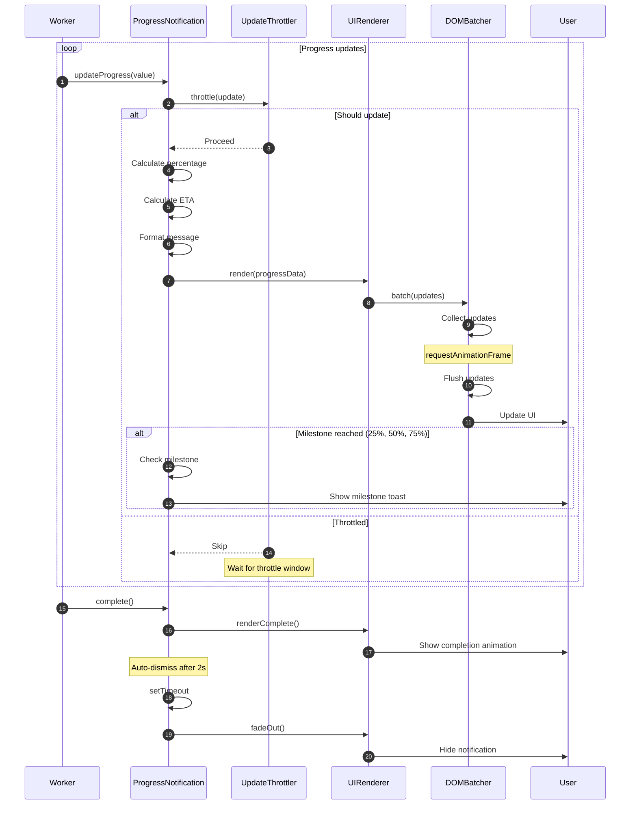
```mermaid
sequenceDiagram
    autonumber
    
    participant Worker
    participant ProgressNotification
    participant UpdateThrottler
    participant UIRenderer
    participant DOMBatcher
    participant User
    
    loop Progress updates
        Worker->>ProgressNotification: updateProgress(value)
        
        ProgressNotification->>UpdateThrottler: throttle(update)
        
        alt Should update
            UpdateThrottler-->>ProgressNotification: Proceed
            
            ProgressNotification->>ProgressNotification: Calculate percentage
            ProgressNotification->>ProgressNotification: Calculate ETA
            ProgressNotification->>ProgressNotification: Format message
            
            ProgressNotification->>UIRenderer: render(progressData)
            
            UIRenderer->>DOMBatcher: batch(updates)
            DOMBatcher->>DOMBatcher: Collect updates
            
            Note over DOMBatcher: requestAnimationFrame
            
            DOMBatcher->>DOMBatcher: Flush updates
            DOMBatcher->>User: Update UI
            
            alt Milestone reached (25%, 50%, 75%)
                ProgressNotification->>ProgressNotification: Check milestone
                ProgressNotification->>User: Show milestone toast
            end
            
        else Throttled
            UpdateThrottler-->>ProgressNotification: Skip
            Note over UpdateThrottler: Wait for throttle window
        end
    end
    
    Worker->>ProgressNotification: complete()
    ProgressNotification->>UIRenderer: renderComplete()
    UIRenderer->>User: Show completion animation
    
    Note over ProgressNotification: Auto-dismiss after 2s
    
    ProgressNotification->>ProgressNotification: setTimeout
    ProgressNotification->>UIRenderer: fadeOut()
    UIRenderer->>User: Hide notification
```

## 4. 메모리 관리 시퀀스

### 4.1 자동 리소스 정리

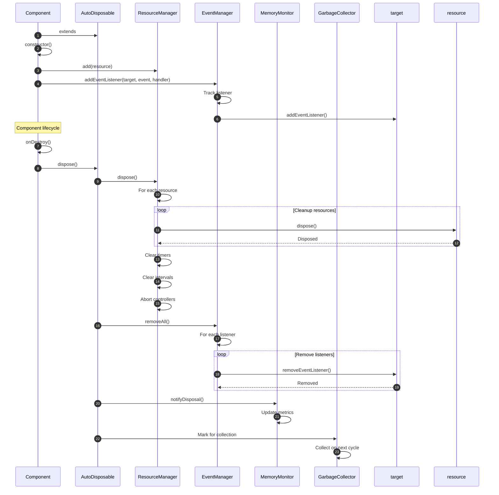
```mermaid
sequenceDiagram
    autonumber
    
    participant Component
    participant AutoDisposable
    participant ResourceManager
    participant EventManager
    participant MemoryMonitor
    participant GarbageCollector
    
    Component->>AutoDisposable: extends
    Component->>Component: constructor()
    
    Component->>ResourceManager: add(resource)
    Component->>EventManager: addEventListener(target, event, handler)
    
    EventManager->>EventManager: Track listener
    EventManager->>target: addEventListener()
    
    Note over Component: Component lifecycle
    
    Component->>Component: onDestroy()
    Component->>AutoDisposable: dispose()
    
    AutoDisposable->>ResourceManager: dispose()
    
    ResourceManager->>ResourceManager: For each resource
    loop Cleanup resources
        ResourceManager->>resource: dispose()
        resource-->>ResourceManager: Disposed
    end
    
    ResourceManager->>ResourceManager: Clear timers
    ResourceManager->>ResourceManager: Clear intervals
    ResourceManager->>ResourceManager: Abort controllers
    
    AutoDisposable->>EventManager: removeAll()
    
    EventManager->>EventManager: For each listener
    loop Remove listeners
        EventManager->>target: removeEventListener()
        target-->>EventManager: Removed
    end
    
    AutoDisposable->>MemoryMonitor: notifyDisposal()
    MemoryMonitor->>MemoryMonitor: Update metrics
    
    AutoDisposable->>GarbageCollector: Mark for collection
    GarbageCollector->>GarbageCollector: Collect on next cycle
```

### 4.2 메모리 누수 방지

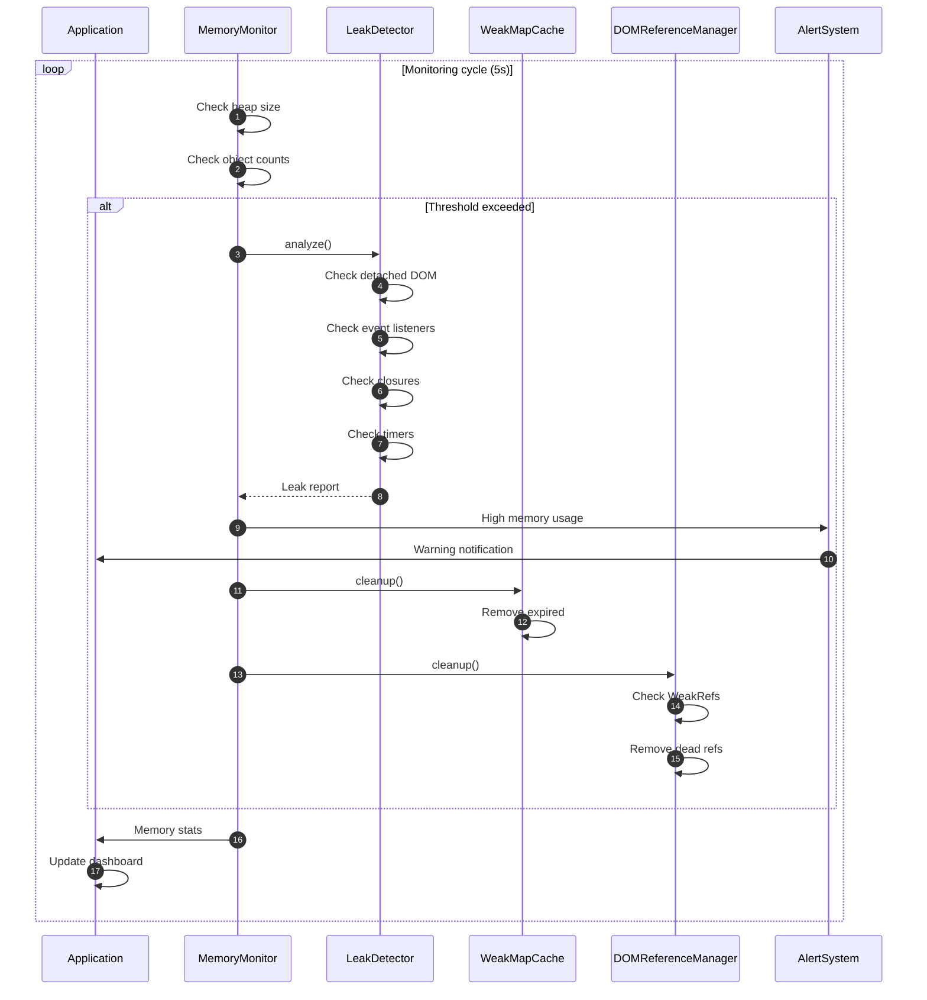
```mermaid
sequenceDiagram
    autonumber
    
    participant Application
    participant MemoryMonitor
    participant LeakDetector
    participant WeakMapCache
    participant DOMReferenceManager
    participant AlertSystem
    
    loop Monitoring cycle (5s)
        MemoryMonitor->>MemoryMonitor: Check heap size
        MemoryMonitor->>MemoryMonitor: Check object counts
        
        alt Threshold exceeded
            MemoryMonitor->>LeakDetector: analyze()
            
            LeakDetector->>LeakDetector: Check detached DOM
            LeakDetector->>LeakDetector: Check event listeners
            LeakDetector->>LeakDetector: Check closures
            LeakDetector->>LeakDetector: Check timers
            
            LeakDetector-->>MemoryMonitor: Leak report
            
            MemoryMonitor->>AlertSystem: High memory usage
            AlertSystem->>Application: Warning notification
            
            MemoryMonitor->>WeakMapCache: cleanup()
            WeakMapCache->>WeakMapCache: Remove expired
            
            MemoryMonitor->>DOMReferenceManager: cleanup()
            DOMReferenceManager->>DOMReferenceManager: Check WeakRefs
            DOMReferenceManager->>DOMReferenceManager: Remove dead refs
        end
        
        MemoryMonitor->>Application: Memory stats
        Application->>Application: Update dashboard
    end
```

## 5. 에러 처리 시퀀스

### 5.1 에러 복구 메커니즘

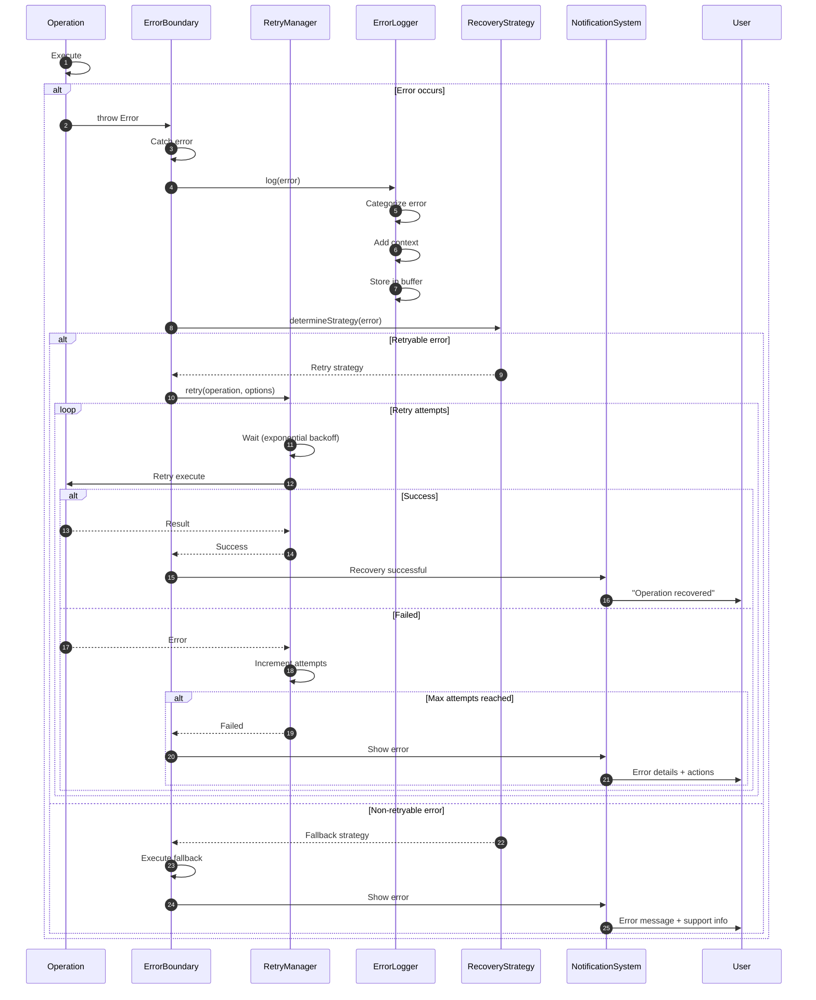
```mermaid
sequenceDiagram
    autonumber
    
    participant Operation
    participant ErrorBoundary
    participant RetryManager
    participant ErrorLogger
    participant RecoveryStrategy
    participant NotificationSystem
    participant User
    
    Operation->>Operation: Execute
    
    alt Error occurs
        Operation->>ErrorBoundary: throw Error
        
        ErrorBoundary->>ErrorBoundary: Catch error
        ErrorBoundary->>ErrorLogger: log(error)
        
        ErrorLogger->>ErrorLogger: Categorize error
        ErrorLogger->>ErrorLogger: Add context
        ErrorLogger->>ErrorLogger: Store in buffer
        
        ErrorBoundary->>RecoveryStrategy: determineStrategy(error)
        
        alt Retryable error
            RecoveryStrategy-->>ErrorBoundary: Retry strategy
            
            ErrorBoundary->>RetryManager: retry(operation, options)
            
            loop Retry attempts
                RetryManager->>RetryManager: Wait (exponential backoff)
                RetryManager->>Operation: Retry execute
                
                alt Success
                    Operation-->>RetryManager: Result
                    RetryManager-->>ErrorBoundary: Success
                    ErrorBoundary->>NotificationSystem: Recovery successful
                    NotificationSystem->>User: "Operation recovered"
                    
                else Failed
                    Operation-->>RetryManager: Error
                    RetryManager->>RetryManager: Increment attempts
                    
                    alt Max attempts reached
                        RetryManager-->>ErrorBoundary: Failed
                        ErrorBoundary->>NotificationSystem: Show error
                        NotificationSystem->>User: Error details + actions
                    end
                end
            end
            
        else Non-retryable error
            RecoveryStrategy-->>ErrorBoundary: Fallback strategy
            
            ErrorBoundary->>ErrorBoundary: Execute fallback
            ErrorBoundary->>NotificationSystem: Show error
            NotificationSystem->>User: Error message + support info
        end
    end
```

## 6. 파일 처리 시퀀스

### 6.1 파일 선택 및 검증

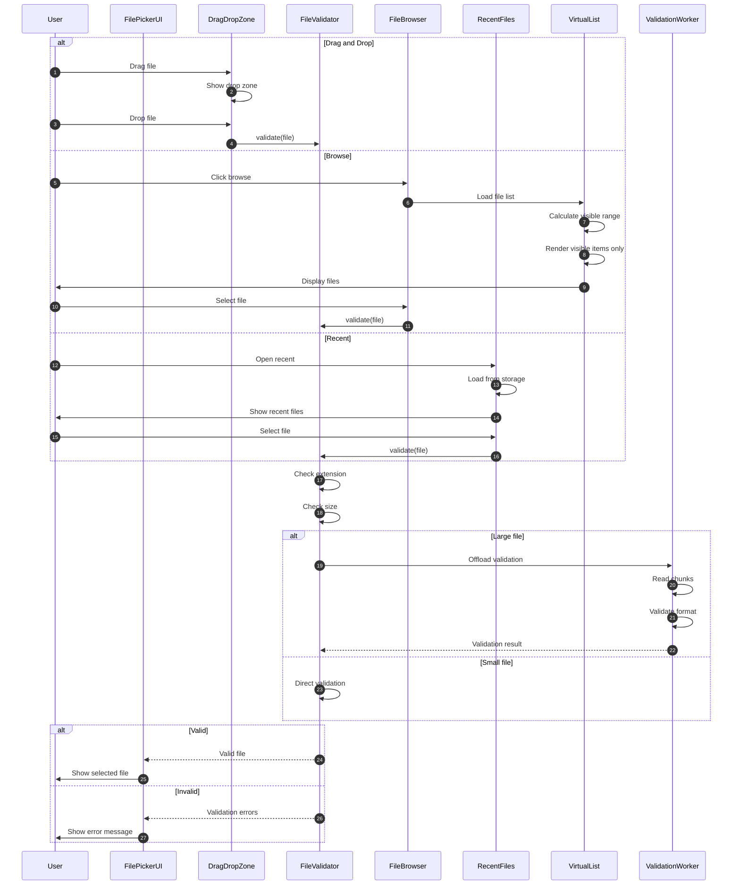
```mermaid
sequenceDiagram
    autonumber
    
    participant User
    participant FilePickerUI
    participant DragDropZone
    participant FileValidator
    participant FileBrowser
    participant RecentFiles
    participant VirtualList
    participant ValidationWorker
    
    alt Drag and Drop
        User->>DragDropZone: Drag file
        DragDropZone->>DragDropZone: Show drop zone
        User->>DragDropZone: Drop file
        DragDropZone->>FileValidator: validate(file)
        
    else Browse
        User->>FileBrowser: Click browse
        FileBrowser->>VirtualList: Load file list
        
        VirtualList->>VirtualList: Calculate visible range
        VirtualList->>VirtualList: Render visible items only
        VirtualList->>User: Display files
        
        User->>FileBrowser: Select file
        FileBrowser->>FileValidator: validate(file)
        
    else Recent
        User->>RecentFiles: Open recent
        RecentFiles->>RecentFiles: Load from storage
        RecentFiles->>User: Show recent files
        User->>RecentFiles: Select file
        RecentFiles->>FileValidator: validate(file)
    end
    
    FileValidator->>FileValidator: Check extension
    FileValidator->>FileValidator: Check size
    
    alt Large file
        FileValidator->>ValidationWorker: Offload validation
        ValidationWorker->>ValidationWorker: Read chunks
        ValidationWorker->>ValidationWorker: Validate format
        ValidationWorker-->>FileValidator: Validation result
    else Small file
        FileValidator->>FileValidator: Direct validation
    end
    
    alt Valid
        FileValidator-->>FilePickerUI: Valid file
        FilePickerUI->>User: Show selected file
    else Invalid
        FileValidator-->>FilePickerUI: Validation errors
        FilePickerUI->>User: Show error message
    end
```

## 7. 성능 최적화 시퀀스

### 7.1 가상 스크롤링 구현

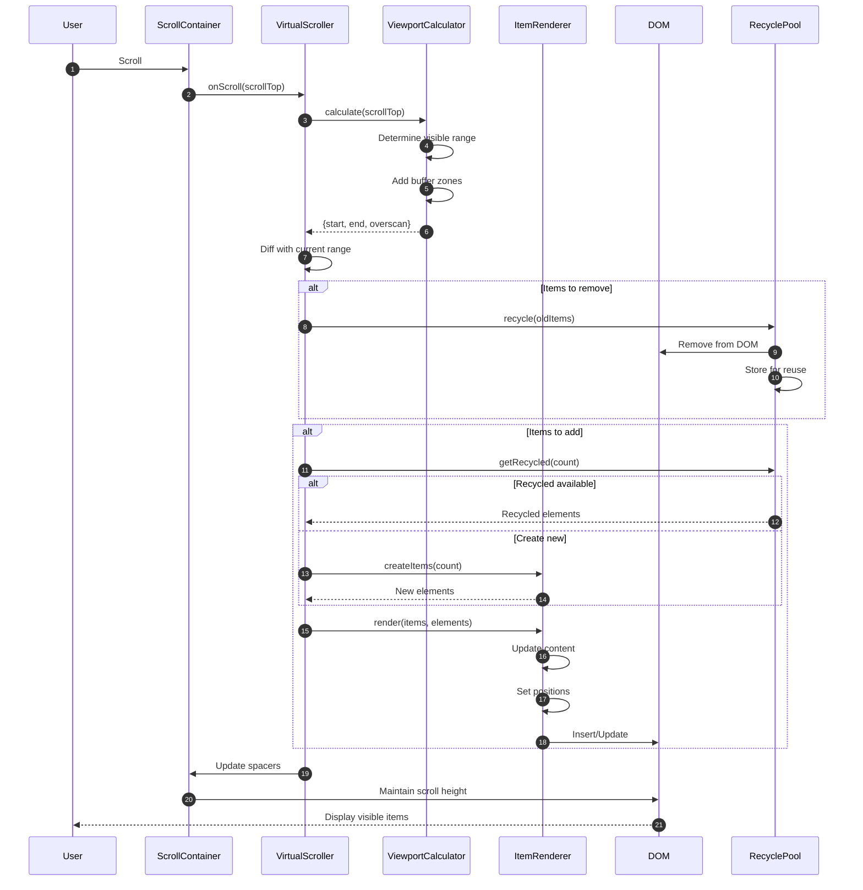
```mermaid
sequenceDiagram
    autonumber
    
    participant User
    participant ScrollContainer
    participant VirtualScroller
    participant ViewportCalculator
    participant ItemRenderer
    participant DOM
    participant RecyclePool
    
    User->>ScrollContainer: Scroll
    ScrollContainer->>VirtualScroller: onScroll(scrollTop)
    
    VirtualScroller->>ViewportCalculator: calculate(scrollTop)
    ViewportCalculator->>ViewportCalculator: Determine visible range
    ViewportCalculator->>ViewportCalculator: Add buffer zones
    ViewportCalculator-->>VirtualScroller: {start, end, overscan}
    
    VirtualScroller->>VirtualScroller: Diff with current range
    
    alt Items to remove
        VirtualScroller->>RecyclePool: recycle(oldItems)
        RecyclePool->>DOM: Remove from DOM
        RecyclePool->>RecyclePool: Store for reuse
    end
    
    alt Items to add
        VirtualScroller->>RecyclePool: getRecycled(count)
        
        alt Recycled available
            RecyclePool-->>VirtualScroller: Recycled elements
        else Create new
            VirtualScroller->>ItemRenderer: createItems(count)
            ItemRenderer-->>VirtualScroller: New elements
        end
        
        VirtualScroller->>ItemRenderer: render(items, elements)
        ItemRenderer->>ItemRenderer: Update content
        ItemRenderer->>ItemRenderer: Set positions
        ItemRenderer->>DOM: Insert/Update
    end
    
    VirtualScroller->>ScrollContainer: Update spacers
    ScrollContainer->>DOM: Maintain scroll height
    
    DOM-->>User: Display visible items
```

## 8. 테스트 시퀀스

### 8.1 E2E 테스트 플로우

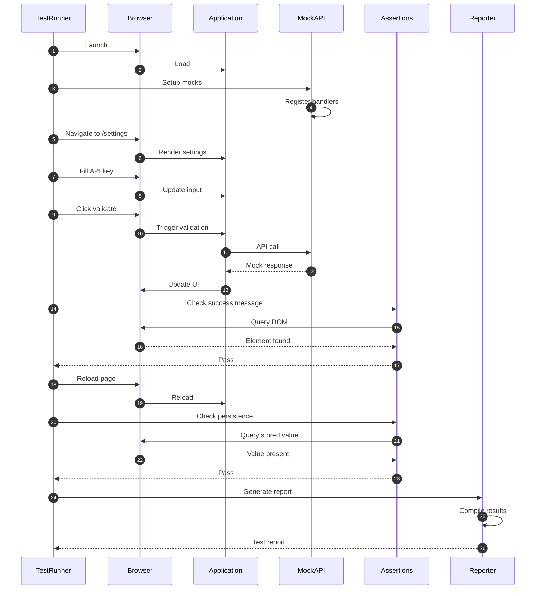
```mermaid
sequenceDiagram
    autonumber
    
    participant TestRunner
    participant Browser
    participant Application
    participant MockAPI
    participant Assertions
    participant Reporter
    
    TestRunner->>Browser: Launch
    Browser->>Application: Load
    
    TestRunner->>MockAPI: Setup mocks
    MockAPI->>MockAPI: Register handlers
    
    TestRunner->>Browser: Navigate to /settings
    Browser->>Application: Render settings
    
    TestRunner->>Browser: Fill API key
    Browser->>Application: Update input
    
    TestRunner->>Browser: Click validate
    Browser->>Application: Trigger validation
    Application->>MockAPI: API call
    MockAPI-->>Application: Mock response
    Application->>Browser: Update UI
    
    TestRunner->>Assertions: Check success message
    Assertions->>Browser: Query DOM
    Browser-->>Assertions: Element found
    Assertions-->>TestRunner: Pass
    
    TestRunner->>Browser: Reload page
    Browser->>Application: Reload
    
    TestRunner->>Assertions: Check persistence
    Assertions->>Browser: Query stored value
    Browser-->>Assertions: Value present
    Assertions-->>TestRunner: Pass
    
    TestRunner->>Reporter: Generate report
    Reporter->>Reporter: Compile results
    Reporter-->>TestRunner: Test report
```

이 시퀀스 다이어그램들은 Phase 3 구현의 주요 플로우를 상세하게 보여줍니다. 각 다이어그램은 실제 구현 시 참조할 수 있는 구체적인 단계별 프로세스를 제공합니다.