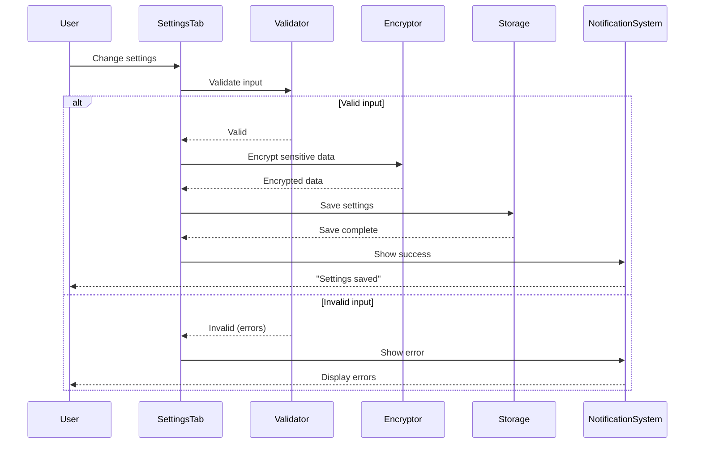
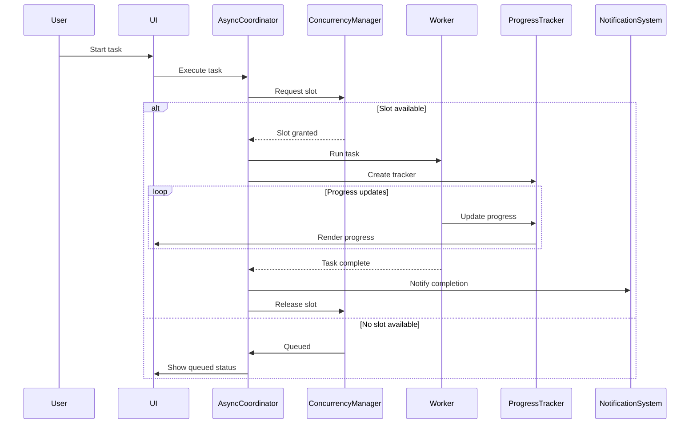

# Phase 3 UX 개선 시스템 설계 문서

## 1. 전체 아키텍처 개요

### 1.1 시스템 구조
```
┌─────────────────────────────────────────────────────────┐
│                     Presentation Layer                    │
├─────────────────────────────────────────────────────────┤
│  ┌──────────────┐  ┌──────────────┐  ┌──────────────┐  │
│  │  Settings    │  │   Progress   │  │ Notification │  │
│  │  Management  │  │   Tracking   │  │    System    │  │
│  └──────────────┘  └──────────────┘  └──────────────┘  │
├─────────────────────────────────────────────────────────┤
│                     Application Layer                     │
├─────────────────────────────────────────────────────────┤
│  ┌──────────────┐  ┌──────────────┐  ┌──────────────┐  │
│  │    State     │  │    Event     │  │    Async     │  │
│  │  Management  │  │   Manager    │  │   Manager    │  │
│  └──────────────┘  └──────────────┘  └──────────────┘  │
├─────────────────────────────────────────────────────────┤
│                   Infrastructure Layer                    │
├─────────────────────────────────────────────────────────┤
│  ┌──────────────┐  ┌──────────────┐  ┌──────────────┐  │
│  │   Storage    │  │    Memory    │  │    Error     │  │
│  │   Manager    │  │   Manager    │  │   Manager    │  │
│  └──────────────┘  └──────────────┘  └──────────────┘  │
└─────────────────────────────────────────────────────────┘
```

### 1.2 설계 원칙
- **관심사 분리 (SoC)**: 각 계층과 컴포넌트는 단일 책임을 가짐
- **의존성 역전 (DIP)**: 추상화에 의존하여 유연성 확보
- **개방-폐쇄 원칙 (OCP)**: 확장에는 열려있고 수정에는 닫혀있음
- **DRY (Don't Repeat Yourself)**: 코드 중복 최소화
- **KISS (Keep It Simple, Stupid)**: 복잡성 최소화

## 2. Task 3.2: 설정 페이지 시스템 설계

### 2.1 컴포넌트 아키텍처

```typescript
interface SettingsArchitecture {
    // 설정 관리 시스템
    SettingsManager: {
        storage: IStorageProvider;
        validator: ISettingsValidator;
        migrator: ISettingsMigrator;
        encryptor: IEncryptor;
    };
    
    // UI 컴포넌트 계층
    SettingsTab: {
        sections: SettingsSection[];
        validator: ApiKeyValidator;
        exporter: SettingsExporter;
        importer: SettingsImporter;
    };
    
    // 설정 섹션 구조
    SettingsSection: {
        general: GeneralSettings;
        apiKeys: ApiKeySettings;
        audio: AudioSettings;
        advanced: AdvancedSettings;
        shortcuts: ShortcutSettings;
    };
}
```

### 2.2 API 키 관리 시스템

```typescript
class SecureApiKeyManager {
    private keyStorage: SecureStorage;
    private validator: ApiKeyValidator;
    private encryptor: AESEncryptor;
    
    // 암호화된 저장
    async storeApiKey(key: string): Promise<void> {
        // 1. 유효성 검증
        const isValid = await this.validator.validate(key);
        if (!isValid) throw new ValidationError('Invalid API key');
        
        // 2. 암호화
        const encrypted = await this.encryptor.encrypt(key);
        
        // 3. 안전한 저장
        await this.keyStorage.set('api_key', encrypted);
        
        // 4. 메모리에서 원본 제거
        key = null;
    }
    
    // 복호화된 조회
    async getApiKey(): Promise<string | null> {
        const encrypted = await this.keyStorage.get('api_key');
        if (!encrypted) return null;
        
        return await this.encryptor.decrypt(encrypted);
    }
}

// 암호화 전략
class AESEncryptor implements IEncryptor {
    private deriveKey(password: string): CryptoKey {
        // PBKDF2를 사용한 키 유도
        return crypto.subtle.deriveKey(
            {
                name: 'PBKDF2',
                salt: this.getSalt(),
                iterations: 100000,
                hash: 'SHA-256'
            },
            this.getBaseKey(password),
            { name: 'AES-GCM', length: 256 },
            false,
            ['encrypt', 'decrypt']
        );
    }
    
    async encrypt(data: string): Promise<EncryptedData> {
        const key = await this.deriveKey(this.getSystemPassword());
        const iv = crypto.getRandomValues(new Uint8Array(12));
        
        const encrypted = await crypto.subtle.encrypt(
            { name: 'AES-GCM', iv },
            key,
            new TextEncoder().encode(data)
        );
        
        return {
            data: btoa(String.fromCharCode(...new Uint8Array(encrypted))),
            iv: btoa(String.fromCharCode(...iv))
        };
    }
}
```

### 2.3 설정 데이터 저장 구조

```typescript
// 설정 스키마 정의
interface SettingsSchema {
    version: string;
    general: {
        language: LanguageCode;
        theme: ThemePreference;
        autoSave: boolean;
        saveInterval: number;
    };
    api: {
        provider: 'openai' | 'custom';
        endpoint?: string;
        model: string;
        maxTokens: number;
        temperature: number;
    };
    audio: {
        format: AudioFormat;
        quality: AudioQuality;
        sampleRate: number;
        channels: 1 | 2;
    };
    advanced: {
        cache: {
            enabled: boolean;
            maxSize: number;
            ttl: number;
        };
        performance: {
            maxConcurrency: number;
            chunkSize: number;
            timeout: number;
        };
    };
}

// 설정 마이그레이션 시스템
class SettingsMigrator {
    private migrations: Map<string, Migration> = new Map([
        ['1.0.0->2.0.0', this.migrateV1ToV2],
        ['2.0.0->3.0.0', this.migrateV2ToV3]
    ]);
    
    async migrate(
        currentSettings: any,
        fromVersion: string,
        toVersion: string
    ): Promise<SettingsSchema> {
        const path = this.findMigrationPath(fromVersion, toVersion);
        let settings = currentSettings;
        
        for (const step of path) {
            const migration = this.migrations.get(step);
            settings = await migration(settings);
        }
        
        return settings;
    }
}
```

## 3. Task 3.3: 진행 상태 표시 시스템

### 3.1 진행률 표시 아키텍처

```typescript
// 진행 상태 관리 시스템
class ProgressTrackingSystem {
    private progressStack: ProgressStack;
    private notificationHub: NotificationHub;
    private uiRenderer: ProgressUIRenderer;
    
    // 계층적 진행 추적
    startTask(taskId: string, totalSteps: number): ProgressTracker {
        const tracker = new ProgressTracker(taskId, totalSteps);
        
        tracker.on('progress', (data) => {
            this.updateUI(data);
            this.notifySubscribers(data);
        });
        
        tracker.on('complete', (data) => {
            this.showCompletion(data);
            this.cleanupTracker(taskId);
        });
        
        this.progressStack.push(tracker);
        return tracker;
    }
}

// 진행 추적기
class ProgressTracker extends EventEmitter {
    private steps: Map<string, StepProgress> = new Map();
    private startTime: number;
    private estimator: ETAEstimator;
    
    updateStep(stepId: string, progress: number, message?: string) {
        const step = this.steps.get(stepId) || this.createStep(stepId);
        
        step.progress = progress;
        step.message = message;
        step.updatedAt = Date.now();
        
        // ETA 계산
        const eta = this.estimator.calculate(
            this.getOverallProgress(),
            this.startTime
        );
        
        this.emit('progress', {
            overall: this.getOverallProgress(),
            steps: Array.from(this.steps.values()),
            eta,
            message
        });
    }
}

// ETA 예측 알고리즘
class ETAEstimator {
    private history: ProgressHistory[] = [];
    private smoothingFactor = 0.3; // 지수 평활 계수
    
    calculate(currentProgress: number, startTime: number): number {
        const elapsed = Date.now() - startTime;
        const rate = currentProgress / elapsed;
        
        if (this.history.length > 0) {
            // 지수 평활을 사용한 예측
            const smoothedRate = this.exponentialSmoothing(rate);
            const remaining = (100 - currentProgress) / smoothedRate;
            return Date.now() + remaining;
        }
        
        // 단순 선형 예측
        const remaining = (100 - currentProgress) / rate;
        return Date.now() + remaining;
    }
    
    private exponentialSmoothing(currentRate: number): number {
        const lastSmoothed = this.history[this.history.length - 1]?.smoothedRate || currentRate;
        return this.smoothingFactor * currentRate + (1 - this.smoothingFactor) * lastSmoothed;
    }
}
```

### 3.2 알림 시스템 통합

```typescript
// 통합 알림 시스템
class IntegratedNotificationSystem {
    private channels: Map<string, NotificationChannel> = new Map();
    private queue: PriorityQueue<Notification>;
    private rateLimiter: RateLimiter;
    
    constructor() {
        // 채널 등록
        this.registerChannel('toast', new ToastChannel());
        this.registerChannel('modal', new ModalChannel());
        this.registerChannel('statusbar', new StatusBarChannel());
        this.registerChannel('sound', new SoundChannel());
        this.registerChannel('native', new NativeNotificationChannel());
    }
    
    // 멀티 채널 알림
    async notify(notification: Notification): Promise<void> {
        // 속도 제한 확인
        if (!this.rateLimiter.allow(notification.type)) {
            this.queue.enqueue(notification);
            return;
        }
        
        // 채널 선택 전략
        const channels = this.selectChannels(notification);
        
        // 병렬 전송
        await Promise.all(
            channels.map(channel => 
                channel.send(notification).catch(this.handleChannelError)
            )
        );
    }
    
    private selectChannels(notification: Notification): NotificationChannel[] {
        const strategy = new ChannelSelectionStrategy();
        
        return strategy.select({
            priority: notification.priority,
            type: notification.type,
            userPreferences: this.getUserPreferences(),
            context: this.getCurrentContext()
        });
    }
}

// 알림 우선순위 큐
class PriorityQueue<T> {
    private heap: Array<{ priority: number; item: T }> = [];
    
    enqueue(item: T, priority: number = 0): void {
        this.heap.push({ priority, item });
        this.bubbleUp(this.heap.length - 1);
    }
    
    dequeue(): T | undefined {
        if (this.heap.length === 0) return undefined;
        
        const result = this.heap[0];
        const end = this.heap.pop()!;
        
        if (this.heap.length > 0) {
            this.heap[0] = end;
            this.sinkDown(0);
        }
        
        return result.item;
    }
}
```

### 3.3 비동기 작업 관리

```typescript
// 비동기 작업 조정자
class AsyncTaskCoordinator {
    private tasks: Map<string, AsyncTask> = new Map();
    private concurrencyManager: ConcurrencyManager;
    private cancellationTokens: Map<string, CancellationToken> = new Map();
    
    // 작업 실행
    async execute<T>(
        taskId: string,
        taskFn: (progress: ProgressReporter) => Promise<T>,
        options: TaskOptions = {}
    ): Promise<T> {
        // 동시성 제어
        await this.concurrencyManager.acquire(options.priority);
        
        // 취소 토큰 생성
        const token = new CancellationToken();
        this.cancellationTokens.set(taskId, token);
        
        // 진행 리포터
        const progressReporter = new ProgressReporter(taskId);
        
        try {
            // 작업 실행
            const task = new AsyncTask(taskId, taskFn, progressReporter, token);
            this.tasks.set(taskId, task);
            
            const result = await task.run();
            
            // 완료 알림
            this.notifyCompletion(taskId, result);
            
            return result;
            
        } catch (error) {
            if (error instanceof CancellationError) {
                this.notifyCancellation(taskId);
            } else {
                this.notifyError(taskId, error);
            }
            throw error;
            
        } finally {
            this.cleanup(taskId);
            this.concurrencyManager.release();
        }
    }
    
    // 작업 취소
    cancel(taskId: string): void {
        const token = this.cancellationTokens.get(taskId);
        token?.cancel();
    }
}

// 동시성 관리자
class ConcurrencyManager {
    private semaphore: Semaphore;
    private priorityQueue: PriorityQueue<() => void>;
    
    constructor(maxConcurrency: number = 3) {
        this.semaphore = new Semaphore(maxConcurrency);
    }
    
    async acquire(priority: number = 0): Promise<void> {
        return new Promise((resolve) => {
            this.priorityQueue.enqueue(resolve, priority);
            this.processQueue();
        });
    }
    
    private async processQueue(): Promise<void> {
        while (this.priorityQueue.size() > 0) {
            if (await this.semaphore.tryAcquire()) {
                const task = this.priorityQueue.dequeue();
                task?.();
            } else {
                break;
            }
        }
    }
}
```

## 4. Task 3.4: 코드 구조 분석

### 4.1 리팩토링 대상 식별

```typescript
// 코드 분석 시스템
class CodeAnalyzer {
    // 복잡도 분석
    analyzeCyclomaticComplexity(component: Component): ComplexityReport {
        const metrics = {
            cyclomaticComplexity: this.calculateCyclomaticComplexity(component),
            cognitiveComplexity: this.calculateCognitiveComplexity(component),
            nestingDepth: this.calculateNestingDepth(component),
            linesOfCode: this.countLinesOfCode(component)
        };
        
        return {
            metrics,
            issues: this.identifyIssues(metrics),
            suggestions: this.generateSuggestions(metrics)
        };
    }
    
    // 의존성 분석
    analyzeDependencies(module: Module): DependencyReport {
        const graph = this.buildDependencyGraph(module);
        
        return {
            circularDependencies: this.findCircularDependencies(graph),
            couplingMetrics: this.calculateCoupling(graph),
            cohesionMetrics: this.calculateCohesion(graph),
            suggestions: this.suggestRefactoring(graph)
        };
    }
}

// 리팩토링 필요 영역
interface RefactoringTargets {
    highPriority: [
        {
            component: 'SettingsTab',
            issues: [
                'High cyclomatic complexity (>15)',
                'Deep nesting (>4 levels)',
                'Mixed responsibilities'
            ],
            solution: 'Extract sub-components and use composition'
        },
        {
            component: 'FilePickerModal',
            issues: [
                'Large file size (>500 lines)',
                'Multiple responsibilities',
                'Complex state management'
            ],
            solution: 'Apply MVC pattern and extract services'
        }
    ];
    
    mediumPriority: [
        {
            component: 'ProgressIndicator',
            issues: [
                'Inline styles',
                'DOM manipulation',
                'Memory leaks risk'
            ],
            solution: 'Use CSS classes and implement AutoDisposable'
        }
    ];
}
```

### 4.2 성능 병목 지점

```typescript
// 성능 프로파일러
class PerformanceProfiler {
    private metrics: Map<string, PerformanceMetric> = new Map();
    
    profile(operation: string, fn: Function): any {
        const startTime = performance.now();
        const startMemory = this.getMemoryUsage();
        
        try {
            const result = fn();
            
            const endTime = performance.now();
            const endMemory = this.getMemoryUsage();
            
            this.metrics.set(operation, {
                duration: endTime - startTime,
                memoryDelta: endMemory - startMemory,
                timestamp: Date.now()
            });
            
            return result;
            
        } catch (error) {
            this.recordError(operation, error);
            throw error;
        }
    }
    
    // 병목 지점 식별
    identifyBottlenecks(): BottleneckReport {
        const sorted = Array.from(this.metrics.entries())
            .sort((a, b) => b[1].duration - a[1].duration);
        
        return {
            slowOperations: sorted.slice(0, 10),
            memoryIntensive: this.findMemoryIntensive(),
            recommendations: this.generateOptimizations(sorted)
        };
    }
}

// 식별된 병목 지점
interface PerformanceBottlenecks {
    critical: [
        {
            area: 'File validation',
            issue: 'Synchronous ArrayBuffer reading',
            impact: 'UI freeze for large files',
            solution: 'Use Web Workers for validation'
        },
        {
            area: 'Settings save',
            issue: 'No debouncing',
            impact: 'Excessive storage writes',
            solution: 'Implement debounced auto-save'
        }
    ];
    
    moderate: [
        {
            area: 'Modal rendering',
            issue: 'Full re-render on state change',
            impact: 'Janky animations',
            solution: 'Use virtual DOM or incremental updates'
        },
        {
            area: 'File list',
            issue: 'No virtualization',
            impact: 'Slow with >100 files',
            solution: 'Implement virtual scrolling'
        }
    ];
}
```

## 5. 구현 시퀀스 다이어그램

### 5.1 설정 저장 플로우



### 5.2 비동기 작업 실행 플로우



## 6. API 인터페이스 정의

### 6.1 설정 관리 API

```typescript
interface ISettingsAPI {
    // 설정 조회
    get<T = any>(key: string): Promise<T>;
    getAll(): Promise<SettingsSchema>;
    
    // 설정 저장
    set<T = any>(key: string, value: T): Promise<void>;
    update(updates: Partial<SettingsSchema>): Promise<void>;
    
    // 설정 검증
    validate(settings: Partial<SettingsSchema>): ValidationResult;
    
    // 설정 마이그레이션
    migrate(fromVersion: string, toVersion: string): Promise<void>;
    
    // 설정 내보내기/가져오기
    export(options?: ExportOptions): Promise<Blob>;
    import(file: File): Promise<void>;
    
    // 설정 초기화
    reset(scope?: 'all' | string[]): Promise<void>;
    
    // 이벤트
    on(event: 'change', listener: (key: string, value: any) => void): void;
    on(event: 'save', listener: () => void): void;
    on(event: 'reset', listener: () => void): void;
}
```

### 6.2 진행 상태 API

```typescript
interface IProgressAPI {
    // 작업 시작
    startTask(taskId: string, options?: TaskOptions): IProgressTracker;
    
    // 작업 제어
    pauseTask(taskId: string): void;
    resumeTask(taskId: string): void;
    cancelTask(taskId: string): void;
    
    // 상태 조회
    getTaskStatus(taskId: string): TaskStatus;
    getAllTasks(): TaskStatus[];
    
    // 진행률 추적
    interface IProgressTracker {
        // 진행률 업데이트
        update(progress: number, message?: string): void;
        updateStep(stepId: string, progress: number): void;
        
        // 상태 변경
        setStatus(status: 'running' | 'paused' | 'completed' | 'failed'): void;
        setMessage(message: string): void;
        
        // ETA
        getETA(): number;
        getRemainingTime(): number;
        
        // 이벤트
        on(event: 'progress', listener: (data: ProgressData) => void): void;
        on(event: 'complete', listener: (result: any) => void): void;
        on(event: 'error', listener: (error: Error) => void): void;
    }
}
```

### 6.3 알림 시스템 API

```typescript
interface INotificationAPI {
    // 알림 표시
    show(options: NotificationOptions): string;
    success(message: string, options?: Partial<NotificationOptions>): string;
    error(message: string, options?: Partial<NotificationOptions>): string;
    warning(message: string, options?: Partial<NotificationOptions>): string;
    info(message: string, options?: Partial<NotificationOptions>): string;
    
    // 알림 제어
    dismiss(notificationId: string): void;
    dismissAll(): void;
    update(notificationId: string, options: Partial<NotificationOptions>): void;
    
    // 대화상자
    confirm(message: string, options?: ConfirmOptions): Promise<boolean>;
    prompt(message: string, options?: PromptOptions): Promise<string | null>;
    
    // 진행률 알림
    showProgress(
        message: string,
        options?: ProgressNotificationOptions
    ): IProgressNotification;
    
    // 설정
    configure(config: NotificationConfig): void;
    setDefaultPosition(position: NotificationPosition): void;
    setSound(enabled: boolean): void;
}
```

## 7. 마이그레이션 전략

### 7.1 단계별 마이그레이션

```typescript
// Phase 1: 기반 구조 개선 (Week 1)
const phase1Tasks = [
    {
        task: 'Implement AutoDisposable pattern',
        targets: ['SettingsTab', 'FilePickerModal', 'ProgressIndicator'],
        priority: 'high'
    },
    {
        task: 'Add memory management',
        targets: ['All UI components'],
        priority: 'high'
    },
    {
        task: 'Setup error boundaries',
        targets: ['Main application'],
        priority: 'medium'
    }
];

// Phase 2: 기능 개선 (Week 2-3)
const phase2Tasks = [
    {
        task: 'Refactor Settings system',
        subtasks: [
            'Extract settings sections',
            'Implement secure storage',
            'Add validation layer'
        ]
    },
    {
        task: 'Enhance Progress tracking',
        subtasks: [
            'Implement progress stack',
            'Add ETA calculation',
            'Create progress UI components'
        ]
    }
];

// Phase 3: 최적화 (Week 4)
const phase3Tasks = [
    {
        task: 'Performance optimization',
        subtasks: [
            'Implement virtual scrolling',
            'Add debouncing/throttling',
            'Optimize re-renders'
        ]
    },
    {
        task: 'Code refactoring',
        subtasks: [
            'Reduce cyclomatic complexity',
            'Extract services',
            'Improve type safety'
        ]
    }
];
```

### 7.2 호환성 유지

```typescript
// 버전 호환성 레이어
class CompatibilityLayer {
    // 기존 API 유지
    @deprecated('Use SettingsAPI.get() instead')
    getSettings(): any {
        console.warn('Deprecated: getSettings() will be removed in v4.0');
        return this.settingsAPI.getAll();
    }
    
    // 점진적 마이그레이션
    migrateComponent(oldComponent: any): any {
        if (this.isLegacyComponent(oldComponent)) {
            return this.wrapLegacyComponent(oldComponent);
        }
        return oldComponent;
    }
}
```

## 8. 테스트 전략

### 8.1 단위 테스트

```typescript
describe('SettingsManager', () => {
    it('should encrypt API keys before storage', async () => {
        const manager = new SecureApiKeyManager();
        const testKey = 'sk-test-key';
        
        await manager.storeApiKey(testKey);
        
        const stored = await mockStorage.getRaw('api_key');
        expect(stored).not.toBe(testKey);
        expect(stored).toMatch(/^[A-Za-z0-9+/=]+$/); // Base64
    });
    
    it('should validate settings schema', () => {
        const validator = new SettingsValidator();
        const invalidSettings = { language: 'invalid' };
        
        const result = validator.validate(invalidSettings);
        
        expect(result.valid).toBe(false);
        expect(result.errors).toContain('Invalid language code');
    });
});
```

### 8.2 통합 테스트

```typescript
describe('Progress Tracking Integration', () => {
    it('should coordinate multiple concurrent tasks', async () => {
        const coordinator = new AsyncTaskCoordinator();
        const tasks = Array(5).fill(0).map((_, i) => 
            coordinator.execute(`task-${i}`, async (progress) => {
                for (let j = 0; j <= 100; j += 10) {
                    progress.update(j);
                    await sleep(10);
                }
                return `result-${i}`;
            })
        );
        
        const results = await Promise.all(tasks);
        
        expect(results).toHaveLength(5);
        expect(coordinator.getActiveTasks()).toHaveLength(0);
    });
});
```

### 8.3 E2E 테스트

```typescript
describe('Settings Page E2E', () => {
    it('should save and restore settings', async () => {
        // 설정 페이지 열기
        await page.goto('/settings');
        
        // API 키 입력
        await page.fill('[data-testid="api-key-input"]', 'sk-test-key');
        await page.click('[data-testid="save-button"]');
        
        // 성공 알림 확인
        await expect(page.locator('.toast--success')).toBeVisible();
        
        // 페이지 새로고침
        await page.reload();
        
        // 설정 유지 확인
        const apiKeyInput = page.locator('[data-testid="api-key-input"]');
        await expect(apiKeyInput).toHaveValue('sk-***');
    });
});
```

## 9. 성능 목표

### 9.1 메트릭스

| 메트릭 | 현재 | 목표 | 측정 방법 |
|--------|------|------|-----------|
| 설정 저장 시간 | 500ms | <100ms | Performance API |
| 메모리 사용량 | 50MB | <30MB | Chrome DevTools |
| 진행 UI 업데이트 | 100ms | <16ms (60fps) | requestAnimationFrame |
| 알림 표시 지연 | 200ms | <50ms | Event timestamp |
| 파일 목록 렌더링 | 2s (1000 files) | <100ms | Virtual scrolling |

### 9.2 최적화 전략

```typescript
// 렌더링 최적화
class OptimizedRenderer {
    private rafId: number | null = null;
    private pendingUpdates: Update[] = [];
    
    scheduleUpdate(update: Update): void {
        this.pendingUpdates.push(update);
        
        if (!this.rafId) {
            this.rafId = requestAnimationFrame(() => {
                this.flushUpdates();
            });
        }
    }
    
    private flushUpdates(): void {
        // 배치 DOM 업데이트
        const fragment = document.createDocumentFragment();
        
        this.pendingUpdates.forEach(update => {
            update.apply(fragment);
        });
        
        document.body.appendChild(fragment);
        
        this.pendingUpdates = [];
        this.rafId = null;
    }
}
```

## 10. 보안 고려사항

### 10.1 데이터 보호

```typescript
// 보안 정책
interface SecurityPolicy {
    encryption: {
        algorithm: 'AES-256-GCM';
        keyDerivation: 'PBKDF2';
        iterations: 100000;
    };
    
    storage: {
        sensitive: ['apiKey', 'tokens', 'passwords'];
        encrypted: true;
        secure: 'localStorage' | 'IndexedDB';
    };
    
    validation: {
        inputSanitization: true;
        xssProtection: true;
        csrfToken: boolean;
    };
}
```

### 10.2 접근 제어

```typescript
// 권한 관리
class AccessControl {
    checkPermission(action: string, resource: string): boolean {
        const permissions = this.getUserPermissions();
        return permissions.includes(`${resource}:${action}`);
    }
    
    sanitizeInput(input: string): string {
        return DOMPurify.sanitize(input, {
            ALLOWED_TAGS: [],
            ALLOWED_ATTR: []
        });
    }
}
```

## 11. 결론

Phase 3 시스템 설계는 다음 핵심 개선사항을 제공합니다:

1. **모듈화된 아키텍처**: 관심사 분리와 재사용 가능한 컴포넌트
2. **보안 강화**: API 키 암호화와 안전한 저장
3. **성능 최적화**: 가상 스크롤링, 디바운싱, 메모리 관리
4. **사용자 경험 개선**: 직관적인 진행 표시와 알림 시스템
5. **유지보수성**: 명확한 인터페이스와 타입 안전성

이 설계를 통해 확장 가능하고 유지보수가 용이한 시스템을 구축할 수 있습니다.