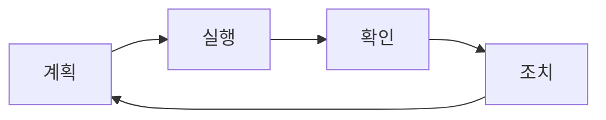

# Phase 4: 품질 보증 가이드라인

## 개요

이 문서는 SpeechNote 플러그인의 품질 보증을 위한 종합적인 가이드라인을 제공합니다.

## 품질 보증 원칙

### 핵심 가치
1. **사용자 중심**: 사용자 경험을 최우선으로 고려
2. **예방적 품질**: 문제 발생 전 예방
3. **지속적 개선**: 반복적인 품질 향상
4. **측정 가능성**: 객관적 지표 기반 평가

## 코드 품질 메트릭

### 정적 분석 기준

#### 복잡도 메트릭
```typescript
// McCabe Cyclomatic Complexity
interface ComplexityLimits {
    method: 10;      // 메서드당 최대 복잡도
    class: 20;       // 클래스당 최대 복잡도
    file: 40;        // 파일당 최대 복잡도
}

// Cognitive Complexity
interface CognitiveLimits {
    function: 15;    // 함수당 인지 복잡도
    file: 100;       // 파일당 인지 복잡도
}
```

#### 코드 스멜 검출
```typescript
// SonarQube 규칙 설정
{
    "rules": {
        "no-duplicate-string": {
            "threshold": 3  // 3회 이상 중복 문자열 검출
        },
        "max-line-length": {
            "limit": 120    // 최대 줄 길이
        },
        "max-file-length": {
            "limit": 500    // 최대 파일 길이
        },
        "max-function-length": {
            "limit": 50     // 최대 함수 길이
        }
    }
}
```

### 코드 커버리지 기준

```typescript
interface CoverageThresholds {
    global: {
        branches: 80;
        functions: 85;
        lines: 85;
        statements: 85;
    };
    critical: {  // 크리티컬 컴포넌트
        branches: 95;
        functions: 95;
        lines: 95;
        statements: 95;
    };
}
```

### 의존성 품질

```bash
# 의존성 취약점 검사
npm audit

# 오래된 패키지 확인
npm outdated

# 라이선스 호환성 확인
npx license-checker --summary
```

## 성능 벤치마크

### 응답 시간 기준

| 작업 | 목표 시간 | 최대 허용 시간 |
|-----|----------|--------------|
| UI 렌더링 | < 100ms | 200ms |
| API 응답 | < 1s | 2s |
| 파일 업로드 (10MB) | < 5s | 10s |
| 텍스트 삽입 | < 50ms | 100ms |
| 설정 저장 | < 200ms | 500ms |

### 메모리 사용량 기준

```typescript
interface MemoryBenchmarks {
    baseline: {
        idle: '< 50MB';           // 유휴 상태
        active: '< 100MB';        // 활성 상태
    };
    peak: {
        processing: '< 200MB';    // 처리 중
        maxAllowed: '< 300MB';    // 최대 허용
    };
    leaks: {
        hourly: '< 5MB';          // 시간당 증가량
        daily: '< 50MB';          // 일일 증가량
    };
}
```

### 처리량 기준

```typescript
interface ThroughputBenchmarks {
    fileProcessing: {
        minRate: '2MB/s';         // 최소 처리 속도
        targetRate: '5MB/s';      // 목표 처리 속도
    };
    concurrency: {
        minRequests: 3;           // 최소 동시 요청
        targetRequests: 5;        // 목표 동시 요청
    };
    queueing: {
        maxQueueSize: 10;         // 최대 큐 크기
        maxWaitTime: '30s';       // 최대 대기 시간
    };
}
```

## 보안 검증 체크리스트

### API 보안
- [ ] API 키 암호화 저장
- [ ] HTTPS 전송 강제
- [ ] API 키 로그 노출 방지
- [ ] Rate limiting 구현
- [ ] Request timeout 설정

### 입력 검증
```typescript
// 파일 업로드 검증
const FILE_VALIDATION = {
    maxSize: 25 * 1024 * 1024,  // 25MB
    allowedTypes: ['audio/mp3', 'audio/wav', 'audio/m4a', 'audio/webm'],
    allowedExtensions: ['.mp3', '.wav', '.m4a', '.webm']
};

// 텍스트 입력 검증
const TEXT_VALIDATION = {
    maxLength: 10000,            // 최대 문자 수
    sanitize: true,              // HTML 태그 제거
    escapeSpecialChars: true     // 특수 문자 이스케이프
};
```

### 데이터 보호
- [ ] 민감 정보 마스킹
- [ ] 로컬 스토리지 암호화
- [ ] 세션 타임아웃 구현
- [ ] 데이터 전송 시 암호화
- [ ] 임시 파일 자동 삭제

## 접근성 체크리스트

### WCAG 2.1 레벨 AA 준수

#### 인지 가능 (Perceivable)
- [ ] 모든 이미지에 대체 텍스트 제공
- [ ] 색상만으로 정보 전달 금지
- [ ] 최소 4.5:1 색상 대비
- [ ] 텍스트 크기 조절 가능 (최대 200%)

#### 운용 가능 (Operable)
- [ ] 키보드만으로 모든 기능 접근
- [ ] 포커스 표시 명확
- [ ] 충분한 시간 제한 (조절 가능)
- [ ] 발작 유발 콘텐츠 없음

#### 이해 가능 (Understandable)
- [ ] 명확한 레이블과 지시사항
- [ ] 예측 가능한 네비게이션
- [ ] 오류 식별 및 수정 제안
- [ ] 도움말 제공

#### 견고함 (Robust)
- [ ] 표준 HTML/ARIA 사용
- [ ] 스크린 리더 호환성
- [ ] 브라우저 호환성

### 접근성 테스트 도구
```bash
# axe-core 사용
npm install --save-dev @axe-core/playwright

# Lighthouse CI
npm install --save-dev @lhci/cli
```

## 사용성 체크리스트

### UI/UX 기준

#### 일관성
- [ ] 디자인 시스템 준수
- [ ] 일관된 용어 사용
- [ ] 표준 UI 패턴 적용
- [ ] 예측 가능한 동작

#### 피드백
- [ ] 즉각적인 시각적 피드백
- [ ] 명확한 진행 상태 표시
- [ ] 에러 메시지 친화적
- [ ] 성공/실패 알림 제공

#### 효율성
- [ ] 최소 클릭으로 목표 달성
- [ ] 자주 사용하는 기능 빠른 접근
- [ ] 단축키 지원
- [ ] 자동 완성 기능

### 사용자 테스트 시나리오

```typescript
interface UsabilityTest {
    scenario: string;
    expectedTime: number;  // 초 단위
    successCriteria: string[];
    commonErrors: string[];
}

const USABILITY_TESTS: UsabilityTest[] = [
    {
        scenario: "첫 번째 음성 파일 변환",
        expectedTime: 60,
        successCriteria: [
            "API 키 설정 완료",
            "파일 선택 및 업로드",
            "텍스트 삽입 확인"
        ],
        commonErrors: [
            "API 키 입력 위치 못 찾음",
            "파일 형식 오류",
            "진행 상태 이해 못함"
        ]
    }
];
```

## 호환성 체크리스트

### Obsidian 버전 호환성
```json
{
    "minAppVersion": "0.15.0",
    "targetVersion": "1.0.0",
    "testedVersions": [
        "0.15.0",
        "1.0.0",
        "1.1.0",
        "latest"
    ]
}
```

### 운영체제 호환성
- [ ] Windows 10/11
- [ ] macOS 10.15+
- [ ] Ubuntu 20.04+
- [ ] 기타 Linux 배포판

### 파일 형식 지원
```typescript
const SUPPORTED_FORMATS = {
    audio: [
        { format: 'MP3', maxSize: '25MB', tested: true },
        { format: 'WAV', maxSize: '25MB', tested: true },
        { format: 'M4A', maxSize: '25MB', tested: true },
        { format: 'WebM', maxSize: '25MB', tested: true }
    ],
    languages: [
        { code: 'ko', name: '한국어', tested: true },
        { code: 'en', name: 'English', tested: true },
        { code: 'auto', name: '자동 감지', tested: true }
    ]
};
```

## 문서화 체크리스트

### 코드 문서화
- [ ] 모든 public 메서드에 JSDoc
- [ ] 복잡한 로직에 인라인 주석
- [ ] README 파일 최신 유지
- [ ] API 문서 자동 생성

### 사용자 문서
- [ ] 설치 가이드
- [ ] 사용자 매뉴얼 (한/영)
- [ ] FAQ 섹션
- [ ] 문제 해결 가이드
- [ ] 비디오 튜토리얼

### 개발자 문서
- [ ] 아키텍처 문서
- [ ] API 레퍼런스
- [ ] 컨트리뷰션 가이드
- [ ] 릴리즈 노트

## CI/CD 파이프라인 체크리스트

### GitHub Actions 워크플로우

```yaml
name: Quality Assurance Pipeline

on:
  push:
    branches: [main, develop]
  pull_request:
    branches: [main]

jobs:
  quality-checks:
    runs-on: ubuntu-latest
    steps:
      # 코드 체크아웃
      - uses: actions/checkout@v3
      
      # 의존성 설치
      - name: Install dependencies
        run: npm ci
      
      # 린트 검사
      - name: Lint code
        run: npm run lint
      
      # 타입 체크
      - name: Type check
        run: npm run typecheck
      
      # 단위 테스트
      - name: Run unit tests
        run: npm run test:unit
      
      # 통합 테스트
      - name: Run integration tests
        run: npm run test:integration
      
      # 커버리지 체크
      - name: Check coverage
        run: npm run test:coverage
      
      # SonarQube 분석
      - name: SonarQube analysis
        uses: sonarsource/sonarqube-scan-action@master
      
      # 보안 스캔
      - name: Security audit
        run: npm audit --audit-level=moderate
      
      # 빌드
      - name: Build
        run: npm run build
      
      # 아티팩트 업로드
      - name: Upload artifacts
        uses: actions/upload-artifact@v3
        with:
          name: build-artifacts
          path: main.js
```

### 배포 전 체크리스트

#### 필수 확인 사항
- [ ] 모든 테스트 통과
- [ ] 코드 커버리지 85% 이상
- [ ] 0개의 크리티컬 버그
- [ ] 보안 취약점 없음
- [ ] 문서 업데이트 완료
- [ ] 버전 번호 업데이트
- [ ] CHANGELOG 작성

#### 릴리즈 체크리스트
```bash
# 1. 버전 태그 생성
git tag -a v1.0.0 -m "Release version 1.0.0"

# 2. 릴리즈 노트 작성
# - 새로운 기능
# - 개선 사항
# - 버그 수정
# - 주의 사항

# 3. 빌드 아티팩트 생성
npm run build

# 4. 플러그인 패키징
zip -r speech-note-v1.0.0.zip manifest.json main.js styles.css

# 5. 릴리즈 게시
# GitHub Releases에 업로드
```

## 모니터링 및 피드백

### 런타임 모니터링

```typescript
interface MonitoringMetrics {
    performance: {
        apiLatency: number[];
        renderTime: number[];
        memoryUsage: number[];
    };
    errors: {
        count: number;
        types: Map<string, number>;
        stackTraces: string[];
    };
    usage: {
        dailyActiveUsers: number;
        featuresUsed: Map<string, number>;
        averageSessionLength: number;
    };
}
```

### 사용자 피드백 수집

```typescript
interface FeedbackSystem {
    channels: [
        'GitHub Issues',
        'Obsidian Forum',
        'Discord Community',
        'In-app Feedback'
    ];
    
    metrics: {
        satisfactionScore: number;  // 1-5
        nps: number;                // -100 to 100
        bugReports: number;
        featureRequests: number;
    };
    
    responseTime: {
        critical: '< 24 hours';
        high: '< 3 days';
        medium: '< 1 week';
        low: '< 2 weeks';
    };
}
```

## 품질 개선 프로세스

### PDCA 사이클



1. **Plan (계획)**
   - 품질 목표 설정
   - 메트릭 정의
   - 개선 영역 식별

2. **Do (실행)**
   - 개선 활동 수행
   - 테스트 실행
   - 데이터 수집

3. **Check (확인)**
   - 결과 분석
   - 목표 대비 평가
   - 문제점 파악

4. **Act (조치)**
   - 개선 사항 표준화
   - 프로세스 업데이트
   - 교훈 문서화

## 품질 보증 도구

### 필수 도구
```json
{
    "testing": {
        "unit": "Jest",
        "integration": "Jest + MSW",
        "e2e": "Playwright"
    },
    "staticAnalysis": {
        "linting": "ESLint",
        "formatting": "Prettier",
        "typeChecking": "TypeScript"
    },
    "codeQuality": {
        "coverage": "Istanbul/nyc",
        "complexity": "SonarQube",
        "dependencies": "npm audit"
    },
    "performance": {
        "profiling": "Chrome DevTools",
        "monitoring": "Sentry",
        "benchmarking": "Benchmark.js"
    }
}
```

## 품질 인증 및 배지

### 획득 가능한 배지
- [ ] Coverage Badge (85%+)
- [ ] Build Status Badge
- [ ] Security Badge
- [ ] License Badge
- [ ] Version Badge
- [ ] Downloads Badge

### 품질 인증 기준
```typescript
interface QualityCertification {
    automated: {
        testCoverage: '>= 85%';
        buildSuccess: '100%';
        securityVulnerabilities: 0;
    };
    manual: {
        codeReview: 'Approved by 2+ reviewers';
        userTesting: 'Completed with 5+ users';
        documentation: '100% complete';
    };
}
```

## 결론

품질 보증은 지속적인 프로세스입니다. 이 가이드라인을 따라 SpeechNote 플러그인의 품질을 체계적으로 관리하고 개선할 수 있습니다.

### 핵심 성공 지표 (KPI)
1. **버그 밀도**: < 0.5 bugs/KLOC
2. **코드 커버리지**: >= 85%
3. **사용자 만족도**: >= 4.5/5.0
4. **응답 시간**: < 2초
5. **가용성**: >= 99.9%

### 다음 단계
1. 자동화된 품질 체크 구현
2. 지속적인 모니터링 설정
3. 정기적인 품질 리뷰 실시
4. 피드백 루프 강화
5. 품질 문화 확산