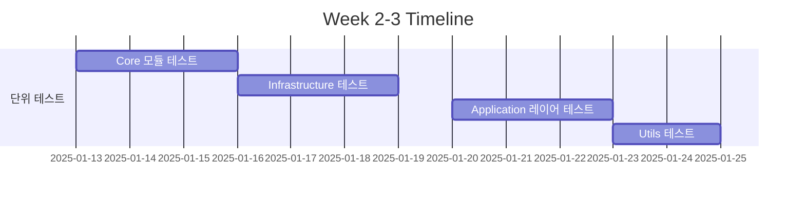
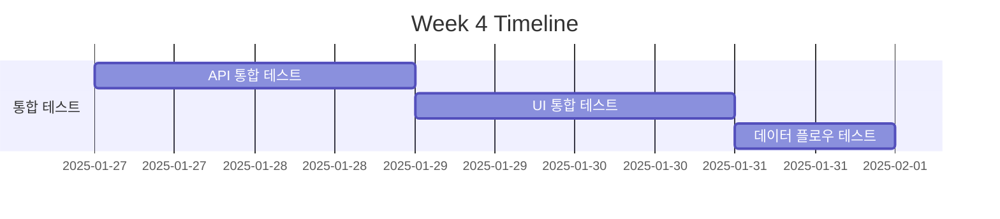
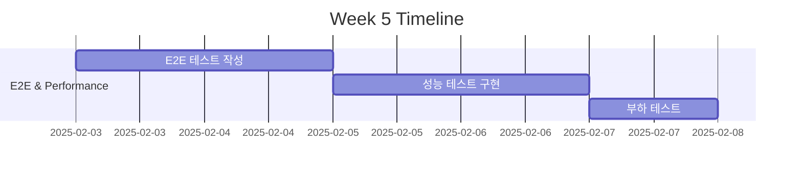
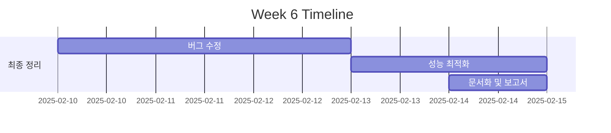

# Phase 4: 테스트 계획서

## 프로젝트 정보

- **프로젝트명**: SpeechNote (Obsidian Speech-to-Text Plugin)
- **버전**: 1.0.0
- **테스트 기간**: 2025년 1월 - 2월 (6주)
- **테스트 팀**: 개발팀 + QA

## 테스트 목표

### 주요 목표
1. 코드 커버리지 85% 이상 달성
2. 크리티컬 버그 0개
3. 성능 기준 100% 충족
4. 사용자 시나리오 100% 검증

### 품질 지표
- 버그 밀도: < 0.5 bugs/KLOC
- 테스트 성공률: > 95%
- 평균 응답 시간: < 2초
- 메모리 누수: 0개

## 테스트 범위

### In Scope
- ✅ Core 비즈니스 로직
- ✅ API 통합 (WhisperService)
- ✅ UI 컴포넌트 및 상호작용
- ✅ 설정 관리 시스템
- ✅ 에러 처리 및 복구
- ✅ 파일 업로드 및 처리
- ✅ 진행 상태 추적
- ✅ 알림 시스템

### Out of Scope
- ❌ Obsidian 코어 기능
- ❌ 외부 API 자체 (OpenAI Whisper)
- ❌ 브라우저 호환성 (Electron only)
- ❌ 다국어 지원 (ko, en만)

## 테스트 일정

### Week 1: 준비 및 환경 구성


**작업 항목**:
- [ ] Jest 설정 최적화
- [ ] GitHub Actions 워크플로우 작성
- [ ] 테스트 fixture 준비
- [ ] Mock 서버 구성 (MSW)

### Week 2-3: 단위 테스트 작성


**테스트 대상**:
```typescript
// Priority 1 - Core Business Logic
□ AudioProcessor.test.ts
□ TextFormatter.test.ts
□ TranscriptionService.test.ts
□ Settings.test.ts
□ ErrorHandler.test.ts

// Priority 2 - Infrastructure
□ WhisperService.test.ts
□ FileUploadManager.test.ts
□ SettingsManager.test.ts
□ Logger.test.ts
□ Encryptor.test.ts

// Priority 3 - Application Services
□ EditorService.test.ts
□ EventManager.test.ts
□ StateManager.test.ts
□ TextInsertionHandler.test.ts

// Priority 4 - Utilities
□ formatters.test.ts
□ validators.test.ts
□ helpers.test.ts
□ AsyncManager.test.ts
```

### Week 4: 통합 테스트 작성


**테스트 시나리오**:
```typescript
// API Integration Tests
□ WhisperService + FileUploadManager
□ SettingsAPI + Storage
□ NotificationSystem + EventManager

// UI Integration Tests
□ FilePickerModal + DragDropZone
□ SettingsTab + Settings persistence
□ ProgressTracker + UI updates

// Data Flow Tests
□ Audio upload → Transcription → Text insertion
□ Settings change → UI update → Storage
□ Error occurrence → Notification → Recovery
```

### Week 5: E2E 테스트 및 성능 테스트


**E2E 시나리오**:
```gherkin
Feature: 음성 인식 기본 플로우
  Scenario: 오디오 파일을 텍스트로 변환
    Given 사용자가 플러그인을 활성화함
    When 오디오 파일을 선택함
    And 업로드 버튼을 클릭함
    Then 진행 상태가 표시됨
    And 변환된 텍스트가 에디터에 삽입됨

Feature: 설정 관리
  Scenario: API 키 설정 및 검증
    Given 사용자가 설정 탭을 열음
    When 새로운 API 키를 입력함
    And 저장 버튼을 클릭함
    Then API 키가 검증됨
    And 설정이 암호화되어 저장됨
```

**성능 테스트 항목**:
```typescript
// Performance Benchmarks
□ API 응답 시간 < 2초
□ 파일 업로드 속도 > 2MB/s
□ UI 렌더링 시간 < 100ms
□ 메모리 사용량 < 200MB
□ 동시 요청 처리 >= 3개
```

### Week 6: 버그 수정 및 최적화


## 테스트 케이스 템플릿

### 단위 테스트 케이스
```typescript
/**
 * Test ID: UT-CORE-001
 * Component: AudioProcessor
 * Method: processAudioFile
 * Priority: High
 */
describe('AudioProcessor', () => {
    describe('processAudioFile', () => {
        // 정상 케이스
        it('should process valid audio file successfully', async () => {
            // Given
            const audioFile = createMockAudioFile();
            
            // When
            const result = await processor.processAudioFile(audioFile);
            
            // Then
            expect(result).toBeDefined();
            expect(result.format).toBe('mp3');
            expect(result.duration).toBeGreaterThan(0);
        });
        
        // 에러 케이스
        it('should throw error for invalid file format', async () => {
            // Given
            const invalidFile = new File([''], 'test.txt');
            
            // When & Then
            await expect(processor.processAudioFile(invalidFile))
                .rejects.toThrow('Invalid audio format');
        });
        
        // 경계값 테스트
        it('should handle maximum file size', async () => {
            // Given
            const largeFile = createMockAudioFile(25 * 1024 * 1024); // 25MB
            
            // When
            const result = await processor.processAudioFile(largeFile);
            
            // Then
            expect(result.size).toBeLessThanOrEqual(25 * 1024 * 1024);
        });
    });
});
```

### 통합 테스트 케이스
```typescript
/**
 * Test ID: IT-API-001
 * Components: WhisperService + FileUploadManager
 * Scenario: Complete transcription flow
 * Priority: Critical
 */
describe('Transcription Integration', () => {
    let whisperService: WhisperService;
    let uploadManager: FileUploadManager;
    
    beforeEach(() => {
        // MSW로 API 모킹
        server.use(
            rest.post('/v1/audio/transcriptions', (req, res, ctx) => {
                return res(ctx.json({ text: 'Transcribed text' }));
            })
        );
    });
    
    it('should complete full transcription workflow', async () => {
        // Given
        const audioFile = createMockAudioFile();
        
        // When
        const uploadResult = await uploadManager.upload(audioFile);
        const transcription = await whisperService.transcribe(uploadResult.url);
        
        // Then
        expect(transcription.text).toBe('Transcribed text');
        expect(uploadResult.status).toBe('completed');
    });
});
```

## 테스트 데이터 관리

### 테스트 데이터 구조
```
tests/
├── fixtures/
│   ├── audio/
│   │   ├── sample-korean.mp3     # 한국어 음성
│   │   ├── sample-english.mp3    # 영어 음성
│   │   ├── sample-mixed.mp3      # 혼합 언어
│   │   ├── sample-noise.mp3      # 노이즈 포함
│   │   └── sample-long.mp3       # 장시간 녹음
│   ├── responses/
│   │   ├── whisper-success.json
│   │   ├── whisper-error.json
│   │   └── whisper-timeout.json
│   └── settings/
│       ├── default-settings.json
│       ├── custom-settings.json
│       └── corrupted-settings.json
```

### Mock 데이터 생성기
```typescript
// tests/helpers/mockDataGenerator.ts
export class MockDataGenerator {
    static audioFile(options?: AudioFileOptions): File {
        const defaults = {
            name: 'test.mp3',
            size: 1024 * 1024, // 1MB
            type: 'audio/mp3',
            duration: 60 // seconds
        };
        
        const config = { ...defaults, ...options };
        return new File([new ArrayBuffer(config.size)], config.name, {
            type: config.type
        });
    }
    
    static apiResponse(status: 'success' | 'error'): WhisperResponse {
        if (status === 'success') {
            return {
                text: 'Transcribed text',
                language: 'ko',
                duration: 45.3
            };
        }
        
        return {
            error: {
                message: 'API rate limit exceeded',
                type: 'rate_limit_error',
                code: 'rate_limit'
            }
        };
    }
}
```

## 버그 추적 및 보고

### 버그 분류 체계
```typescript
enum BugSeverity {
    CRITICAL = 'P0',  // 시스템 중단, 데이터 손실
    HIGH = 'P1',      // 주요 기능 불가
    MEDIUM = 'P2',    // 부분 기능 제한
    LOW = 'P3'        // 미관상 문제
}

enum BugStatus {
    NEW = 'New',
    ASSIGNED = 'Assigned',
    IN_PROGRESS = 'In Progress',
    RESOLVED = 'Resolved',
    VERIFIED = 'Verified',
    CLOSED = 'Closed',
    REOPENED = 'Reopened'
}
```

### 버그 리포트 템플릿
```markdown
## Bug Report #[ID]

**제목**: [간단한 버그 설명]
**심각도**: P0 | P1 | P2 | P3
**컴포넌트**: [영향받는 컴포넌트]
**발견 일자**: YYYY-MM-DD
**발견자**: [이름]

### 재현 단계
1. [단계 1]
2. [단계 2]
3. [단계 3]

### 예상 결과
[예상되는 정상 동작]

### 실제 결과
[실제 발생한 동작]

### 환경 정보
- OS: [Windows/Mac/Linux]
- Obsidian 버전: [x.x.x]
- 플러그인 버전: [x.x.x]

### 스크린샷/로그
[첨부 파일]

### 추가 정보
[기타 관련 정보]
```

## 테스트 환경 요구사항

### 하드웨어 요구사항
```yaml
최소 사양:
  CPU: 2 cores
  RAM: 4GB
  Storage: 10GB free space

권장 사양:
  CPU: 4 cores
  RAM: 8GB
  Storage: 20GB free space
```

### 소프트웨어 요구사항
```yaml
운영체제:
  - Windows 10/11
  - macOS 10.15+
  - Ubuntu 20.04+

런타임:
  - Node.js: 16.x, 18.x, 20.x
  - npm: 8.x+

개발 도구:
  - VSCode (권장)
  - Git 2.x+
  - Docker (선택)
```

## 위험 요소 및 완화 전략

### 식별된 위험 요소

| 위험 요소 | 확률 | 영향 | 완화 전략 |
|---------|-----|-----|---------|
| API 비용 초과 | 중 | 높음 | Mock 서버 활용, 일일 한도 설정 |
| 테스트 환경 불안정 | 낮음 | 중간 | Docker 컨테이너화, 환경 백업 |
| 테스트 데이터 부족 | 중 | 중간 | 데이터 생성기 구축, 실제 데이터 수집 |
| 일정 지연 | 중 | 높음 | 버퍼 시간 확보, 우선순위 조정 |
| Obsidian API 변경 | 낮음 | 높음 | 버전 고정, API 변경 모니터링 |

## 테스트 완료 기준

### Exit Criteria
- [ ] 모든 P0, P1 버그 해결
- [ ] 코드 커버리지 85% 이상
- [ ] 모든 E2E 시나리오 통과
- [ ] 성능 기준 100% 충족
- [ ] 보안 취약점 0개
- [ ] 문서화 100% 완료

### 승인 프로세스
1. **테스트 보고서 작성**
2. **코드 리뷰 완료**
3. **QA 승인**
4. **프로젝트 관리자 승인**
5. **배포 준비 완료**

## 테스트 메트릭 및 보고

### 주요 메트릭
```typescript
interface TestMetrics {
    // 테스트 실행
    totalTests: number;
    passedTests: number;
    failedTests: number;
    skippedTests: number;
    
    // 커버리지
    lineCoverage: number;
    branchCoverage: number;
    functionCoverage: number;
    
    // 버그
    totalBugs: number;
    criticalBugs: number;
    resolvedBugs: number;
    
    // 성능
    avgResponseTime: number;
    maxMemoryUsage: number;
    
    // 진행률
    completionRate: number;
    remainingDays: number;
}
```

### 보고 주기
- **일일 보고**: 테스트 실행 결과, 새로운 버그
- **주간 보고**: 진행 상황, 메트릭 트렌드
- **최종 보고**: 전체 결과, 권장사항

## 도구 및 자원

### 테스트 도구
- **단위 테스트**: Jest, ts-jest
- **통합 테스트**: Jest + MSW
- **E2E 테스트**: Playwright (계획)
- **성능 테스트**: k6, Artillery
- **코드 품질**: ESLint, Prettier, SonarQube

### 문서 및 참고자료
- [Jest 공식 문서](https://jestjs.io/)
- [MSW 가이드](https://mswjs.io/)
- [Obsidian API 문서](https://docs.obsidian.md/)
- [테스트 베스트 프랙티스](./testing-best-practices.md)

## 연락처 및 책임자

| 역할 | 담당자 | 책임 영역 |
|-----|-------|---------|
| 테스트 리드 | TBD | 전체 테스트 전략 및 실행 |
| 개발자 | Taesun Lee | 단위 테스트, 버그 수정 |
| QA 엔지니어 | TBD | 통합/E2E 테스트, 품질 보증 |
| 프로젝트 매니저 | TBD | 일정 관리, 리소스 조정 |