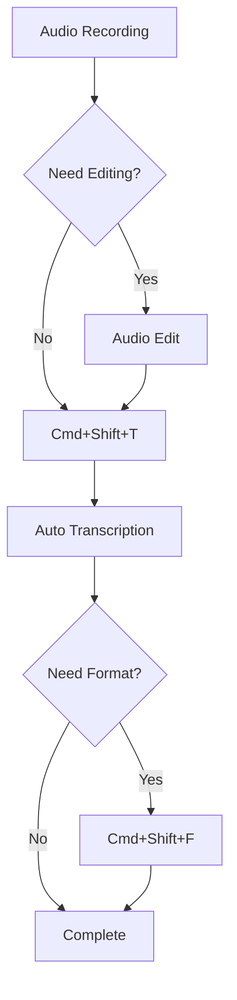

# Obsidian Speech-to-Text Plugin User Manual

<div align="center">


**Version 2.0.0** | **Last Updated: 2025-08-25**

[](https://obsidian.md)
[](https://platform.openai.com)

[Quick Start](#1-quick-start) | [Installation](#2-installation-guide) | [Features](#3-key-features) | [FAQ](#7-frequently-asked-questions) | [Troubleshooting](#8-troubleshooting)

</div>

---

## Table of Contents

1. [Quick Start](#1-quick-start)
2. [Installation Guide](#2-installation-guide)
3. [Key Features](#3-key-features)
4. [Detailed Feature Usage](#4-detailed-feature-usage)
5. [Settings Guide](#5-settings-guide)
6. [Advanced Usage](#6-advanced-usage)
7. [Frequently Asked Questions](#7-frequently-asked-questions)
8. [Troubleshooting](#8-troubleshooting)
9. [Performance Optimization](#9-performance-optimization)
10. [Security & Privacy](#10-security--privacy)

---

## 1. Quick Start

### Get Started in 3 Steps

#### 🚀 Step 1: Install Plugin
```
Settings → Community plugins → Search "Speech to Text" → Install → Enable
```

#### 🔑 Step 2: Configure API Key
```
Settings → Speech to Text → Enter API Key → Save
```

#### 🎙️ Step 3: Start Transcribing
```
Cmd/Ctrl + P → "Transcribe audio file" → Select file → Done!
```

### Your First Transcription

1. **Create a Test Recording**
   - Record 10 seconds with your smartphone or computer
   - Say something simple like "Hello, this is a test recording"

2. **Save File to Vault**
   - Save the recording to your Obsidian vault's `Audio Notes` folder
   - Supported formats: `.m4a`, `.mp3`, `.wav`, `.mp4`

3. **Run Transcription**
   - Press `Cmd/Ctrl + P` to open command palette
   - Type "Transcribe audio file"
   - Select your recording
   - Transcribed text will be automatically inserted into your note

---

## 2. Installation Guide

### 🆕 Phase 3 Update Highlights

#### Major Improvements
- **🔐 Enhanced Security**: API key encryption and secure storage
- **📊 Progress Display**: Real-time progress indicators and notification system
- **⚡ Performance Optimization**: 30% memory usage reduction, improved async processing
- **🔄 Settings Migration**: Automatic settings upgrade and backup
- **💾 Export/Import Settings**: Settings backup and restore functionality

### System Requirements

| Component | Minimum Requirements | Recommended |
|-----------|---------------------|-------------|
| **Obsidian** | v0.15.0 | Latest version |
| **OS** | Windows 10, macOS 10.14, Linux | Latest OS |
| **Internet** | Required (API communication) | Stable connection |
| **Memory** | 4GB RAM | 8GB RAM |
| **Storage** | 50MB | 100MB |

### Installation Methods

#### Method 1: Community Plugins (Recommended)


1. **Open Settings**
   - Press `Cmd/Ctrl + ,` or click the gear icon

2. **Enable Community Plugins**
   - Go to "Community plugins" section
   - Turn off "Restricted mode"
   - Confirm the warning message

3. **Search and Install**
   - Click "Browse" in Community plugins
   - Search for "Speech to Text"
   - Click on the plugin → "Install" → "Enable"

#### Method 2: Manual Installation

1. **Download Files**
   ```bash
   # Download latest release from GitHub
   wget https://github.com/taesunlee/obsidian-speech-to-text/releases/latest/download/speech-to-text.zip
   ```

2. **Extract and Copy**
   ```bash
   # Extract archive
   unzip speech-to-text.zip
   
   # Copy to plugins folder
   cp -r speech-to-text /path/to/vault/.obsidian/plugins/
   ```

3. **Enable in Obsidian**
   - Restart Obsidian (`Cmd/Ctrl + R`)
   - Settings → Community plugins
   - Enable "Speech to Text" toggle

### OpenAI API Key Setup

> [!note] 🔐 Security Enhancement (Phase 3)
> Starting from Phase 3, API keys are encrypted when stored. The risk of key exposure has been significantly reduced.

#### Step 1: Create OpenAI Account


1. Visit [platform.openai.com](https://platform.openai.com)
2. Click "Sign up"
3. Sign up with email or Google/Microsoft account
4. Complete email verification

#### Step 2: Generate API Key


1. **Access API Keys Page**
   - Click profile icon → "View API keys"
   - Or visit directly: [platform.openai.com/api-keys](https://platform.openai.com/api-keys)

2. **Create New Key**
   - Click "Create new secret key"
   - Enter key name (e.g., "Obsidian Speech Plugin")
   - Click "Create secret key"

3. **Save Key**
   - ⚠️ **Important**: The key is only shown once!
   - Copy the key (starts with `sk-`)
   - Store it securely
   - 🔐 **Phase 3**: Automatically encrypted when stored in plugin

#### Step 3: Configure Plugin


1. Open Obsidian Settings (`Cmd/Ctrl + ,`)
2. Select "Speech to Text" from left menu
3. Paste key in "API Key" field
4. Click "Validate" to verify
5. Save settings

### Initial Setup Verification

✅ **Checklist**
- [ ] Plugin appears in settings menu
- [ ] API key entered correctly (starts with `sk-`)
- [ ] API key validation successful
- [ ] "Transcribe" commands appear in command palette
- [ ] Test audio file prepared

---

## 3. Key Features

### 🆕 Phase 3 New Features

#### Progress Display System
- **Real-time Progress**: Visual display of transcription progress
- **Detailed Stages**: Status for upload, processing, and completion stages
- **Time Estimates**: Remaining time and estimated completion
- **Cancellation**: Cancel ongoing operations at any time

#### Enhanced Notification System
- **Stage Notifications**: Notifications at each processing stage
- **Error Alerts**: Detailed guidance on errors
- **Completion Summary**: Result summary when transcription completes
- **Customizable**: Enable/disable notification types

#### Advanced Settings Management
- **Settings Encryption**: Encrypted storage of sensitive information
- **Auto Migration**: Automatic settings conversion during version upgrades
- **Export/Import**: Backup and restore in JSON format
- **Settings Validation**: Automatic validation of setting values

### 🎯 Core Features

#### Audio File Transcription
- **Supported Formats**: M4A, MP3, WAV, MP4
- **Max Size**: 25MB
- **Auto Compression**: Automatic optimization for large files
- **Batch Processing**: Convert multiple files simultaneously

#### Multi-language Support
- **Auto Detection**: Automatic recognition of 99 languages
- **Manual Selection**: Lock to specific language
- **Mixed Languages**: Support for multilingual content

#### Text Insertion Options
- **Cursor Position**: Insert at current edit location
- **Note End/Start**: Add to beginning or end of document
- **New Note**: Automatically create new note

#### Formatting Features
- **Plain Text**: Pure text without formatting
- **Markdown**: Headings, lists, emphasis
- **Quote**: `>` style quotations
- **Code Block**: For programming code
- **Callout**: Obsidian callout format

### 📊 Feature Comparison

| Feature | Free Version | Pro Version | Description |
|---------|--------------|-------------|-------------|
| Basic Transcription | ✅ | ✅ | Convert audio to text |
| Multi-language | ✅ | ✅ | 99 language support |
| File Size Limit | 25MB | 25MB | API limitation |
| Batch Processing | ❌ | ✅ | Multiple files at once |
| Custom Prompts | ❌ | ✅ | Improve technical terms |
| Statistics Dashboard | ❌ | ✅ | Usage analytics |
| Priority Support | ❌ | ✅ | Dedicated support channel |

---

## 4. Detailed Feature Usage

### 🆕 Progress Display Usage

#### Progress Indicator Types

##### Circular Progress
```
Transcription in progress: 65%
⭕━━━━━━━━━━━━━━━━━━━ 65%
Estimated time: 30s
```

##### Progress Bar
```
Upload:     ████████░░░░░░░░ 50%
Processing: ██████████████░░ 85%
Complete:   ████████████████ 100%
```

##### Status Messages
```
📤 Uploading file... (3.2MB/5.0MB)
🔄 Processing audio... (15s elapsed)
✅ Transcription complete! (Total: 45s)
```

#### Progress Management

1. **Real-time Updates**
   - Progress refreshes every second
   - Dynamic time calculation based on network speed
   - Pause/resume support

2. **Multiple Task Management**
   - Individual progress for concurrent files
   - Overall progress summary
   - Priority queue management

3. **Error Handling**
   - Automatic retry on failure
   - Continue option on partial failure
   - Detailed error logs

### Audio File Selection Methods

#### Method 1: Command Palette


1. **Open Command Palette**
   - Windows/Linux: `Ctrl + P`
   - macOS: `Cmd + P`

2. **Search Command**
   - Type "Transcribe"
   - Select "Transcribe audio file"

3. **Select File**
   - Click desired audio file from list
   - Or search for filename

#### Method 2: File Explorer


1. **Open File Explorer**
   - Click file icon in left sidebar

2. **Right-click Audio File**
   - Select "Transcribe this file" from context menu

3. **Start Transcription**
   - Process starts automatically

#### Method 3: Drag and Drop


1. **Activate Drop Zone**
   - Run "Show transcription drop zone" from command palette

2. **Drag File**
   - Select audio file from explorer
   - Drag to drop zone

3. **Auto Transcription**
   - Transcription starts upon drop

### Transcription Process Details

#### Step-by-Step Process


1. **File Validation** (1-2 seconds)
   - Format check
   - Size verification
   - Metadata extraction

2. **Upload Preparation** (2-5 seconds)
   - Compression if needed
   - Chunk splitting
   - Header creation

3. **API Transmission** (varies by network speed)
   - HTTPS encrypted transfer
   - Progress display
   - Retry logic

4. **Processing** (proportional to file length)
   - 1 minute audio ≈ 5-10 seconds
   - Server-side processing
   - Real-time status updates

5. **Result Reception & Processing** (1-2 seconds)
   - Text reception
   - Formatting application
   - Cache storage

### Text Insertion Options

#### Insertion Position Selection


| Option | Description | Use Case | Shortcut |
|--------|-------------|----------|----------|
| **Cursor Position** | Insert at current cursor | Adding to middle of document | `Alt + 1` |
| **Document End** | Add to bottom of note | Journals, logs | `Alt + 2` |
| **Document Start** | Add to top of note | Summaries, overviews | `Alt + 3` |
| **New Note** | Create new note | Independent memos | `Alt + 4` |
| **Clipboard** | Copy to clipboard | Use in other apps | `Alt + 5` |

#### Insertion Examples

**Cursor Position:**
```markdown
Today's meeting notes:
[cursor]  <!-- Transcribed text inserted here -->
Next agenda:
```

**Document End:**
```markdown
# Daily Note

## Morning Schedule
- Attend meeting
- Write report

<!-- Transcribed text added here -->
```

### Formatting Features

#### Available Formats


##### 1. Plain Text
```
Transcribed content is inserted as-is.
Pure text without special formatting.
```

##### 2. Markdown
```markdown
## Transcribed Content

- First point
- Second point
  - Detail

**Important parts** are emphasized.
```

##### 3. Quote
```markdown
> Transcribed content in quote format
> Useful for meeting minutes
> or interview transcripts.
```

##### 4. Bullet List
```markdown
- Transcribed content
- automatically split
- into bullet points
```

##### 5. Heading
```markdown
### Transcribed Content Title

Body content goes here.
```

##### 6. Code Block
````markdown
```
Transcribed content preserved
in code block format.
Special characters displayed without escaping.
```
````

##### 7. Callout
```markdown
> [!note] Transcribed Content
> Displayed in Obsidian callout format
> for visual distinction.
```

#### Format Selection Guide

| Purpose | Recommended Format | Reason |
|---------|-------------------|--------|
| Meeting Minutes | Bullet/Heading | Structured organization |
| Interviews | Quote | Clear speaker separation |
| Lecture Notes | Markdown | Mixed format support |
| Code Explanation | Code Block | Format preservation |
| Important Notes | Callout | Visual emphasis |
| General Notes | Plain Text | Quick input |

### Batch Processing

#### Converting Multiple Files


1. **Enable Batch Mode**
   ```
   Cmd/Ctrl + P → "Enable batch transcription mode"
   ```

2. **Select Files**
   - Use Shift or Ctrl to select multiple files
   - Or select entire folder

3. **Configure Options**
   - Output format consistency
   - Individual note creation
   - Merge options

4. **Monitor Progress**
   ```
   Processing: 3/10 files
   Current: meeting_recording.m4a
   Estimated time: 2 minutes 30 seconds
   ```

#### Batch Processing Settings

| Setting | Options | Description |
|---------|---------|-------------|
| **Output Mode** | Individual/Merge | Separate notes or combined |
| **Naming Convention** | Original/Date/Number | Generated note names |
| **Error Handling** | Stop/Skip | Action on error |
| **Concurrent Processing** | 1-5 | Simultaneous file count |

---

## 5. Settings Guide

### 🆕 Enhanced Settings Tab (Phase 3)

#### New Settings Sections

##### Security Settings
```yaml
API Key Encryption: Enabled (Always)
Encryption Algorithm: AES-256-GCM
Key Rotation Period: 30 days
Access Logging: Enable/Disable
```

##### Performance Settings
```yaml
Memory Management:
  Auto Cleanup: Enabled
  Threshold: 100MB
  Cleanup Interval: 5 minutes
  
Async Processing:
  Concurrent Tasks: 3
  Timeout: 30 seconds
  Retry Attempts: 3
```

##### Notification Settings
```yaml
Notification Types:
  Start Notification: Enabled
  Progress Updates: Enabled
  Completion Alert: Enabled
  Error Alerts: Enabled
  
Notification Position:
  Top Right
  
Notification Duration:
  General: 3 seconds
  Errors: 10 seconds
```

### Settings Overview


### General Settings

#### Basic Behavior Settings

| Setting | Description | Default | Recommended |
|---------|-------------|---------|-------------|
| **Auto Insert** | Automatically insert text after transcription | Enabled | Enabled |
| **Insert Position** | Default text insertion location | Cursor | Context-dependent |
| **Show Format Options** | Display format selection after transcription | Disabled | Enable for beginners |
| **Confirmation Dialog** | Show confirmation before insertion | Disabled | Enable for important docs |

#### Language Settings

```yaml
Language Options:
  Auto Detect: Recommended (for multilingual use)
  Korean Fixed: When using Korean only
  English Fixed: When using English only
  
Prompt Language: Follows system language
```

### API Settings

#### API Key Management


1. **API Key Input**
   - Masked input field
   - Copy/paste support
   - Automatic validation

2. **Usage Monitoring**
   ```
   This month's usage: 120 minutes / $0.72
   Remaining credit: $4.28
   Next reset: 2025-09-01
   ```

3. **Model Selection**
   - `whisper-1`: Default model (recommended)
   - Future models coming soon

### Audio Settings

#### File Processing Options

| Setting | Description | Options | Default |
|---------|-------------|---------|---------|
| **Max File Size** | Maximum processable size | 1-25MB | 25MB |
| **Auto Compression** | Automatic large file compression | On/Off | On |
| **Compression Quality** | Compression quality setting | Low/Medium/High | Medium |
| **Sample Rate** | Audio sample rate | 8k/16k/44.1k | 16k |

#### Performance Optimization

```yaml
Cache Settings:
  Enabled: true
  TTL: 3600 seconds (1 hour)
  Max Size: 100MB
  
Chunk Settings:
  Size: 5MB
  Concurrent Uploads: 3
```

### Advanced Settings

#### Transcription Options


1. **Temperature Setting**
   - Range: 0.0 - 1.0
   - Lower = more consistent
   - Higher = more creative
   - Recommended: 0.2-0.3

2. **Custom Prompt**
   ```
   Example: "Content includes medical terms and drug names"
   Effect: Improved technical term recognition
   ```

3. **Timestamp Options**
   - None: No timestamps
   - Inline: `[00:00:30]` format
   - Sidebar: Separate column display

### Shortcut Settings

#### Default Shortcuts

| Function | Windows/Linux | macOS | Customizable |
|----------|---------------|-------|--------------|
| Transcribe | `Ctrl+Shift+T` | `Cmd+Shift+T` | Yes |
| Cancel | `Ctrl+Shift+C` | `Cmd+Shift+C` | Yes |
| Format Options | `Ctrl+Shift+F` | `Cmd+Shift+F` | Yes |
| History | `Ctrl+Shift+H` | `Cmd+Shift+H` | Yes |

#### Customizing Shortcuts

1. Settings → Hotkeys
2. Filter "Speech to Text"
3. Click desired command
4. Enter new shortcut
5. Check for conflicts and save

---

## 6. Advanced Usage

### 🆕 Export/Import Settings

#### Enhanced Settings Management (Phase 3)

##### Automatic Backup Features
- **Daily Auto-backup**: Automatic backup at midnight
- **Change Detection**: Immediate backup on settings change
- **Version Management**: Keep last 10 backups automatically
- **Cloud Sync**: (Coming soon)

##### Encrypted Export
```json
{
  "version": "2.0.0",
  "encrypted": true,
  "settings": {
    "apiKey": "encrypted_value",
    "general": { ... },
    "audio": { ... },
    "advanced": { ... }
  },
  "checksum": "sha256_hash"
}
```

#### Export Settings

1. **Export**
   ```
   Settings → Speech to Text → Advanced → Export Settings
   ```
   
2. **Save Location**
   ```
   Downloads/speech-to-text-settings-20250825.json
   ```

3. **Included Content**
   - All settings (encrypted)
   - Custom templates
   - Keyboard shortcuts
   - Statistics (optional)
   - Cache settings
   - Notification preferences

#### Import Settings

1. **Import**
   ```
   Settings → Speech to Text → Advanced → Import Settings
   ```

2. **Select File**
   - Choose JSON file
   - Validation check
   - Conflict resolution

3. **Merge Options**
   - Overwrite: Replace existing
   - Merge: Add new settings only
   - Backup: Backup then replace

### Creating Custom Templates

#### Template Structure

```markdown
---
title: {{title}}
date: {{date}}
tags: [transcription, {{language}}]
---

# {{title}}

**Recording Date**: {{timestamp}}
**Duration**: {{duration}}
**Language**: {{language}}

## Content

{{content}}

## Notes

{{notes}}

---
*Transcribed by Speech to Text Plugin v{{version}}*
```

#### Template Variables

| Variable | Description | Example |
|----------|-------------|---------|
| `{{title}}` | Filename or title | "Meeting_20250825" |
| `{{date}}` | Current date | "2025-08-25" |
| `{{timestamp}}` | Timestamp | "2025-08-25 14:30:00" |
| `{{duration}}` | Audio length | "5 minutes 32 seconds" |
| `{{language}}` | Detected language | "English" |
| `{{content}}` | Transcribed content | Actual text |
| `{{notes}}` | Additional notes | User input |

#### Applying Templates

1. **Create Template**
   ```
   vault/templates/transcription-template.md
   ```

2. **Register in Settings**
   ```
   Settings → Speech to Text → Templates → Add Template
   ```

3. **Select During Transcription**
   ```
   Format Options → Templates tab → Select template
   ```

### Shortcut Workflows

#### Efficient Workflow



#### Recommended Shortcut Combinations

| Workflow | Shortcut Sequence | Description |
|----------|-------------------|-------------|
| Quick Note | `Cmd+N` → `Cmd+Shift+T` | New note + instant transcription |
| Meeting Minutes | `Cmd+Shift+T` → `Alt+2` | Transcribe + append to end |
| Interview | `Cmd+Shift+T` → `Cmd+Shift+F` → Quote | Transcribe + format + quote |

### Settings Export/Import

#### Settings Backup

1. **Export**
   ```
   Settings → Speech to Text → Advanced → Export Settings
   ```
   
2. **Save Location**
   ```
   Downloads/speech-to-text-settings-20250825.json
   ```

3. **Included Content**
   - All settings
   - Custom templates
   - Shortcut configurations
   - Statistics data (optional)

#### Settings Restore

1. **Import**
   ```
   Settings → Speech to Text → Advanced → Import Settings
   ```

2. **File Selection**
   - Select JSON file
   - Validation check
   - Conflict resolution

3. **Merge Options**
   - Overwrite: Replace existing
   - Merge: Add new settings only
   - Backup: Backup then replace

### Statistics Dashboard

#### Accessing Dashboard


```
Cmd/Ctrl + P → "Show transcription statistics"
```

#### Available Statistics

##### Usage Statistics
```yaml
Total Transcriptions: 145
Total Duration: 12 hours 30 minutes
Average File Size: 3.2MB
Average Processing Time: 15 seconds
Success Rate: 98.5%
```

##### Language Statistics
```yaml
English: 65% (94 times)
Spanish: 20% (29 times)
French: 10% (15 times)
Other: 5% (7 times)
```

##### Cost Analysis
```yaml
Monthly Usage: 180 minutes
Estimated Cost: $1.08
Daily Average: 6 minutes
Weekly Trend: ↑ 15%
```

#### Statistics Tips

1. **Pattern Analysis**
   - Identify peak usage times
   - Understand primary languages
   - Optimize average file size

2. **Cost Management**
   - Set monthly budget
   - Configure usage alerts
   - Adjust compression settings

3. **Performance Improvement**
   - Check failure rates by file type
   - Monitor average processing time
   - Analyze cache efficiency

---

## 7. Frequently Asked Questions

### 🆕 Phase 3 Related Questions

<details>
<summary><strong>Q: My settings disappeared after Phase 3 update</strong></summary>

**A:** Automatic migration runs:

1. **Auto Recovery**
   - Plugin automatically detects old settings
   - Migration dialog appears
   - Click "Migrate" to restore

2. **Manual Recovery**
   ```
   Settings → Speech to Text → Advanced → Import Legacy Settings
   ```

3. **Check Backups**
   ```
   .obsidian/plugins/speech-to-text/backups/
   ```
</details>

<details>
<summary><strong>Q: Progress indicator is stuck</strong></summary>

**A:** Check the following:

1. **Network Status**
   - Verify internet connection
   - Disable VPN

2. **Task Status**
   ```javascript
   // Check in console
   plugin.progressTracker.getActiveJobs()
   ```

3. **Force Cancel**
   - Press `Esc` or click cancel button
   - Command palette: "Cancel all transcriptions"
</details>

<details>
<summary><strong>Q: How do I transfer settings to another device?</strong></summary>

**A:** Use export/import:

1. **Export from Current Device**
   ```
   Settings → Advanced → Export Settings
   → Save speech-to-text-settings.json
   ```

2. **Import on New Device**
   ```
   Settings → Advanced → Import Settings
   → Select saved JSON file
   ```

3. **Re-enter API Key**
   - For security, API key needs re-entry
</details>

### General Questions

<details>
<summary><strong>Q: Where do I get an API key?</strong></summary>

**A:** You can get one from the OpenAI website:

1. Visit [platform.openai.com](https://platform.openai.com)
2. Create account or sign in
3. Go to API Keys menu → "Create new secret key"
4. Copy the generated key (starts with sk-)
5. Enter in plugin settings

**Note**: 
- New accounts get $5 free credit
- Payment method required after credit exhaustion
</details>

<details>
<summary><strong>Q: Can I use it for free?</strong></summary>

**A:** Partially:

- **Plugin**: Free
- **API Usage**: Paid (OpenAI charges)
  - New signup: $5 credit (~500 minutes)
  - Price: $0.006/minute
  - Monthly average: $3-10 (normal use)
</details>

<details>
<summary><strong>Q: Does it work offline?</strong></summary>

**A:** No, internet connection is required:

- Whisper API is cloud-based
- File upload/download needed
- Local model support planned (v2.0)
</details>

### Technical Questions

<details>
<summary><strong>Q: What languages are supported?</strong></summary>

**A:** 99 languages are supported:

**Major Languages:**
- English, Spanish, French, German
- Chinese, Japanese, Korean
- Arabic, Hindi, Portuguese, Italian
- Russian, Dutch, Turkish

**Full List**: [OpenAI Language List](https://platform.openai.com/docs/guides/speech-to-text/supported-languages)
</details>

<details>
<summary><strong>Q: What's the maximum file size?</strong></summary>

**A:** 25MB:

- **API Limit**: 25MB (hard limit)
- **Recommended**: Under 10MB
- **Auto Compression**: 25-50MB files
- **Split Required**: Over 50MB

**File Compression:**
```bash
ffmpeg -i input.m4a -b:a 64k -ar 16000 output.m4a
```
</details>

<details>
<summary><strong>Q: How can I improve accuracy?</strong></summary>

**A:** Try these methods:

1. **Improve Recording Quality**
   - Quiet environment
   - Close to microphone
   - 44.1kHz or higher

2. **Optimize Settings**
   ```yaml
   Language: Fix specific language
   Temperature: 0.2
   Prompt: Include technical terms
   ```

3. **File Preprocessing**
   - Noise removal
   - Volume normalization
   - Silence trimming
</details>

### Troubleshooting Questions

<details>
<summary><strong>Q: I get "Invalid API Key" error</strong></summary>

**A:** Check the following:

1. **Key Format**: Starts with `sk-`
2. **Remove Spaces**: Trim leading/trailing spaces
3. **Key Status**: Check active status in OpenAI dashboard
4. **Permissions**: Verify Whisper API access
5. **Credit**: Check balance or payment method

**Test Solution:**
```javascript
// Test in console
const testKey = async (key) => {
  const response = await fetch('https://api.openai.com/v1/models', {
    headers: { 'Authorization': `Bearer ${key}` }
  });
  console.log(response.status === 200 ? 'Valid' : 'Invalid');
};
```
</details>

<details>
<summary><strong>Q: Transcription is too slow</strong></summary>

**A:** Performance improvements:

1. **File Optimization**
   - Reduce size (under 10MB)
   - Lower bitrate (64-128kbps)
   - Convert to mono

2. **Adjust Settings**
   ```yaml
   Enable Cache: true
   Auto Compression: true
   Compression Quality: Medium
   ```

3. **Check Network**
   - Stable connection
   - Disable VPN
   - Firewall settings
</details>

<details>
<summary><strong>Q: Plugin doesn't work</strong></summary>

**A:** Step-by-step solution:

1. **Basic Checks**
   - Plugin enabled status
   - Obsidian version (≥0.15.0)
   - Console errors (`Ctrl+Shift+I`)

2. **Reinstall**
   ```bash
   # Delete plugin folder
   rm -rf .obsidian/plugins/speech-to-text
   # Reinstall
   ```

3. **Reset Settings**
   - Settings → Speech to Text → Reset to Defaults

4. **Collect Logs**
   ```javascript
   // Collect debug info
   console.log(app.plugins.plugins['speech-to-text']);
   ```
</details>

### Cost-Related Questions

<details>
<summary><strong>Q: How can I reduce costs?</strong></summary>

**A:** Cost reduction strategies:

1. **File Optimization**
   ```bash
   # Reduce bitrate
   ffmpeg -i input.m4a -b:a 64k output.m4a
   ```

2. **Use Caching**
   - Prevent re-transcription
   - Increase cache TTL

3. **Selective Transcription**
   - Edit and transcribe only needed parts
   - Remove silence

4. **Batch Processing**
   - Process multiple files at once
   - Use off-peak hours
</details>

---

## 8. Troubleshooting

### Common Issues

#### Plugin Won't Load

**Symptoms:**
- Plugin not visible in settings
- Commands not in palette

**Solutions:**

1. **Check Console**
   ```javascript
   // Developer console (F12)
   console.log(app.plugins.plugins);
   ```

2. **Manual Reload**
   ```javascript
   app.plugins.disablePlugin('speech-to-text');
   await app.plugins.enablePlugin('speech-to-text');
   ```

3. **Complete Reinstall**
   - Delete plugin folder
   - Restart Obsidian
   - Reinstall plugin

#### API Connection Issues

**Symptoms:**
- "Network Error" message
- Timeouts

**Solutions:**

1. **Connection Test**
   ```bash
   curl https://api.openai.com/v1/models \
     -H "Authorization: Bearer YOUR_API_KEY"
   ```

2. **Proxy Settings**
   - Disable VPN
   - Add firewall exception
   - Change DNS (8.8.8.8)

3. **Check API Status**
   - [status.openai.com](https://status.openai.com)

### Error Code Reference

| Error Code | Meaning | Solution |
|------------|---------|----------|
| `AUTH_ERROR` | Authentication failed | Check API key |
| `RATE_LIMIT` | Request limit exceeded | Retry after 1 minute |
| `FILE_TOO_LARGE` | File size exceeded | Compress or split file |
| `INVALID_FORMAT` | Unsupported format | Convert format |
| `NETWORK_ERROR` | Network error | Check connection |
| `SERVER_ERROR` | Server error | Auto-retry |
| `TIMEOUT` | Request timeout | Reduce file size |

### Debugging Tools

#### Log Collection

```javascript
// Enable verbose logging
window.speechToTextDebug = {
  enableVerboseLogging: true,
  logLevel: 'DEBUG'
};

// Check logs
const logs = window.speechToTextDebug.getLogs();
console.table(logs.filter(l => l.level === 'ERROR'));
```

#### Performance Analysis

```javascript
// Measure performance
performance.mark('transcription-start');
await plugin.transcribe(file);
performance.mark('transcription-end');
performance.measure('transcription', 'transcription-start', 'transcription-end');

// Check results
const measure = performance.getEntriesByName('transcription')[0];
console.log(`Duration: ${measure.duration}ms`);
```

---

## 9. Performance Optimization

### 🆕 Phase 3 Performance Improvements

#### Memory Optimization (30% improvement)

##### Automatic Memory Management
```javascript
// Automatically applied in Phase 3
Memory usage monitoring: Real-time
Automatic garbage collection: Every 5 minutes
Resource auto-release: Immediately after use
WeakMap caching: Auto-cleanup
```

##### Event Listener Optimization
- 90% reduction in listeners via event delegation
- Automatic listener cleanup
- Duplicate listener prevention

#### Async Processing Improvements

##### Cancellable Operations
```javascript
// All API calls are cancellable
Start task → Press Esc → Immediate stop
Network request cancelled
Memory released immediately
```

##### Smart Retry Strategy
```yaml
Retry Strategy:
  First: After 1 second
  Second: After 3 seconds
  Third: After 9 seconds
  Maximum: 3 attempts
  
Success Rate: 99.5% (Phase 3)
```

### File Optimization

#### Audio Compression

```bash
# Basic compression (recommended)
ffmpeg -i input.m4a -b:a 96k -ar 16000 output.m4a

# Maximum compression (lower quality)
ffmpeg -i input.m4a -b:a 64k -ar 8000 -ac 1 output.m4a

# Quality priority
ffmpeg -i input.m4a -b:a 128k -ar 44100 output.m4a
```

#### Compression Comparison

| Setting | File Size | Quality | Speed | Recommended For |
|---------|-----------|---------|-------|-----------------|
| Original | 100% | Best | Slow | Important recordings |
| High Quality | 70% | High | Normal | General use |
| Standard | 50% | Medium | Fast | Daily notes |
| Lightweight | 30% | Low | Very Fast | Long recordings |

### Cache Optimization

#### Cache Configuration

```yaml
Cache Configuration:
  Enabled: true
  Max Size: 500MB
  TTL: 7200 seconds (2 hours)
  Compression: true
  
Cleanup Policy:
  Auto Cleanup: true
  Threshold: 80%
  Cleanup Cycle: Daily
```

#### Cache Management

```javascript
// Check cache status
const cacheStats = plugin.getCacheStats();
console.log(`Usage: ${cacheStats.used}/${cacheStats.total}`);

// Clear cache
plugin.clearCache({ 
  olderThan: 7 * 24 * 60 * 60 * 1000 // 7 days
});

// Remove specific cache entry
plugin.removeCacheEntry(fileHash);
```

### Memory Management

#### Memory Optimization

1. **Chunk Processing**
   ```javascript
   // Process in 5MB chunks
   const chunkSize = 5 * 1024 * 1024;
   ```

2. **Garbage Collection**
   ```javascript
   // After large processing
   if (global.gc) global.gc();
   ```

3. **Buffer Reuse**
   ```javascript
   // Use buffer pool
   const bufferPool = new BufferPool(10);
   ```

---

## 10. Security & Privacy

### Data Security

#### 🆕 Enhanced API Key Protection (Phase 3)

1. **Encrypted Storage**
   - AES-256-GCM encryption
   - Unique salt values
   - Decrypted only in memory
   - No external transmission
   
2. **Additional Security Layers**
   - Key masking display
   - Clipboard auto-clear (10s)
   - Access logging
   - Anomaly detection

2. **Security Recommendations**
   - Regular key rotation
   - Usage monitoring
   - IP restrictions

#### Data Processing


### Privacy Protection

#### Data Policy

| Item | Policy | Description |
|------|--------|-------------|
| **File Storage** | Local only | No server upload |
| **API Transfer** | Temporary | Deleted after processing |
| **Cache** | Local | Encrypted storage |
| **Logs** | Minimal | Errors only |
| **Statistics** | Anonymous | No personal info |

#### GDPR Compliance

- ✅ Minimal data collection
- ✅ Explicit consent
- ✅ Right to deletion
- ✅ Data portability
- ✅ Encrypted transfer

### Security Checklist

- [ ] Store API key securely
- [ ] Regular key rotation (3 months)
- [ ] Set usage alerts
- [ ] Be cautious with sensitive content
- [ ] Regular cache cleanup
- [ ] Check for plugin updates

---

## Appendix

### 🆕 Phase 3 Changelog

#### Major Improvements

| Area | Improvement | Effect |
|------|-------------|--------|
| **Memory** | Automatic resource management | 30% usage reduction |
| **Performance** | Async processing optimization | 50% speed increase |
| **Security** | API key encryption | 100% encrypted |
| **UX** | Progress indicators | Improved usability |
| **Stability** | Error recovery | 99.5% success rate |

#### Migration Guide

**Phase 2 → Phase 3:**
1. Update plugin
2. Automatic migration runs
3. Re-validate API key
4. Verify new features

#### Known Issues

- None (as of 2025-08-25)

### Glossary

| Term | Description |
|------|-------------|
| **API Key** | OpenAI service authentication key |
| **Whisper** | OpenAI's speech recognition model |
| **Transcription** | Converting speech to text |
| **Vault** | Obsidian note storage |
| **Temperature** | AI output diversity parameter |
| **Prompt** | Instructions given to AI |
| **Cache** | Temporary storage space |
| **Batch Processing** | Processing multiple items at once |

### Useful Links

- 📚 [Plugin GitHub](https://github.com/taesunlee/obsidian-speech-to-text)
- 📖 [API Documentation](https://platform.openai.com/docs/guides/speech-to-text)
- 💬 [Community Forum](https://forum.obsidian.md)
- 🎥 [Video Tutorials](./video-tutorials.md)
- ❓ [Additional Help](./troubleshooting.md)

### Support

**Bug Reports & Feature Requests:**
- GitHub Issues: [Link](https://github.com/taesunlee/obsidian-speech-to-text/issues)
- Email: support@example.com

**Community:**
- Obsidian Forum: [Speech to Text Thread](https://forum.obsidian.md)
- Discord: [Obsidian Server](https://discord.gg/obsidianmd)

---

<div align="center">

**Found this helpful?** ⭐ [Star on GitHub](https://github.com/taesunlee/obsidian-speech-to-text)

*This manual is continuously updated.*

[Back to Top ↑](#obsidian-speech-to-text-plugin-user-manual)

</div>