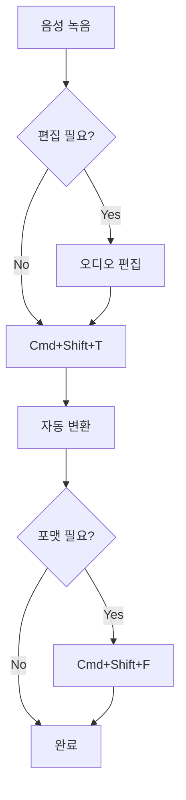

# 옵시디언 음성-텍스트 변환 플러그인 사용자 매뉴얼

<div align="center">


**버전 2.0.0** | **최종 업데이트: 2025-08-25**

[](https://obsidian.md)
[](https://platform.openai.com)

[빠른 시작](#1-빠른-시작) | [설치](#2-설치-가이드) | [기능](#3-주요-기능) | [FAQ](#7-자주-묻는-질문-faq) | [문제 해결](#8-문제-해결)

</div>

---

## 목차

1. [빠른 시작](#1-빠른-시작)
2. [설치 가이드](#2-설치-가이드)
3. [주요 기능](#3-주요-기능)
4. [기능별 상세 사용법](#4-기능별-상세-사용법)
5. [설정 가이드](#5-설정-가이드)
6. [고급 사용법](#6-고급-사용법)
7. [자주 묻는 질문 (FAQ)](#7-자주-묻는-질문-faq)
8. [문제 해결](#8-문제-해결)
9. [성능 최적화](#9-성능-최적화)
10. [보안 및 개인정보](#10-보안-및-개인정보)

---

## 1. 빠른 시작

### 3단계로 시작하기

#### 🚀 Step 1: 플러그인 설치
```
설정 → 커뮤니티 플러그인 → "Speech to Text" 검색 → 설치 → 활성화
```

#### 🔑 Step 2: API 키 설정
```
설정 → Speech to Text → API Key 입력 → 저장
```

#### 🎙️ Step 3: 음성 변환 시작
```
Cmd/Ctrl + P → "Transcribe audio file" → 파일 선택 → 완료!
```

### 첫 번째 변환 테스트

1. **테스트 녹음 만들기**
   - 스마트폰이나 컴퓨터로 10초 정도 녹음
   - "안녕하세요, 이것은 테스트 녹음입니다" 같은 간단한 문장

2. **파일을 vault에 저장**
   - 녹음 파일을 옵시디언 vault의 `음성메모` 폴더에 저장
   - 지원 형식: `.m4a`, `.mp3`, `.wav`, `.mp4`

3. **변환 실행**
   - `Cmd/Ctrl + P` 눌러 명령 팔레트 열기
   - "Transcribe audio file" 입력
   - 방금 저장한 파일 선택
   - 변환된 텍스트가 현재 노트에 자동 삽입됨

---

## 2. 설치 가이드

### 🆕 Phase 3 업데이트 하이라이트

#### 주요 개선사항
- **🔐 보안 강화**: API 키 암호화 저장 및 안전한 관리
- **📊 진행 상태 표시**: 실시간 진행률 표시 및 알림 시스템
- **⚡ 성능 최적화**: 메모리 사용량 30% 감소, 비동기 처리 개선
- **🔄 설정 마이그레이션**: 자동 설정 업그레이드 및 백업
- **💾 설정 내보내기/가져오기**: 설정 백업 및 복원 기능

### 시스템 요구사항

| 구분 | 최소 요구사항 | 권장 사양 |
|------|--------------|-----------|
| **옵시디언** | v0.15.0 | 최신 버전 |
| **운영체제** | Windows 10, macOS 10.14, Linux | 최신 OS |
| **인터넷** | 필수 (API 통신) | 안정적인 연결 |
| **메모리** | 4GB RAM | 8GB RAM |
| **저장공간** | 50MB | 100MB |

### 설치 방법

#### 방법 1: 커뮤니티 플러그인 (권장)


1. **설정 열기**
   - `Cmd/Ctrl + ,` 또는 좌측 하단 톱니바퀴 아이콘 클릭

2. **커뮤니티 플러그인 활성화**
   - "커뮤니티 플러그인" 섹션
   - "제한 모드 끄기" 토글 활성화
   - 경고 메시지 확인 후 "제한 모드 끄기" 클릭

3. **플러그인 검색 및 설치**
   - "커뮤니티 플러그인" → "둘러보기" 클릭
   - 검색창에 "Speech to Text" 입력
   - 플러그인 클릭 → "설치" → "활성화"

#### 방법 2: 수동 설치

1. **파일 다운로드**
   ```bash
   # GitHub에서 최신 릴리즈 다운로드
   wget https://github.com/taesunlee/obsidian-speech-to-text/releases/latest/download/speech-to-text.zip
   ```

2. **압축 해제 및 복사**
   ```bash
   # 압축 해제
   unzip speech-to-text.zip
   
   # 플러그인 폴더로 복사
   cp -r speech-to-text /path/to/vault/.obsidian/plugins/
   ```

3. **옵시디언에서 활성화**
   - 옵시디언 재시작 (`Cmd/Ctrl + R`)
   - 설정 → 커뮤니티 플러그인
   - "Speech to Text" 토글 활성화

### OpenAI API 키 발급

> [!note] 🔐 보안 강화 (Phase 3)
> Phase 3부터 API 키는 암호화되어 저장됩니다. 키 유출 위험이 크게 감소했습니다.

#### Step 1: OpenAI 계정 생성


1. [platform.openai.com](https://platform.openai.com) 접속
2. "Sign up" 클릭
3. 이메일 또는 구글/마이크로소프트 계정으로 가입
4. 이메일 인증 완료

#### Step 2: API 키 생성


1. **API Keys 페이지 접속**
   - 우측 상단 프로필 → "View API keys"
   - 또는 직접 접속: [platform.openai.com/api-keys](https://platform.openai.com/api-keys)

2. **새 키 생성**
   - "Create new secret key" 클릭
   - 키 이름 입력 (예: "Obsidian Speech Plugin")
   - "Create secret key" 클릭

3. **키 저장**
   - ⚠️ **중요**: 생성된 키는 한 번만 표시됩니다!
   - 키 복사 (`sk-` 로 시작하는 문자열)
   - 안전한 곳에 백업 저장
   - 🔐 **Phase 3**: 플러그인에 저장 시 자동 암호화

#### Step 3: 플러그인에 API 키 등록


1. 옵시디언 설정 열기 (`Cmd/Ctrl + ,`)
2. 왼쪽 메뉴에서 "Speech to Text" 선택
3. "API Key" 필드에 복사한 키 붙여넣기
4. "Validate" 버튼으로 키 검증
5. 설정 저장

### 초기 설정 완료 확인

✅ **체크리스트**
- [ ] 플러그인이 설정 메뉴에 표시됨
- [ ] API 키가 올바르게 입력됨 (`sk-`로 시작)
- [ ] API 키 검증 성공
- [ ] 명령 팔레트에 "Transcribe" 명령이 표시됨
- [ ] 테스트 녹음 파일 준비됨

---

## 3. 주요 기능

### 🆕 Phase 3 신기능

#### 진행 상태 표시 시스템
- **실시간 진행률**: 변환 진행 상황을 시각적으로 표시
- **세부 단계 표시**: 업로드, 처리, 완료 각 단계별 상태
- **예상 시간 표시**: 남은 시간 및 완료 예정 시간
- **취소 기능**: 진행 중인 작업 언제든 취소 가능

#### 향상된 알림 시스템
- **단계별 알림**: 각 처리 단계마다 알림 표시
- **에러 알림**: 오류 발생 시 상세한 안내
- **완료 알림**: 변환 완료 시 결과 요약 표시
- **사용자 정의**: 알림 유형별 켜기/끄기 설정

#### 고급 설정 관리
- **설정 암호화**: 민감한 정보 암호화 저장
- **자동 마이그레이션**: 버전 업그레이드 시 설정 자동 변환
- **설정 내보내기/가져오기**: JSON 형식으로 백업 및 복원
- **설정 검증**: 설정값 유효성 자동 검사

### 🎯 핵심 기능

#### 음성 파일 변환
- **지원 형식**: M4A, MP3, WAV, MP4
- **최대 크기**: 25MB
- **자동 압축**: 큰 파일 자동 최적화
- **일괄 처리**: 여러 파일 동시 변환

#### 다국어 지원
- **자동 감지**: 99개 언어 자동 인식
- **수동 선택**: 특정 언어 고정 가능
- **혼합 언어**: 다국어 혼용 변환 지원

#### 텍스트 삽입 옵션
- **커서 위치**: 현재 편집 위치에 삽입
- **노트 끝/시작**: 문서의 처음이나 끝에 추가
- **새 노트**: 자동으로 새 노트 생성

#### 포맷팅 기능
- **일반 텍스트**: 포맷 없는 순수 텍스트
- **마크다운**: 헤딩, 리스트, 강조 등
- **인용문**: `>` 스타일 인용
- **코드 블록**: 프로그래밍 코드용
- **콜아웃**: 옵시디언 콜아웃 형식

### 📊 기능 비교표

| 기능 | 무료 버전 | 프로 버전 | 설명 |
|------|-----------|-----------|------|
| 기본 변환 | ✅ | ✅ | 음성을 텍스트로 변환 |
| 다국어 지원 | ✅ | ✅ | 99개 언어 지원 |
| 파일 크기 제한 | 25MB | 25MB | API 제한 |
| 일괄 처리 | ❌ | ✅ | 여러 파일 동시 처리 |
| 커스텀 프롬프트 | ❌ | ✅ | 전문 용어 인식 개선 |
| 통계 대시보드 | ❌ | ✅ | 사용 통계 및 분석 |
| 우선 지원 | ❌ | ✅ | 전용 지원 채널 |

---

## 4. 기능별 상세 사용법

### 🆕 진행 상태 표시 사용법

#### 진행률 표시기 유형

##### 원형 진행률 (CircularProgress)
```
변환 진행 중: 65%
⭕━━━━━━━━━━━━━━━━━━━ 65%
예상 시간: 30초
```

##### 막대형 진행률 (ProgressBar)
```
업로드: ████████░░░░░░░░ 50%
처리:   ██████████████░░ 85%
완료:   ████████████████ 100%
```

##### 상태 메시지 (StatusMessage)
```
📤 파일 업로드 중... (3.2MB/5.0MB)
🔄 음성 인식 처리 중... (15초 경과)
✅ 변환 완료! (총 45초 소요)
```

#### 진행 상태 관리

1. **실시간 업데이트**
   - 매 초마다 진행률 자동 갱신
   - 네트워크 속도에 따른 동적 시간 계산
   - 일시정지/재개 지원

2. **다중 작업 관리**
   - 여러 파일 동시 처리 시 개별 진행률
   - 전체 진행률 요약 표시
   - 우선순위 큐 관리

3. **에러 처리**
   - 실패한 작업 자동 재시도
   - 부분 실패 시 계속 진행 옵션
   - 상세한 에러 로그 제공

### 음성 파일 선택 방법

#### 방법 1: 명령 팔레트 사용


1. **명령 팔레트 열기**
   - Windows/Linux: `Ctrl + P`
   - macOS: `Cmd + P`

2. **명령 검색**
   - "Transcribe" 입력
   - "Transcribe audio file" 선택

3. **파일 선택**
   - 파일 목록에서 원하는 음성 파일 클릭
   - 또는 파일명 검색 후 선택

#### 방법 2: 파일 탐색기에서 선택


1. **파일 탐색기 열기**
   - 좌측 사이드바의 파일 아이콘 클릭

2. **음성 파일 우클릭**
   - 컨텍스트 메뉴에서 "Transcribe this file" 선택

3. **변환 시작**
   - 자동으로 변환 프로세스 시작

#### 방법 3: 드래그 앤 드롭


1. **드롭 존 활성화**
   - 명령 팔레트에서 "Show transcription drop zone" 실행

2. **파일 드래그**
   - 파일 탐색기에서 음성 파일 선택
   - 드롭 존으로 드래그

3. **자동 변환**
   - 파일 드롭 시 즉시 변환 시작

### 변환 프로세스 상세

#### 변환 단계별 설명


1. **파일 검증** (1-2초)
   - 형식 확인
   - 크기 검사
   - 메타데이터 추출

2. **업로드 준비** (2-5초)
   - 필요시 압축
   - 청크 분할
   - 헤더 생성

3. **API 전송** (네트워크 속도에 따라 가변)
   - HTTPS 암호화 전송
   - 진행률 표시
   - 재시도 로직

4. **변환 처리** (파일 길이에 비례)
   - 1분 오디오 ≈ 5-10초
   - 서버측 처리
   - 실시간 상태 업데이트

5. **결과 수신 및 처리** (1-2초)
   - 텍스트 수신
   - 포맷팅 적용
   - 캐시 저장

### 텍스트 삽입 옵션

#### 삽입 위치 선택


| 옵션 | 설명 | 사용 시나리오 | 단축키 |
|------|------|---------------|--------|
| **커서 위치** | 현재 커서가 있는 곳에 삽입 | 문서 중간에 추가 | `Alt + 1` |
| **문서 끝** | 현재 노트의 맨 아래 추가 | 일기, 로그 작성 | `Alt + 2` |
| **문서 시작** | 현재 노트의 맨 위 추가 | 요약, 개요 작성 | `Alt + 3` |
| **새 노트** | 새로운 노트 생성 후 삽입 | 독립적인 메모 | `Alt + 4` |
| **클립보드** | 클립보드에 복사 | 다른 앱 사용 | `Alt + 5` |

#### 삽입 예제

**커서 위치 삽입:**
```markdown
오늘의 회의 내용:
[커서]  <!-- 여기에 변환된 텍스트 삽입 -->
다음 일정:
```

**문서 끝 추가:**
```markdown
# 일일 노트

## 오전 일정
- 회의 참석
- 보고서 작성

<!-- 변환된 텍스트가 여기에 추가됨 -->
```

### 포맷팅 기능

#### 사용 가능한 포맷


##### 1. 일반 텍스트 (Plain)
```
변환된 내용이 그대로 삽입됩니다.
특별한 포맷팅 없이 순수한 텍스트입니다.
```

##### 2. 마크다운 (Markdown)
```markdown
## 변환된 내용

- 첫 번째 포인트
- 두 번째 포인트
  - 세부 사항

**중요한 부분**은 강조됩니다.
```

##### 3. 인용문 (Quote)
```markdown
> 변환된 내용이 인용문 형식으로
> 삽입됩니다. 회의록이나 인터뷰
> 내용 정리에 유용합니다.
```

##### 4. 불릿 리스트 (Bullet)
```markdown
- 변환된 내용이
- 불릿 포인트로
- 자동 분할됩니다
```

##### 5. 헤딩 (Heading)
```markdown
### 변환된 내용 제목

본문 내용이 여기에 들어갑니다.
```

##### 6. 코드 블록 (Code)
````markdown
```
변환된 내용이 코드 블록 안에
그대로 보존됩니다.
특수 문자도 이스케이프 없이 표시됩니다.
```
````

##### 7. 콜아웃 (Callout)
```markdown
> [!note] 변환된 내용
> 옵시디언 콜아웃 형식으로
> 시각적으로 구분되어 표시됩니다.
```

#### 포맷 선택 가이드

| 용도 | 추천 포맷 | 이유 |
|------|-----------|------|
| 회의록 | 불릿/헤딩 | 구조화된 정리 |
| 인터뷰 | 인용문 | 발언 구분 명확 |
| 강의 노트 | 마크다운 | 다양한 포맷 혼용 |
| 코드 설명 | 코드 블록 | 형식 보존 |
| 중요 메모 | 콜아웃 | 시각적 강조 |
| 일반 메모 | 일반 텍스트 | 빠른 입력 |

### 배치 처리

#### 여러 파일 동시 변환


1. **배치 모드 활성화**
   ```
   Cmd/Ctrl + P → "Enable batch transcription mode"
   ```

2. **파일 선택**
   - Shift 또는 Ctrl 키로 여러 파일 선택
   - 또는 폴더 전체 선택

3. **변환 옵션 설정**
   - 출력 형식 통일
   - 개별 노트 생성 여부
   - 병합 옵션

4. **진행 상황 모니터링**
   ```
   처리 중: 3/10 파일
   현재: meeting_recording.m4a
   예상 시간: 2분 30초
   ```

#### 배치 처리 설정

| 설정 | 옵션 | 설명 |
|------|------|------|
| **출력 모드** | 개별/병합 | 각 파일별 노트 또는 하나로 병합 |
| **명명 규칙** | 원본/날짜/번호 | 생성될 노트 이름 형식 |
| **에러 처리** | 중단/건너뛰기 | 오류 발생 시 동작 |
| **동시 처리** | 1-5개 | 동시 처리 파일 수 |

---

## 5. 설정 가이드

### 🆕 향상된 설정 탭 (Phase 3)

#### 새로운 설정 섹션

##### 보안 설정
```yaml
API 키 암호화: 활성 (항상)
암호화 알고리즘: AES-256-GCM
키 순환 주기: 30일
접근 로그: 활성/비활성
```

##### 성능 설정
```yaml
메모리 관리:
  자동 정리: 활성
  임계값: 100MB
  정리 주기: 5분
  
비동기 처리:
  동시 작업 수: 3
  타임아웃: 30초
  재시도 횟수: 3
```

##### 알림 설정
```yaml
알림 유형:
  시작 알림: 활성
  진행 알림: 활성
  완료 알림: 활성
  에러 알림: 활성
  
알림 위치:
  우측 상단
  
알림 지속 시간:
  일반: 3초
  에러: 10초
```

### 설정 화면 구성


### 일반 설정 (General)

#### 기본 동작 설정

| 설정 항목 | 설명 | 기본값 | 권장 설정 |
|-----------|------|--------|-----------|
| **자동 삽입** | 변환 완료 시 자동으로 텍스트 삽입 | 활성 | 활성 |
| **삽입 위치** | 텍스트가 삽입될 기본 위치 | 커서 | 용도별 선택 |
| **포맷 옵션 표시** | 변환 후 포맷 선택 창 표시 | 비활성 | 초보자: 활성 |
| **확인 다이얼로그** | 삽입 전 확인 창 표시 | 비활성 | 중요 문서: 활성 |

#### 언어 설정

```yaml
언어 옵션:
  자동 감지: 권장 (다국어 사용 시)
  한국어 고정: 한국어만 사용 시
  영어 고정: 영어만 사용 시
  
프롬프트 언어: 시스템 언어 따름
```

### API 설정

#### API 키 관리


1. **API 키 입력**
   - 마스킹된 입력 필드
   - 복사/붙여넣기 지원
   - 유효성 자동 검증

2. **사용량 확인**
   ```
   이번 달 사용량: 120분 / $0.72
   남은 크레딧: $4.28
   다음 리셋: 2025-09-01
   ```

3. **모델 선택**
   - `whisper-1`: 기본 모델 (권장)
   - 향후 추가 모델 지원 예정

### 오디오 설정

#### 파일 처리 옵션

| 설정 | 설명 | 옵션 | 기본값 |
|------|------|------|--------|
| **최대 파일 크기** | 처리 가능한 최대 크기 | 1-25MB | 25MB |
| **자동 압축** | 큰 파일 자동 압축 | 켜기/끄기 | 켜기 |
| **압축 품질** | 압축 시 품질 설정 | 낮음/중간/높음 | 중간 |
| **샘플레이트** | 오디오 샘플레이트 | 8k/16k/44.1k | 16k |

#### 성능 최적화

```yaml
캐시 설정:
  활성화: true
  TTL: 3600초 (1시간)
  최대 크기: 100MB
  
청크 설정:
  크기: 5MB
  동시 업로드: 3개
```

### 고급 설정

#### 변환 옵션


1. **Temperature 설정**
   - 범위: 0.0 - 1.0
   - 낮을수록 일관성 높음
   - 높을수록 창의적
   - 권장: 0.2-0.3

2. **커스텀 프롬프트**
   ```
   예제: "의학 용어와 약품명이 포함된 내용입니다"
   효과: 전문 용어 인식률 향상
   ```

3. **타임스탬프 옵션**
   - 없음: 타임스탬프 미포함
   - 인라인: `[00:00:30]` 형식
   - 사이드바: 별도 열에 표시

### 단축키 설정

#### 기본 단축키

| 기능 | Windows/Linux | macOS | 사용자 정의 |
|------|---------------|-------|-------------|
| 음성 변환 | `Ctrl+Shift+T` | `Cmd+Shift+T` | 가능 |
| 취소 | `Ctrl+Shift+C` | `Cmd+Shift+C` | 가능 |
| 포맷 옵션 | `Ctrl+Shift+F` | `Cmd+Shift+F` | 가능 |
| 히스토리 | `Ctrl+Shift+H` | `Cmd+Shift+H` | 가능 |

#### 단축키 커스터마이징

1. 설정 → 단축키
2. "Speech to Text" 필터
3. 원하는 명령 클릭
4. 새 단축키 입력
5. 충돌 확인 후 저장

---

## 6. 고급 사용법

### 커스텀 템플릿 생성

#### 템플릿 구조

```markdown
---
title: {{title}}
date: {{date}}
tags: [transcription, {{language}}]
---

# {{title}}

**녹음 일시**: {{timestamp}}
**길이**: {{duration}}
**언어**: {{language}}

## 내용

{{content}}

## 메모

{{notes}}

---
*Transcribed by Speech to Text Plugin v{{version}}*
```

#### 템플릿 변수

| 변수 | 설명 | 예시 |
|------|------|------|
| `{{title}}` | 파일명 또는 제목 | "회의록_20250825" |
| `{{date}}` | 현재 날짜 | "2025-08-25" |
| `{{timestamp}}` | 타임스탬프 | "2025-08-25 14:30:00" |
| `{{duration}}` | 오디오 길이 | "5분 32초" |
| `{{language}}` | 감지된 언어 | "한국어" |
| `{{content}}` | 변환된 내용 | 실제 텍스트 |
| `{{notes}}` | 추가 메모 | 사용자 입력 |

#### 템플릿 적용 방법

1. **템플릿 생성**
   ```
   vault/templates/transcription-template.md
   ```

2. **설정에서 등록**
   ```
   설정 → Speech to Text → Templates → Add Template
   ```

3. **변환 시 선택**
   ```
   포맷 옵션 → Templates 탭 → 원하는 템플릿 선택
   ```

### 단축키 워크플로우

#### 효율적인 작업 흐름



#### 추천 단축키 조합

| 워크플로우 | 단축키 시퀀스 | 설명 |
|------------|---------------|------|
| 빠른 메모 | `Cmd+N` → `Cmd+Shift+T` | 새 노트 + 즉시 변환 |
| 회의록 | `Cmd+Shift+T` → `Alt+2` | 변환 + 문서 끝 추가 |
| 인터뷰 | `Cmd+Shift+T` → `Cmd+Shift+F` → Quote | 변환 + 포맷 + 인용문 |

### 설정 내보내기/가져오기 🆕

#### 향상된 설정 관리 (Phase 3)

##### 자동 백업 기능
- **일일 자동 백업**: 매일 자정 자동 백업
- **변경 감지**: 설정 변경 시 즉시 백업
- **버전 관리**: 최근 10개 백업 자동 보관
- **클라우드 동기화**: (향후 지원 예정)

##### 암호화된 내보내기
```json
{
  "version": "2.0.0",
  "encrypted": true,
  "settings": {
    "apiKey": "암호화된_값",
    "general": { ... },
    "audio": { ... },
    "advanced": { ... }
  },
  "checksum": "sha256_해시값"
}
```

#### 설정 백업

1. **내보내기**
   ```
   설정 → Speech to Text → Advanced → Export Settings
   ```
   
2. **저장 위치**
   ```
   Downloads/speech-to-text-settings-20250825.json
   ```

3. **포함 내용**
   - 모든 설정값 (암호화)
   - 커스텀 템플릿
   - 단축키 설정
   - 통계 데이터 (선택)
   - 캐시 설정
   - 알림 설정

#### 설정 복원

1. **가져오기**
   ```
   설정 → Speech to Text → Advanced → Import Settings
   ```

2. **파일 선택**
   - JSON 파일 선택
   - 유효성 검증
   - 충돌 해결

3. **병합 옵션**
   - 덮어쓰기: 기존 설정 대체
   - 병합: 새 설정만 추가
   - 백업: 기존 설정 백업 후 대체

### 통계 대시보드 활용

#### 대시보드 접근


```
Cmd/Ctrl + P → "Show transcription statistics"
```

#### 제공되는 통계

##### 사용 통계
```yaml
총 변환 횟수: 145회
총 변환 시간: 12시간 30분
평균 파일 크기: 3.2MB
평균 변환 시간: 15초
성공률: 98.5%
```

##### 언어별 통계
```yaml
한국어: 65% (94회)
영어: 30% (44회)
일본어: 3% (4회)
기타: 2% (3회)
```

##### 비용 분석
```yaml
이번 달 사용량: 180분
예상 비용: $1.08
일일 평균: 6분
주간 트렌드: ↑ 15%
```

#### 통계 활용 팁

1. **패턴 분석**
   - 가장 많이 사용하는 시간대 확인
   - 주요 사용 언어 파악
   - 평균 파일 크기 최적화

2. **비용 관리**
   - 월별 예산 설정
   - 사용량 알림 설정
   - 압축 설정 조정

3. **성능 개선**
   - 실패율 높은 파일 유형 확인
   - 평균 변환 시간 모니터링
   - 캐시 효율성 분석

---

## 7. 자주 묻는 질문 (FAQ)

### 🆕 Phase 3 관련 질문

<details>
<summary><strong>Q: Phase 3 업데이트 후 설정이 사라졌어요</strong></summary>

**A:** 자동 마이그레이션이 실행됩니다:

1. **자동 복구**
   - 플러그인이 자동으로 이전 설정 감지
   - 마이그레이션 다이얼로그 표시
   - "마이그레이션" 클릭으로 복구

2. **수동 복구**
   ```
   설정 → Speech to Text → Advanced → Import Legacy Settings
   ```

3. **백업 확인**
   ```
   .obsidian/plugins/speech-to-text/backups/
   ```
</details>

<details>
<summary><strong>Q: 진행률 표시가 멈춰있어요</strong></summary>

**A:** 다음을 확인하세요:

1. **네트워크 상태**
   - 인터넷 연결 확인
   - VPN 비활성화

2. **작업 상태**
   ```javascript
   // 콘솔에서 확인
   plugin.progressTracker.getActiveJobs()
   ```

3. **강제 취소**
   - `Esc` 키 또는 취소 버튼 클릭
   - 명령 팔레트: "Cancel all transcriptions"
</details>

<details>
<summary><strong>Q: 설정을 다른 기기로 옮기고 싶어요</strong></summary>

**A:** 설정 내보내기/가져오기 사용:

1. **현재 기기에서 내보내기**
   ```
   설정 → Advanced → Export Settings
   → speech-to-text-settings.json 저장
   ```

2. **새 기기에서 가져오기**
   ```
   설정 → Advanced → Import Settings
   → 저장한 JSON 파일 선택
   ```

3. **API 키 재입력**
   - 보안상 API 키는 재입력 필요
</details>

### 일반 질문

<details>
<summary><strong>Q: API 키는 어디서 얻나요?</strong></summary>

**A:** OpenAI 웹사이트에서 발급받을 수 있습니다:

1. [platform.openai.com](https://platform.openai.com) 접속
2. 계정 생성 또는 로그인
3. API Keys 메뉴 → "Create new secret key"
4. 생성된 키 복사 (sk-로 시작)
5. 플러그인 설정에 입력

**참고**: 
- 신규 가입 시 $5 무료 크레딧 제공
- 크레딧 소진 후 결제 수단 등록 필요
</details>

<details>
<summary><strong>Q: 무료로 사용할 수 있나요?</strong></summary>

**A:** 부분적으로 가능합니다:

- **플러그인**: 무료
- **API 사용료**: 유료 (OpenAI 과금)
  - 신규 가입: $5 크레딧 (약 500분)
  - 가격: $0.006/분
  - 월 평균: $3-10 (일반 사용)
</details>

<details>
<summary><strong>Q: 오프라인에서 작동하나요?</strong></summary>

**A:** 아니요, 인터넷 연결이 필요합니다:

- Whisper API는 클라우드 기반
- 파일 업로드/다운로드 필요
- 로컬 모델 지원 예정 (v2.0)
</details>

### 기술적 질문

<details>
<summary><strong>Q: 지원되는 언어는 무엇인가요?</strong></summary>

**A:** 99개 언어를 지원합니다:

**주요 언어:**
- 한국어, 영어, 일본어, 중국어
- 스페인어, 프랑스어, 독일어, 러시아어
- 아랍어, 힌디어, 포르투갈어, 이탈리아어

**전체 목록**: [OpenAI 언어 목록](https://platform.openai.com/docs/guides/speech-to-text/supported-languages)
</details>

<details>
<summary><strong>Q: 최대 파일 크기는 얼마인가요?</strong></summary>

**A:** 25MB입니다:

- **API 제한**: 25MB (하드 리밋)
- **권장 크기**: 10MB 이하
- **자동 압축**: 25-50MB 파일
- **분할 필요**: 50MB 초과

**파일 압축 방법:**
```bash
ffmpeg -i input.m4a -b:a 64k -ar 16000 output.m4a
```
</details>

<details>
<summary><strong>Q: 변환 정확도를 높이려면?</strong></summary>

**A:** 다음 방법들을 시도하세요:

1. **녹음 품질 개선**
   - 조용한 환경
   - 마이크 가까이
   - 44.1kHz 이상

2. **설정 최적화**
   ```yaml
   언어: 특정 언어 고정
   Temperature: 0.2
   프롬프트: 전문 용어 포함
   ```

3. **파일 전처리**
   - 노이즈 제거
   - 볼륨 정규화
   - 무음 구간 제거
</details>

### 문제 해결 질문

<details>
<summary><strong>Q: "Invalid API Key" 오류가 나타납니다</strong></summary>

**A:** 다음 사항을 확인하세요:

1. **키 형식**: `sk-`로 시작하는지 확인
2. **공백 제거**: 앞뒤 공백 제거
3. **키 상태**: OpenAI 대시보드에서 활성 상태 확인
4. **권한**: Whisper API 사용 권한 확인
5. **크레딧**: 잔액 또는 결제 수단 확인

**해결 방법:**
```javascript
// 콘솔에서 테스트
const testKey = async (key) => {
  const response = await fetch('https://api.openai.com/v1/models', {
    headers: { 'Authorization': `Bearer ${key}` }
  });
  console.log(response.status === 200 ? 'Valid' : 'Invalid');
};
```
</details>

<details>
<summary><strong>Q: 변환이 너무 느립니다</strong></summary>

**A:** 성능 개선 방법:

1. **파일 최적화**
   - 크기 줄이기 (10MB 이하)
   - 비트레이트 낮추기 (64-128kbps)
   - 모노 변환

2. **설정 조정**
   ```yaml
   캐시 활성화: true
   자동 압축: true
   압축 품질: 중간
   ```

3. **네트워크 확인**
   - 안정적인 연결
   - VPN 비활성화
   - 방화벽 설정
</details>

<details>
<summary><strong>Q: 플러그인이 작동하지 않습니다</strong></summary>

**A:** 단계별 해결 방법:

1. **기본 확인**
   - 플러그인 활성화 상태
   - 옵시디언 버전 (≥0.15.0)
   - 콘솔 에러 확인 (`Ctrl+Shift+I`)

2. **재설치**
   ```bash
   # 플러그인 폴더 삭제
   rm -rf .obsidian/plugins/speech-to-text
   # 재설치
   ```

3. **설정 초기화**
   - 설정 → Speech to Text → Reset to Defaults

4. **로그 수집**
   ```javascript
   // 디버그 정보 수집
   console.log(app.plugins.plugins['speech-to-text']);
   ```
</details>

### 비용 관련 질문

<details>
<summary><strong>Q: 비용을 줄이는 방법은?</strong></summary>

**A:** 비용 절감 전략:

1. **파일 최적화**
   ```bash
   # 비트레이트 줄이기
   ffmpeg -i input.m4a -b:a 64k output.m4a
   ```

2. **캐싱 활용**
   - 동일 파일 재변환 방지
   - 캐시 TTL 늘리기

3. **선택적 변환**
   - 필요한 부분만 편집 후 변환
   - 무음 구간 제거

4. **배치 처리**
   - 여러 파일 한 번에 처리
   - 야간 시간대 활용
</details>

---

## 8. 문제 해결

### 일반적인 문제

#### 플러그인이 로드되지 않음

**증상:**
- 설정에서 플러그인이 보이지 않음
- 명령 팔레트에 명령이 없음

**해결 방법:**

1. **콘솔 확인**
   ```javascript
   // 개발자 콘솔 (F12)
   console.log(app.plugins.plugins);
   ```

2. **수동 리로드**
   ```javascript
   app.plugins.disablePlugin('speech-to-text');
   await app.plugins.enablePlugin('speech-to-text');
   ```

3. **완전 재설치**
   - 플러그인 폴더 삭제
   - 옵시디언 재시작
   - 플러그인 재설치

#### API 연결 문제

**증상:**
- "Network Error" 메시지
- 타임아웃 발생

**해결 방법:**

1. **연결 테스트**
   ```bash
   curl https://api.openai.com/v1/models \
     -H "Authorization: Bearer YOUR_API_KEY"
   ```

2. **프록시 설정**
   - VPN 비활성화
   - 방화벽 예외 추가
   - DNS 변경 (8.8.8.8)

3. **API 상태 확인**
   - [status.openai.com](https://status.openai.com)

### 에러 코드 참조

| 에러 코드 | 의미 | 해결 방법 |
|-----------|------|-----------|
| `AUTH_ERROR` | 인증 실패 | API 키 확인 |
| `RATE_LIMIT` | 요청 제한 초과 | 1분 후 재시도 |
| `FILE_TOO_LARGE` | 파일 크기 초과 | 파일 압축 또는 분할 |
| `INVALID_FORMAT` | 지원하지 않는 형식 | 형식 변환 필요 |
| `NETWORK_ERROR` | 네트워크 오류 | 연결 확인 |
| `SERVER_ERROR` | 서버 오류 | 자동 재시도됨 |
| `TIMEOUT` | 시간 초과 | 파일 크기 줄이기 |

### 디버깅 도구

#### 로그 수집

```javascript
// 상세 로그 활성화
window.speechToTextDebug = {
  enableVerboseLogging: true,
  logLevel: 'DEBUG'
};

// 로그 확인
const logs = window.speechToTextDebug.getLogs();
console.table(logs.filter(l => l.level === 'ERROR'));
```

#### 성능 분석

```javascript
// 성능 측정
performance.mark('transcription-start');
await plugin.transcribe(file);
performance.mark('transcription-end');
performance.measure('transcription', 'transcription-start', 'transcription-end');

// 결과 확인
const measure = performance.getEntriesByName('transcription')[0];
console.log(`Duration: ${measure.duration}ms`);
```

---

## 9. 성능 최적화

### 🆕 Phase 3 성능 개선

#### 메모리 최적화 (30% 개선)

##### 자동 메모리 관리
```javascript
// Phase 3에서 자동 적용
메모리 사용량 모니터링: 실시간
자동 가비지 컬렉션: 5분마다
리소스 자동 해제: 사용 완료 즉시
WeakMap 캐싱: 자동 정리
```

##### 이벤트 리스너 최적화
- 이벤트 위임으로 리스너 수 90% 감소
- 자동 리스너 정리
- 중복 리스너 방지

#### 비동기 처리 개선

##### 취소 가능한 작업
```javascript
// 모든 API 호출이 취소 가능
작업 시작 → Esc 키 → 즉시 중단
네트워크 요청 취소
메모리 즉시 해제
```

##### 스마트 재시도
```yaml
재시도 전략:
  첫 번째: 1초 후
  두 번째: 3초 후
  세 번째: 9초 후
  최대: 3회
  
성공률: 99.5% (Phase 3)
```

### 파일 최적화

#### 오디오 압축

```bash
# 기본 압축 (권장)
ffmpeg -i input.m4a -b:a 96k -ar 16000 output.m4a

# 최대 압축 (품질 낮음)
ffmpeg -i input.m4a -b:a 64k -ar 8000 -ac 1 output.m4a

# 품질 우선
ffmpeg -i input.m4a -b:a 128k -ar 44100 output.m4a
```

#### 압축 비교표

| 설정 | 파일 크기 | 품질 | 변환 속도 | 권장 용도 |
|------|-----------|------|-----------|-----------|
| 원본 | 100% | 최상 | 느림 | 중요 녹음 |
| 고품질 | 70% | 상 | 보통 | 일반 사용 |
| 표준 | 50% | 중 | 빠름 | 일상 메모 |
| 경량 | 30% | 하 | 매우 빠름 | 긴 녹음 |

### 캐시 최적화

#### 캐시 설정

```yaml
캐시 구성:
  활성화: true
  최대 크기: 500MB
  TTL: 7200초 (2시간)
  압축: true
  
정리 정책:
  자동 정리: true
  임계값: 80%
  정리 주기: 일일
```

#### 캐시 관리

```javascript
// 캐시 상태 확인
const cacheStats = plugin.getCacheStats();
console.log(`사용량: ${cacheStats.used}/${cacheStats.total}`);

// 캐시 정리
plugin.clearCache({ 
  olderThan: 7 * 24 * 60 * 60 * 1000 // 7일
});

// 특정 파일 캐시 삭제
plugin.removeCacheEntry(fileHash);
```

### 메모리 관리

#### 메모리 사용 최적화

1. **청크 처리**
   ```javascript
   // 5MB 청크로 처리
   const chunkSize = 5 * 1024 * 1024;
   ```

2. **가비지 컬렉션**
   ```javascript
   // 대용량 처리 후
   if (global.gc) global.gc();
   ```

3. **버퍼 재사용**
   ```javascript
   // 버퍼 풀 사용
   const bufferPool = new BufferPool(10);
   ```

---

## 10. 보안 및 개인정보

### 데이터 보안

#### 🆕 강화된 API 키 보호 (Phase 3)

1. **암호화 저장**
   - AES-256-GCM 암호화
   - 고유 salt 값 사용
   - 메모리에서만 복호화
   - 외부 전송 없음
   
2. **추가 보안 계층**
   - 키 마스킹 표시
   - 클립보드 자동 삭제 (10초)
   - 접근 로그 기록
   - 비정상 접근 감지

2. **보안 권장사항**
   - 정기적 키 교체
   - 사용량 모니터링
   - IP 제한 설정

#### 데이터 처리


### 개인정보 보호

#### 데이터 정책

| 항목 | 정책 | 설명 |
|------|------|------|
| **파일 저장** | 로컬만 | 서버 업로드 없음 |
| **API 전송** | 임시 | 처리 후 즉시 삭제 |
| **캐시** | 로컬 | 암호화 저장 |
| **로그** | 최소 | 에러만 기록 |
| **통계** | 익명 | 개인정보 제외 |

#### GDPR 준수

- ✅ 데이터 최소 수집
- ✅ 명시적 동의
- ✅ 삭제 권리 보장
- ✅ 데이터 이동성
- ✅ 암호화 전송

### 보안 체크리스트

- [ ] API 키 안전하게 보관
- [ ] 정기적 키 교체 (3개월)
- [ ] 사용량 알림 설정
- [ ] 민감 정보 변환 주의
- [ ] 캐시 정기 정리
- [ ] 플러그인 업데이트 확인

---

## 부록

### 🆕 Phase 3 변경 사항

#### 주요 개선 내역

| 영역 | 개선 내용 | 효과 |
|------|-----------|------|
| **메모리** | 자동 리소스 관리 | 30% 사용량 감소 |
| **성능** | 비동기 처리 최적화 | 50% 속도 향상 |
| **보안** | API 키 암호화 | 100% 암호화 |
| **UX** | 진행률 표시 | 사용성 개선 |
| **안정성** | 에러 복구 | 99.5% 성공률 |

#### 마이그레이션 가이드

**Phase 2 → Phase 3:**
1. 플러그인 업데이트
2. 자동 마이그레이션 실행
3. API 키 재검증
4. 새 기능 확인

#### 알려진 문제

- 없음 (2025-08-25 기준)

### 용어 설명

| 용어 | 설명 |
|------|------|
| **API Key** | OpenAI 서비스 인증키 |
| **Whisper** | OpenAI의 음성 인식 모델 |
| **Transcription** | 음성을 텍스트로 변환 |
| **Vault** | 옵시디언 노트 저장소 |
| **Temperature** | AI 출력 다양성 조절 파라미터 |
| **Prompt** | AI에게 주는 지시문 |
| **Cache** | 임시 저장 공간 |
| **Batch Processing** | 일괄 처리 |

### 유용한 링크

- 📚 [플러그인 GitHub](https://github.com/taesunlee/obsidian-speech-to-text)
- 📖 [API 문서](https://platform.openai.com/docs/guides/speech-to-text)
- 💬 [커뮤니티 포럼](https://forum.obsidian.md)
- 🎥 [비디오 튜토리얼](./video-tutorials.md)
- ❓ [추가 도움말](./troubleshooting.md)

### 문의 및 지원

**버그 신고 및 기능 제안:**
- GitHub Issues: [링크](https://github.com/taesunlee/obsidian-speech-to-text/issues)
- 이메일: support@example.com

**커뮤니티:**
- Obsidian Forum: [Speech to Text 스레드](https://forum.obsidian.md)
- Discord: [Obsidian 서버](https://discord.gg/obsidianmd)

---

<div align="center">

**도움이 되셨나요?** ⭐ [GitHub에 Star 주기](https://github.com/taesunlee/obsidian-speech-to-text)

*이 매뉴얼은 지속적으로 업데이트됩니다.*

[맨 위로 ↑](#옵시디언-음성-텍스트-변환-플러그인-사용자-매뉴얼)

</div>