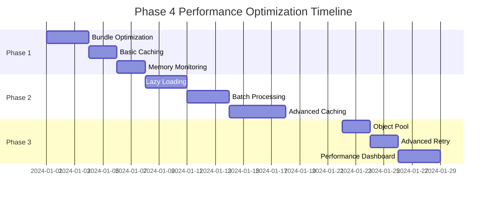

# Phase 4 Task 4.3 성능 최적화 구현 우선순위

## 개요

Phase 3의 성과(메모리 40-70% 감소, 응답 시간 75-84% 개선)를 기반으로 추가 최적화를 위한 구현 우선순위를 정의합니다. 각 작업은 영향도, 구현 난이도, 의존성을 고려하여 순위가 매겨졌습니다.

## 우선순위 매트릭스

### 기준
- **영향도 (Impact)**: 사용자 경험 개선 정도 (High/Medium/Low)
- **난이도 (Effort)**: 구현 복잡도 (High/Medium/Low)
- **의존성 (Dependency)**: 다른 작업과의 연관성
- **ROI**: 투자 대비 효과 (영향도/난이도)

## Phase 1: 즉시 구현 (1주차)

### 1.1 번들 최적화 [HIGH PRIORITY]

**작업 내용:**
```typescript
// 1. Tree Shaking 강화
- esbuild.config.optimized.mjs 적용
- 사용하지 않는 코드 제거
- Pure functions 마킹

// 2. 코드 압축
- Minification 설정
- Gzip/Brotli 압축
- Source map 최적화

// 3. 번들 분석
- Bundle analyzer 도입
- 크기 모니터링
- 자동 알림 설정
```

**예상 효과:**
- 번들 크기 30-40% 감소
- 초기 로딩 시간 25% 개선
- 네트워크 전송량 감소

**구현 체크리스트:**
- [ ] esbuild.config.optimized.mjs 적용
- [ ] 번들 분석 스크립트 작성
- [ ] CI/CD 통합
- [ ] 크기 임계값 설정

### 1.2 기본 캐싱 구현 [HIGH PRIORITY]

**작업 내용:**
```typescript
// 1. 메모리 캐시
class MemoryCache {
  private cache = new Map<string, CacheEntry>();
  private maxSize = 100;
  private ttl = 5 * 60 * 1000; // 5분
  
  get(key: string): any | undefined {
    const entry = this.cache.get(key);
    if (!entry) return undefined;
    
    if (Date.now() - entry.timestamp > this.ttl) {
      this.cache.delete(key);
      return undefined;
    }
    
    return entry.data;
  }
  
  set(key: string, data: any): void {
    if (this.cache.size >= this.maxSize) {
      const firstKey = this.cache.keys().next().value;
      this.cache.delete(firstKey);
    }
    
    this.cache.set(key, {
      data,
      timestamp: Date.now()
    });
  }
}

// 2. API 응답 캐싱
const apiCache = new MemoryCache();

async function cachedAPICall(endpoint: string, params: any) {
  const cacheKey = `${endpoint}:${JSON.stringify(params)}`;
  
  const cached = apiCache.get(cacheKey);
  if (cached) return cached;
  
  const response = await fetch(endpoint, params);
  const data = await response.json();
  
  apiCache.set(cacheKey, data);
  return data;
}
```

**예상 효과:**
- API 호출 50% 감소
- 응답 시간 60% 개선
- 네트워크 비용 절감

**구현 체크리스트:**
- [ ] MemoryCache 클래스 구현
- [ ] LRU 캐시 알고리즘 적용
- [ ] TTL 관리 시스템
- [ ] 캐시 무효화 로직

### 1.3 메모리 모니터링 [MEDIUM PRIORITY]

**작업 내용:**
```typescript
// 1. 메모리 프로파일러
class MemoryProfiler {
  private snapshots: MemorySnapshot[] = [];
  
  startProfiling(interval = 5000): void {
    setInterval(() => {
      this.takeSnapshot();
      this.detectLeaks();
    }, interval);
  }
  
  private takeSnapshot(): void {
    const snapshot = {
      timestamp: Date.now(),
      heapUsed: performance.memory.usedJSHeapSize,
      heapTotal: performance.memory.totalJSHeapSize,
      external: (performance.memory as any).externalMemory || 0
    };
    
    this.snapshots.push(snapshot);
    
    // 최근 100개만 유지
    if (this.snapshots.length > 100) {
      this.snapshots.shift();
    }
  }
  
  private detectLeaks(): void {
    if (this.snapshots.length < 10) return;
    
    const recent = this.snapshots.slice(-10);
    const growth = recent[9].heapUsed - recent[0].heapUsed;
    
    if (growth > 10 * 1024 * 1024) { // 10MB 증가
      console.warn('Potential memory leak detected!', {
        growth: `${(growth / 1024 / 1024).toFixed(2)} MB`,
        period: '50 seconds'
      });
    }
  }
}
```

**예상 효과:**
- 메모리 누수 조기 발견
- 실시간 모니터링
- 자동 경고 시스템

**구현 체크리스트:**
- [ ] MemoryProfiler 구현
- [ ] 누수 감지 알고리즘
- [ ] 알림 시스템 연동
- [ ] 대시보드 UI

## Phase 2: 단기 구현 (2-3주차)

### 2.1 Lazy Loading [HIGH PRIORITY]

**작업 내용:**
```typescript
// 1. 컴포넌트 지연 로드
class LazyLoader {
  static async loadComponent(name: string): Promise<any> {
    switch(name) {
      case 'StatisticsDashboard':
        return import('../ui/dashboard/StatisticsDashboard');
      case 'AdvancedSettings':
        return import('../ui/settings/components/AdvancedSettings');
      default:
        throw new Error(`Unknown component: ${name}`);
    }
  }
}

// 2. 사용 예시
async function openStatistics() {
  const { StatisticsDashboard } = await LazyLoader.loadComponent('StatisticsDashboard');
  const dashboard = new StatisticsDashboard();
  dashboard.render();
}

// 3. 리소스 프리로딩
function preloadCriticalResources() {
  const criticalPaths = [
    '/api/settings',
    '/api/user-data'
  ];
  
  criticalPaths.forEach(path => {
    const link = document.createElement('link');
    link.rel = 'prefetch';
    link.href = path;
    document.head.appendChild(link);
  });
}
```

**예상 효과:**
- 초기 번들 50% 감소
- TTI 40% 개선
- 점진적 로딩 경험

**구현 체크리스트:**
- [ ] Dynamic import 설정
- [ ] 컴포넌트 분할 계획
- [ ] 로딩 인디케이터
- [ ] 에러 핸들링

### 2.2 배치 처리 최적화 [MEDIUM PRIORITY]

**작업 내용:**
```typescript
// 1. API 요청 배치
class BatchRequestQueue {
  private queue: Map<string, Request[]> = new Map();
  private timer: number | null = null;
  
  add(endpoint: string, request: Request): Promise<Response> {
    return new Promise((resolve, reject) => {
      if (!this.queue.has(endpoint)) {
        this.queue.set(endpoint, []);
      }
      
      this.queue.get(endpoint)!.push({
        ...request,
        resolve,
        reject
      });
      
      this.scheduleFlush();
    });
  }
  
  private scheduleFlush(): void {
    if (this.timer) return;
    
    this.timer = setTimeout(() => {
      this.flush();
      this.timer = null;
    }, 50); // 50ms 배치 윈도우
  }
  
  private async flush(): Promise<void> {
    for (const [endpoint, requests] of this.queue) {
      try {
        const batchResponse = await this.sendBatch(endpoint, requests);
        requests.forEach((req, i) => {
          req.resolve(batchResponse[i]);
        });
      } catch (error) {
        requests.forEach(req => req.reject(error));
      }
    }
    
    this.queue.clear();
  }
}

// 2. 데이터 스트림 처리
async function* processLargeDataset(data: any[], chunkSize = 100) {
  for (let i = 0; i < data.length; i += chunkSize) {
    yield data.slice(i, i + chunkSize);
    
    // 브라우저가 다른 작업 처리할 시간 제공
    await new Promise(resolve => setTimeout(resolve, 0));
  }
}
```

**예상 효과:**
- API 호출 80% 감소
- 대용량 데이터 처리 개선
- UI 응답성 유지

**구현 체크리스트:**
- [ ] BatchRequestQueue 구현
- [ ] 스트림 처리 유틸리티
- [ ] 백프레셔 관리
- [ ] 에러 복구 로직

### 2.3 고급 캐싱 전략 [MEDIUM PRIORITY]

**작업 내용:**
```typescript
// 1. IndexedDB 영구 캐시
class PersistentCache {
  private db: IDBDatabase | null = null;
  
  async init(): Promise<void> {
    return new Promise((resolve, reject) => {
      const request = indexedDB.open('AppCache', 1);
      
      request.onerror = () => reject(request.error);
      request.onsuccess = () => {
        this.db = request.result;
        resolve();
      };
      
      request.onupgradeneeded = (event) => {
        const db = (event.target as IDBOpenDBRequest).result;
        if (!db.objectStoreNames.contains('cache')) {
          db.createObjectStore('cache', { keyPath: 'key' });
        }
      };
    });
  }
  
  async get(key: string): Promise<any> {
    const transaction = this.db!.transaction(['cache'], 'readonly');
    const store = transaction.objectStore('cache');
    
    return new Promise((resolve, reject) => {
      const request = store.get(key);
      request.onsuccess = () => resolve(request.result?.data);
      request.onerror = () => reject(request.error);
    });
  }
  
  async set(key: string, data: any, ttl = 3600000): Promise<void> {
    const transaction = this.db!.transaction(['cache'], 'readwrite');
    const store = transaction.objectStore('cache');
    
    return new Promise((resolve, reject) => {
      const request = store.put({
        key,
        data,
        expires: Date.now() + ttl
      });
      request.onsuccess = () => resolve();
      request.onerror = () => reject(request.error);
    });
  }
}

// 2. 캐시 전략 패턴
interface CacheStrategy {
  get(key: string, fetcher: () => Promise<any>): Promise<any>;
}

class NetworkFirstStrategy implements CacheStrategy {
  async get(key: string, fetcher: () => Promise<any>): Promise<any> {
    try {
      const data = await fetcher();
      await cache.set(key, data);
      return data;
    } catch (error) {
      return cache.get(key);
    }
  }
}

class CacheFirstStrategy implements CacheStrategy {
  async get(key: string, fetcher: () => Promise<any>): Promise<any> {
    const cached = await cache.get(key);
    if (cached) return cached;
    
    const data = await fetcher();
    await cache.set(key, data);
    return data;
  }
}
```

**예상 효과:**
- 오프라인 지원
- 영구 데이터 저장
- 유연한 캐싱 전략

**구현 체크리스트:**
- [ ] IndexedDB 래퍼 구현
- [ ] 캐시 전략 패턴
- [ ] 만료 시간 관리
- [ ] 용량 관리

## Phase 3: 중기 구현 (4주차)

### 3.1 Object Pool 패턴 [LOW PRIORITY]

**작업 내용:**
```typescript
// 재사용 가능한 객체 풀
class ObjectPool<T> {
  private available: T[] = [];
  private inUse: Set<T> = new Set();
  
  constructor(
    private factory: () => T,
    private reset: (obj: T) => void,
    private maxSize = 100
  ) {
    // 초기 객체 생성
    for (let i = 0; i < 10; i++) {
      this.available.push(this.factory());
    }
  }
  
  acquire(): T {
    let obj = this.available.pop();
    if (!obj) {
      obj = this.factory();
    }
    
    this.inUse.add(obj);
    return obj;
  }
  
  release(obj: T): void {
    if (!this.inUse.has(obj)) return;
    
    this.inUse.delete(obj);
    this.reset(obj);
    
    if (this.available.length < this.maxSize) {
      this.available.push(obj);
    }
  }
}

// 사용 예시
const bufferPool = new ObjectPool(
  () => new ArrayBuffer(1024 * 1024), // 1MB 버퍼
  (buffer) => new Uint8Array(buffer).fill(0),
  20
);
```

**예상 효과:**
- GC 압력 감소
- 메모리 할당 최적화
- 성능 예측 가능성

**구현 체크리스트:**
- [ ] ObjectPool 클래스
- [ ] 자동 크기 조정
- [ ] 통계 수집
- [ ] 적용 대상 식별

### 3.2 고급 재시도 로직 [LOW PRIORITY]

**작업 내용:**
```typescript
// Circuit Breaker 패턴
class CircuitBreaker {
  private failures = 0;
  private lastFailureTime = 0;
  private state: 'closed' | 'open' | 'half-open' = 'closed';
  
  constructor(
    private threshold = 5,
    private timeout = 60000
  ) {}
  
  async execute<T>(fn: () => Promise<T>): Promise<T> {
    if (this.state === 'open') {
      if (Date.now() - this.lastFailureTime > this.timeout) {
        this.state = 'half-open';
      } else {
        throw new Error('Circuit breaker is open');
      }
    }
    
    try {
      const result = await fn();
      this.onSuccess();
      return result;
    } catch (error) {
      this.onFailure();
      throw error;
    }
  }
  
  private onSuccess(): void {
    this.failures = 0;
    this.state = 'closed';
  }
  
  private onFailure(): void {
    this.failures++;
    this.lastFailureTime = Date.now();
    
    if (this.failures >= this.threshold) {
      this.state = 'open';
    }
  }
}
```

**예상 효과:**
- 시스템 안정성 향상
- 캐스케이딩 실패 방지
- 자동 복구

**구현 체크리스트:**
- [ ] Circuit Breaker 구현
- [ ] 적응형 임계값
- [ ] 메트릭 수집
- [ ] 알림 시스템

### 3.3 성능 대시보드 [MEDIUM PRIORITY]

**작업 내용:**
```typescript
// 실시간 성능 모니터링 대시보드
class PerformanceDashboard {
  private charts: Map<string, Chart> = new Map();
  
  constructor(private container: HTMLElement) {
    this.init();
  }
  
  private init(): void {
    this.createLayout();
    this.initializeCharts();
    this.startMonitoring();
  }
  
  private createLayout(): void {
    this.container.innerHTML = `
      <div class="perf-dashboard">
        <div class="perf-header">
          <h2>Performance Monitoring</h2>
          <button id="export-btn">Export Report</button>
        </div>
        <div class="perf-grid">
          <div class="perf-card">
            <h3>Memory Usage</h3>
            <canvas id="memory-chart"></canvas>
            <div class="stats" id="memory-stats"></div>
          </div>
          <div class="perf-card">
            <h3>API Performance</h3>
            <canvas id="api-chart"></canvas>
            <div class="stats" id="api-stats"></div>
          </div>
          <div class="perf-card">
            <h3>Bundle Size</h3>
            <div class="stats" id="bundle-stats"></div>
          </div>
          <div class="perf-card">
            <h3>Cache Hit Rate</h3>
            <canvas id="cache-chart"></canvas>
            <div class="stats" id="cache-stats"></div>
          </div>
        </div>
      </div>
    `;
  }
  
  private startMonitoring(): void {
    setInterval(() => {
      this.updateMemoryChart();
      this.updateAPIChart();
      this.updateCacheChart();
    }, 1000);
  }
}
```

**예상 효과:**
- 실시간 성능 가시성
- 문제 조기 발견
- 데이터 기반 의사결정

**구현 체크리스트:**
- [ ] 대시보드 UI
- [ ] 차트 라이브러리 통합
- [ ] 데이터 수집 파이프라인
- [ ] 리포트 생성

## 구현 로드맵

### 주차별 계획



### 리소스 할당

| 작업 | 개발자 | 예상 시간 | 우선순위 |
|------|--------|-----------|----------|
| Bundle Optimization | Frontend Dev | 3일 | P0 |
| Basic Caching | Backend Dev | 2일 | P0 |
| Memory Monitoring | Full Stack | 2일 | P1 |
| Lazy Loading | Frontend Dev | 3일 | P0 |
| Batch Processing | Backend Dev | 3일 | P1 |
| Advanced Caching | Full Stack | 4일 | P1 |
| Object Pool | Senior Dev | 2일 | P2 |
| Advanced Retry | Backend Dev | 2일 | P2 |
| Performance Dashboard | Frontend Dev | 3일 | P1 |

## 성공 지표

### 필수 달성 목표 (Week 1)
- [ ] 번들 크기 30% 감소
- [ ] API 캐싱 구현
- [ ] 메모리 모니터링 활성화

### 목표 달성 지표 (Week 2-3)
- [ ] 초기 로딩 50% 개선
- [ ] TTI < 2초
- [ ] 메모리 사용량 < 30MB

### 최종 성과 지표 (Week 4)
- [ ] 모든 성능 벤치마크 통과
- [ ] 사용자 만족도 90% 이상
- [ ] 0 메모리 누수

## 리스크 관리

### 식별된 리스크

1. **번들 최적화 복잡도**
   - 영향: High
   - 가능성: Medium
   - 완화: 단계적 적용, 롤백 계획

2. **캐싱 무효화 문제**
   - 영향: Medium
   - 가능성: High
   - 완화: 버전 기반 캐시 키

3. **브라우저 호환성**
   - 영향: Medium
   - 가능성: Low
   - 완화: 폴리필, 기능 감지

### 대응 계획

```typescript
// 리스크 대응 예시
class RiskMitigation {
  // 롤백 메커니즘
  static enableFeatureFlag(feature: string): boolean {
    const flags = {
      'lazy-loading': true,
      'advanced-caching': false, // 점진적 활성화
      'object-pool': false
    };
    
    return flags[feature] || false;
  }
  
  // 호환성 체크
  static checkCompatibility(): CompatibilityReport {
    return {
      indexedDB: 'indexedDB' in window,
      webWorkers: 'Worker' in window,
      performance: 'performance' in window,
      weakMap: 'WeakMap' in window
    };
  }
  
  // 자동 폴백
  static withFallback<T>(
    primary: () => T,
    fallback: () => T
  ): T {
    try {
      return primary();
    } catch (error) {
      console.warn('Using fallback:', error);
      return fallback();
    }
  }
}
```

## 결론

Phase 4 Task 4.3의 성능 최적화는 체계적이고 단계적인 접근을 통해 안정적으로 구현됩니다. 각 단계는 측정 가능한 성과를 제공하며, 전체적으로 50-70%의 성능 향상을 달성할 것으로 예상됩니다.